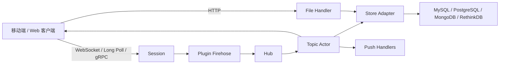
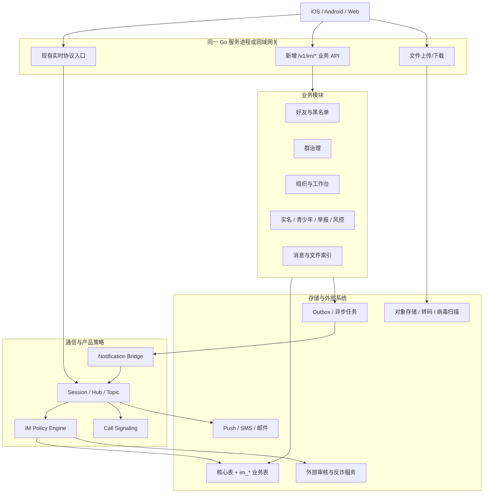
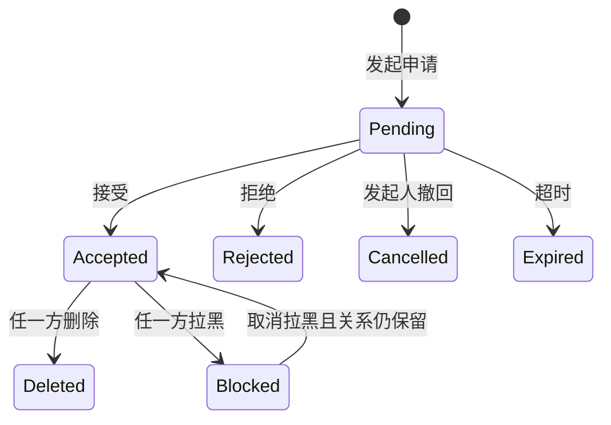
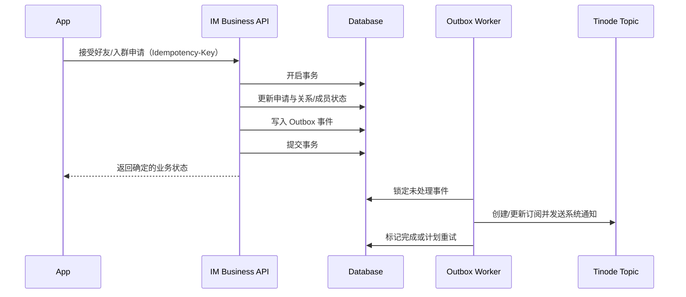

# IM 产品需求服务端改造分析报告

> 分析日期：2026-08-09  
> 分析对象：`chat-0.25.3` 当前工作区源码  
> 需求依据：[IM-产品原型需求文档](./IM-产品原型需求文档.md)  
> 报告范围：服务端能力、数据模型、协议/API、安全、实施计划和验收建议

## 1. 报告结论

当前项目是一个以 Tinode 为核心的 Go 即时通讯服务端，已经具备稳定的实时通信底座：账号登录、单聊、群聊、订阅与访问控制、消息收发、已读/送达回执、输入状态、消息删除、文件上传、推送、点对点 WebRTC 信令，以及可扩展的 gRPC 插件机制。

原型中的基础聊天能力不需要推倒重做，建议继续复用现有 Topic、Subscription、Message 和 Session 模型。在此基础上增加产品业务层，负责好友关系、群治理、内容检索、企业组织、会议/日报/月报、实名认证、青少年模式、举报与安全审计等业务。

本次分析得到以下关键结论：

1. **现有服务端可以承担实时通信内核，但不能直接满足完整产品需求。** 当前代码主要解决消息路由、会话和 ACL，不包含完整的社交关系、企业协同和安全治理领域模型。
2. **应将“实时消息能力”和“产品业务能力”分层。** 聊天消息继续走 WebSocket；需要事务、查询、审批和管理的业务走 HTTP API；状态变化通过结构化系统消息回推 WebSocket。
3. **必须先确定企业租户模式。** 当前 User、Topic、Subscription、Message 和 FileDef 均没有 `tenant_id`。如果多个企业共用一套数据库，租户隔离必须作为所有功能之前的基础改造。
4. **消息幂等和文件授权是上线前必须修复的基础问题。** 发布消息处仍有“重复消息 ID 检查”的 TODO；文件下载只校验登录身份，没有验证用户是否有权访问对应消息或话题。
5. **仓库部分旧文档与当前源码存在漂移。** 旧文档提到的 `x-im-*` 扩展、`im_*` 业务表、数据库版本 119 和 `tools/wsmock`，在当前源码中均未发现。本报告分析时各数据库适配器版本为 116；多租户第一阶段已把 MySQL 提升到 118，其他适配器仍为 116。本报告以可执行源码为准，不把文档设想视为已实现能力。

建议按“基础安全与协议 → 好友和群治理 → 搜索与文件 → 通话与设置 → 企业工作台”的顺序实施。若团队和测试资源稳定，完整服务端改造建议拆成 4 个产品阶段、6 至 9 个迭代交付。

## 2. 分析范围与判定口径

### 2.1 需求范围

本报告覆盖原型文档的 11 个功能域：

1. 账号注册、登录与身份安全；
2. 消息首页、全局导航与系统通知；
3. 单聊会话、会话建立与消息状态；
4. 消息输入、媒体内容与消息操作；
5. 通讯录、好友关系与黑名单；
6. 群聊创建、资料维护与成员治理；
7. 文件下载、收藏管理与聊天记录检索；
8. 实时语音与视频通话；
9. 企业工作台与办公协同；
10. 个人资料、通用设置、隐私与青少年模式；
11. 反诈安全、举报与意见反馈。

### 2.2 能力分类

文中的需求按以下四类判定：

| 分类 | 含义 | 处理方式 |
| --- | --- | --- |
| 已支持 | 当前代码已有可用服务端能力 | 直接复用并补验收测试 |
| 扩展支持 | 现有核心模型可承载，但缺少业务字段、校验或接口 | 在现有链路中增加明确的领域逻辑 |
| 全新建设 | 当前没有对应模型和服务 | 新增业务模块、表、API 和通知桥接 |
| 客户端为主 | 服务端只需提供数据或开关，交互由 App 完成 | 避免在服务端重复实现 UI 状态 |

### 2.3 源码核查范围

重点核查了以下目录与文件：

- `server/session.go`：客户端消息分发、发布、订阅和元数据处理；
- `server/topic.go`：Topic 生命周期、ACL、消息广播、回执和元数据读写；
- `server/datamodel.go`：WebSocket 客户端/服务端协议模型；
- `server/calls.go`：WebRTC 呼叫信令；
- `server/hdl_files.go`：文件上传与下载；
- `server/plugins.go`：gRPC 插件和消息拦截；
- `server/store/store.go`、`server/store/types/types.go`：存储接口和核心实体；
- `server/db/mysql/adapter.go`、`server/db/mysql/schema.sql`：当前 MySQL 实现；
- `server/auth`、`server/validate`、`server/push`：认证、验证码和推送；
- 根目录与 `docs` 目录的 Markdown 文档。

## 3. 当前服务端真实能力

### 3.1 核心架构

当前服务端采用“Session 接收协议包 → Hub/Topic 路由 → Store 持久化 → Topic 广播/Push”的模型。



Topic 以串行事件循环处理同一话题内的状态和消息，适合维持顺序号、订阅状态和广播一致性。扩展时不应在 Topic 事件循环中执行耗时的远程 RPC、全文搜索或复杂审批事务，否则会阻塞该话题的全部消息。

### 3.2 已有能力清单

| 能力 | 当前实现 | 主要源码位置 | 复用判断 |
| --- | --- | --- | --- |
| 账号创建与登录 | `acc`、`login` 协议；basic、token、REST 等认证方式 | `server/session.go`、`server/auth` | 已支持基础能力 |
| 手机验证码 | 电话号码校验、验证码、重试控制，可配置 Twilio | `server/validate/tel/validate.go` | 可用于注册/找回密码，需补产品流程 |
| 单聊与群聊 | P2P、group、channel Topic | `server/topic.go` | 已支持 |
| 会话成员与 ACL | `ModeWant`、`ModeGiven`，包含 Join、Read、Write、Admin、Owner 等权限 | `server/topic.go`、`server/store/types` | 已支持底层权限 |
| 消息收发 | 消息持久化、Topic 内递增序号、广播、离线推送 | `server/topic.go:997`、`server/store/store.go` | 已支持 |
| 已读/送达/输入中 | `note` 的 `read`、`recv`、`kp` 等事件 | `server/datamodel.go:309`、`server/topic.go:1137` | 已支持 |
| 消息扩展内容 | `head` 和 `content` 为通用 JSON；支持 Drafty | `server/datamodel.go:265`、`server/store/types/types.go:1213` | 能承载，缺少产品级规范与校验 |
| 用户/群资料扩展 | Public、Trusted、Private、Aux、Tags | `server/datamodel.go`、`server/topic.go:2202` | 能承载少量扩展信息 |
| 收藏话题 | 存在 `slf` Topic 类别 | `server/topic.go`、`server/store/types` | 可复用，但缺少完整收藏模型与检索 |
| 文件 | HTTP 上传、元数据保存、附件与消息关联 | `server/hdl_files.go`、`server/store/store.go` | 基础可用，下载授权需修复 |
| 音视频信令 | 邀请、接听、Offer、Answer、ICE、挂断；单聊中维护一个当前呼叫 | `server/calls.go` | 可复用，需产品化扩展 |
| 推送 | 可插拔 Push Handler，包含消息和通话字段 | `server/push.go`、`server/push` | 已支持基础能力 |
| 外部风控/审核 | gRPC 插件可继续、丢弃、替换或直接响应协议包 | `server/plugins.go:353` | 适合接外部审核，不替代内部授权 |

### 3.3 当前核心数据模型

当前模型聚焦通信内核：

| 实体 | 关键字段 | 缺少的产品概念 |
| --- | --- | --- |
| User | 状态、访问权限、Public、Trusted、Tags、设备 | 企业、部门、好友关系、实名认证状态、青少年策略 |
| Topic | Owner、默认 ACL、Public、Trusted、Tags、Aux | 入群策略、群公告、禁言规则、群二维码、企业归属 |
| Subscription | Topic、User、ModeWant、ModeGiven、Private | 备注、置顶、通知策略、单独禁言、好友状态 |
| Message | Topic、SeqId、From、Head、Content | 客户端幂等 ID、消息类型索引、全文检索字段、审核状态 |
| FileDef | 文件位置、状态、上传用户等 | 资源级访问策略、业务用途、病毒扫描状态 |

MySQL 当前消息表只对 `(topic, seqid)` 建唯一索引，没有消息类型索引、客户端消息 ID 唯一索引或全文检索索引。分析基线中各适配器均为 schema 116；当前 MySQL 已因租户主表升级到 118，PostgreSQL、MongoDB、RethinkDB 仍为 116。

### 3.4 当前主要缺口

1. `MsgGetQuery` 只支持 desc、sub、data、del，消息查询只有序号范围和数量，没有关键词、媒体类型、发送人、时间区间等检索条件。
2. 发布消息时没有客户端消息幂等校验，`server/session.go:691` 仍保留重复消息 ID 检查 TODO。
3. 当前群成员模型能表达 ACL，但不能完整表达申请加入、审批记录、过期状态和审批理由。直接用 `ModeGiven` 表示待审批会与当前订阅逻辑冲突。
4. 当前群“静音”更接近通知/Presence 控制，不等同于禁止指定成员发言；服务端缺少群禁言策略。
5. 文件下载只校验 API Key 和登录用户，没有根据文件关联消息、Topic ACL、发送者或接收者判断访问权限。
6. WebRTC 只维护 P2P Topic 的一个当前呼叫，缺少稳定的业务 `call_id`、跨设备抢答、通话详单、失败原因规范和群通话能力。
7. 没有企业、组织、部门、会议、日报、月报、信箱等领域模型。
8. 没有实名认证审批、反诈策略、举报工单、反馈工单、青少年模式的服务端强制规则。
9. 没有租户字段；共享数据库的企业 SaaS 部署会有数据越界风险。

## 4. 总体改造原则

### 4.1 保留通信内核，新增产品业务层

不建议将会议、日报、实名认证等业务硬塞进 Topic 的 Public/Aux JSON。Aux 适合兼容性元数据，不适合作为需要索引、唯一约束、状态机、审批记录和审计日志的主数据。

推荐分为四层：

1. **Tinode 实时内核**：Session、Hub、Topic、ACL、Message、Push、WebRTC 信令；
2. **IM 产品策略层**：结构化消息解析、发消息前鉴权、好友/黑名单/群禁言/青少年模式校验；
3. **业务服务层**：好友申请、群审批、组织、会议、报告、实名认证、举报等 HTTP API；
4. **业务存储与事件层**：业务表、事务、Outbox、审计日志、搜索索引。

### 4.2 目标架构



### 4.3 WebSocket 与 HTTP 的职责边界

| 场景 | 推荐通道 | 原因 |
| --- | --- | --- |
| 发消息、回执、输入中、在线事件、通话信令 | 现有 WebSocket | 低延迟、已有 Topic 路由和广播 |
| 好友申请/审批、群申请/审批 | HTTP 写操作 + WS 通知 | 需要幂等、状态机、审计和列表查询 |
| 组织架构、日报/月报、会议管理 | HTTP API | 强查询和事务型业务，不应阻塞 Topic |
| 消息关键词/类型搜索 | HTTP 或扩展后的 `get` | 需要独立索引、分页游标和查询权限 |
| 实名认证、举报、反馈、版本配置 | HTTP API | 涉及附件、敏感字段、工单和后台管理 |
| 文件上传/下载 | HTTP | 沿用当前链路，但补资源级授权 |
| 业务状态变化提醒 | 结构化系统消息/系统 Topic | 复用实时和推送能力 |

## 5. 11 类原型需求的服务端适配方案

### 5.1 账号注册、登录与身份安全

| 原型能力 | 现状 | 改造方案 | 优先级 |
| --- | --- | --- | --- |
| 企业码登录 | 无企业模型 | 新增企业码解析接口；企业码映射到企业、部署地址和登录策略 | P0 |
| 手机号/密码登录 | 认证框架已有 | 固化账号标识规范、失败次数、锁定时长、设备记录和安全审计 | P0 |
| 注册和验证码倒计时 | 电话验证器已有 | 新增注册编排接口；倒计时由客户端显示，服务端返回 `retry_after`、过期时间和重试上限 | P0 |
| 忘记密码 | 有认证与验证器，无完整流程 | 增加发送验证码、校验票据、重置密码三个阶段；票据一次性、短时有效 | P0 |
| 设置独立密码 | 可更新账号，但无产品流程 | 增加二次验证和密码策略；写审计日志并撤销旧 Token | P1 |
| 实名认证 | 无 | 新建实名申请、状态查询、审核回调；敏感字段加密，客户端仅返回脱敏结果 | P1 |

企业码有两种实现方式：

- **推荐第一阶段：一企一实例/一企一库。** 企业码只负责发现该企业的服务地址和认证方式。现有核心表无需立即加入 `tenant_id`，隔离边界清晰。
- **共享 SaaS：多企业共用服务和数据库。** 必须先完成第 6 节的全链路租户隔离，再开放企业码登录。

建议新增接口：

```text
POST /v1/im/auth/enterprise/resolve
POST /v1/im/auth/sms/send
POST /v1/im/auth/password/reset-ticket
POST /v1/im/auth/password/reset
POST /v1/im/identity/verifications
GET  /v1/im/identity/verifications/current
```

不要把身份证号、证件照片地址写入 User.Public、User.Trusted 或消息内容。实名数据应单独加密存储，并限制后台角色、访问理由和留痕。

### 5.2 消息首页、全局导航与系统通知

| 原型能力 | 现状 | 改造方案 | 优先级 |
| --- | --- | --- | --- |
| 会话列表 | Subscription 已有未读、时间等信息 | 扩展每用户会话设置：置顶、免打扰、草稿、隐藏；草稿可优先本地保存 | P1 |
| 离线/重连 | Session 支持连接和队列 | 客户端指数退避；服务端增加连接状态指标、消息同步游标和限流 | P0 |
| 长按置顶/删除/免打扰 | 部分可由 Private/订阅状态承载 | 明确 `im_conversation_settings`，避免 Private JSON 无法查询和约束 | P1 |
| 系统消息 | 可创建系统 Topic/系统账号 | 建立系统消息类型字典、模板版本、跳转参数和去重键 | P1 |

系统消息应使用正常的 Message 存储和 Push 链路，而不是只发临时 `info` 包。这样用户离线后仍可拉取、已读和跨设备同步。

### 5.3 单聊会话、会话建立与消息状态

| 原型能力 | 现状 | 改造方案 | 优先级 |
| --- | --- | --- | --- |
| 单聊建立 | P2P Topic 已支持 | 在创建/订阅前检查好友、黑名单和隐私策略 | P0 |
| 在线、输入中 | Presence、`kp` 已支持 | 统一客户端节流和过期时间；按隐私设置决定是否透出 | P1 |
| 已发送、已送达、已读 | Topic 序号和 `recv/read` 已支持 | 定义产品状态映射；群聊展示规则单独定义 | P0 |
| 拉黑后限制沟通 | 无完整关系表 | 关系表作为真源；发布、建会话、呼叫、文件访问均执行同一策略 | P0 |
| 删除消息/撤回 | 有消息删除能力 | 区分“仅自己删除”和“全员撤回”；增加撤回时限、操作者和审计事件 | P1 |
| 名片消息 | 通用 JSON 可承载 | 定义 `contact_card` 类型，只保存稳定用户 ID 和展示快照，打开时重新鉴权 | P1 |

“拉黑”不能只修改客户端按钮或 Topic 私有字段。策略层至少要拦截：新建单聊、发送消息、发送好友请求、音视频呼叫、读取对方敏感资料。

### 5.4 消息输入、媒体内容与消息操作

当前 `head`、`content` 接受通用 JSON，技术上可以传文本、图片、语音、视频、文件、名片、合并转发等内容，但服务端没有类型白名单、字段校验、幂等、审核和索引。建议增加明确的消息信封：

```json
{
  "pub": {
    "id": "client-request-id",
    "topic": "grp...",
    "head": {
      "x-im-schema": 1,
      "x-im-type": "image",
      "x-im-client-mid": "01J...",
      "x-im-reply-to": 128
    },
    "content": {
      "file_id": "f...",
      "width": 1080,
      "height": 1440,
      "thumbnail_file_id": "f..."
    }
  }
}
```

服务端改造要求：

1. 在 `server/datamodel.go` 定义扩展字段常量和允许类型，不再由各客户端自由命名。
2. 在 `server/session.go` 发布入口解析 `x-im-client-mid`，按“租户 + 发送者 + client_mid”去重；重复请求返回第一次成功的 Topic/SeqId。
3. 在 `server/topic.go` 持久化前执行类型、大小、引用消息、附件所有权、好友/黑名单、禁言、青少年和风控策略。
4. 文本继续使用 Drafty；图片、视频、语音、文件只在消息里保存 `file_id` 和必要元数据，不信任客户端提交的任意下载 URL。
5. `@成员` 保存稳定用户 ID 列表；服务端校验被提醒者确实是当前群成员，并生成定向推送。
6. 合并转发生成不可变快照，保留原作者展示名、时间和内容类型，但不得泄露原会话 ID 或无权访问的附件。
7. 多选、键盘、表情面板、录音进度、上传进度属于客户端交互；服务端只负责资源、消息和失败状态。

推荐消息类型首批固定为：

```text
text, image, voice, video, file, contact_card,
location, merged_forward, system_notice, call_record
```

转发应区分两种语义：

- **逐条转发**：为每条内容创建新消息，原附件通过授权后重新建立引用；
- **合并转发**：创建一个 `merged_forward` 快照，子项限制数量和总大小，服务端清理敏感字段。

### 5.5 通讯录、好友关系与黑名单

当前 Subscription 表示“用户订阅了哪个 Topic”，不能替代双边好友关系和申请状态机。建议新增：

- `im_user_relations`：双方关系、备注、黑名单、免打扰等当前状态；
- `im_friend_requests`：申请、处理人、验证信息、状态、过期时间和幂等键；
- `im_privacy_settings`：允许通过手机号/ID/二维码查找、加好友验证方式等。

好友流程：



实现要点：

1. 精准用户 ID 搜索必须受隐私设置、租户和账号状态限制；手机号搜索应使用规范化哈希进行匹配，禁止模糊枚举。
2. 接受好友申请和建立双方关系必须在同一数据库事务内完成，并通过 Outbox 异步创建/激活 P2P Topic、发送系统通知。
3. 删除好友是否删除 P2P 历史需产品确认。建议只解除关系，不物理删除历史；双方分别控制会话是否可见。
4. 拉黑属于单方策略，服务端立即生效。是否同时解除好友关系应作为明确产品规则，不由客户端猜测。
5. 关系变化必须使 ACL/策略缓存失效，避免短时间内继续发消息。

建议接口：

```text
GET    /v1/im/contacts
GET    /v1/im/users/exact-search?id=...
POST   /v1/im/friend-requests
GET    /v1/im/friend-requests
POST   /v1/im/friend-requests/{id}/accept
POST   /v1/im/friend-requests/{id}/reject
DELETE /v1/im/contacts/{user_id}
PUT    /v1/im/contacts/{user_id}/block
DELETE /v1/im/contacts/{user_id}/block
GET    /v1/im/blocks
```

### 5.6 群聊创建、资料维护与成员治理

现有群 Topic、Owner/Admin ACL 和所有者转移可以复用。需要新增群业务规则和审批数据。

| 原型能力 | 可复用基础 | 新增服务端能力 |
| --- | --- | --- |
| 创建群、群资料 | Group Topic、Public/Trusted/Aux | 资料字段规范、头像资源校验、敏感词审核 |
| 加入群聊 | Subscription/Join ACL | 入群方式、申请表、审批状态机、人数和频率限制 |
| 邀请进群 | Admin/Share ACL | 邀请记录、邀请权限、被邀请人确认、批量幂等 |
| 群公告 | 消息可承载 | 公告主表、版本、置顶、已读回执、发布权限 |
| 管理员 | Admin ACL | 管理员人数上限、操作审计、角色显示 |
| 禁言成员 | 无对应强制策略 | 单人/全员禁言表和发布前校验，管理员豁免规则 |
| 转让群主 | 已有 Owner 转移逻辑 | 二次确认、风险校验、审计和通知 |
| 群二维码 | 无 | 签名短 Token、有效期、次数限制、撤销和入群策略 |
| 群文件 | 文件与消息已有关联 | 群文件索引、上传者/类型/时间筛选、删除权限 |

当前订阅代码在新订阅者没有 Join 权限时会拒绝加入，因此不能仅用“`ModeGiven` 不含 Join”来保存待审批申请。正确做法是先写 `im_group_join_requests`，审批通过后再创建或更新 Subscription。

群禁言必须在消息持久化前检查，建议规则优先级为：

```text
账号停用 > 黑名单/关系限制 > 全员禁言 > 单人禁言 > Topic Write ACL > 允许发送
```

群二维码只应包含服务端生成的短 Token，不应直接暴露可永久加入的 Topic ID。Token 至少绑定群、创建人、过期时间、最大使用次数和当前入群策略，并使用服务端密钥签名或只保存其哈希。

### 5.7 文件下载、收藏管理与聊天记录检索

#### 文件访问安全

这是当前代码中最明确的安全缺口。`server/hdl_files.go` 的下载流程验证 API Key 和已登录用户后即可读取 URL 对应文件，没有验证该用户是否是上传者、是否属于关联消息的 Topic、该消息是否已撤回，或文件是否为公开资源。

建议新增统一的 `FileCanAccess(uid, fileID, action)`：

1. 查询 FileDef 和 file-message links；
2. 上传未完成的文件只允许上传者访问；
3. 已关联消息的文件要求用户对至少一个关联 Topic 具有 Read 权限；
4. 群文件删除要求上传者、群管理员或群主权限；
5. 转发附件时重新建立授权关联，不暴露底层存储永久地址；
6. 使用短时签名下载 URL，记录下载审计；
7. 对上传文件执行 MIME 嗅探、扩展名一致性、病毒扫描、图片/视频解码安全检查。

#### 收藏

`slf` Topic 可以继续承担“收藏内容跨设备同步”的消息容器，但建议增加 `im_favorites` 索引表，保存源消息、收藏消息、类型、创建时间和已清理的展示摘要。源消息删除后，收藏快照是否保留需按合规策略处理。

#### 聊天记录检索

当前 `MessageGetAll` 仅支持 Topic、序号范围和数量，不支持关键词或类型。建议新增 `im_message_index`：

| 字段 | 用途 |
| --- | --- |
| tenant_id / topic / seq_id | 权限过滤和定位原消息 |
| sender_id / message_type | 发送人和类型筛选 |
| sent_at | 时间范围和排序 |
| searchable_text | 文本、文件名、链接标题等可搜索文本 |
| file_id / mime_group | 文件、图片、视频分类 |
| deleted / moderation_state | 排除已删除或不可见内容 |

若仅支持 MySQL，可使用 InnoDB FULLTEXT 配合 `ngram` 分词；若需要更强中文检索、跨话题检索和高数据量，建议使用 OpenSearch/Elasticsearch。无论使用哪种索引，查询结果都必须再次以当前 Topic Read ACL、消息删除范围和租户进行过滤，不能把搜索索引当作授权来源。

需要提供全量回填任务和增量 Outbox 消费者，避免上线后只能搜索新消息。

### 5.8 实时语音与视频通话

现有 `server/calls.go` 已支持 P2P 呼叫的邀请、接听、Offer、Answer、ICE Candidate 和挂断，可作为首期基础。改造建议：

1. 为每次呼叫生成不可复用的 `call_id`，不要只用 Topic 和消息 SeqId 表示一次通话；
2. 增加 `voice/video` 类型、主叫/被叫设备、创建/响铃/接听/结束时间、结束方、标准结束原因；
3. 增加跨设备抢答：一台设备接听后，其他设备收到 `answered_elsewhere`；
4. 呼叫前执行好友、黑名单、隐私、账号状态和青少年策略；
5. 呼叫超时、拒接、忙线、取消分别生成一致的通话记录消息和推送；
6. 配置可用的 STUN/TURN，监控 ICE 成功率和呼叫建立耗时；
7. 麦克风、扬声器、摄像头开关和悬浮窗主要由客户端管理，服务端只同步必要的媒体状态事件；
8. 群音视频不应扩展当前单个 `videoCall` 结构硬做，建议另建会议房间并接入 SFU。

### 5.9 企业工作台与办公协同

该部分属于全新业务域，当前服务端没有组织、部门、会议、日报、月报或信箱代码。建议它们作为独立业务模块，通过 Tinode 系统消息发送提醒，而不是修改聊天核心协议承载所有 CRUD。

#### 组织架构

- `im_org_units`：企业、部门、层级、排序、负责人、状态；
- `im_org_members`：用户、部门、职位、主部门、在职状态和可见范围；
- 支持树形查询、按姓名/部门搜索、部门成员分页；
- 组织同步应有版本号，客户端可增量刷新；
- 离职用户需在一个事务编排中禁用账号、退出企业群、撤销 Token 和处理数据归属。

#### 会议通知

- `im_meetings`：主题、时间、地点/会议链接、发起人、提醒策略、状态；
- `im_meeting_participants`：参与人、回复状态、回复时间；
- 创建/变更/取消写 Outbox，由通知桥接器向参与者系统 Topic 发结构化消息；
- 定时提醒由任务调度器执行，任务必须使用幂等键避免重复推送；
- 若未来增加在线视频会议，会议业务 ID 与通话房间 ID 分离。

#### 日报与月报

- 统一使用 `im_work_reports`，字段包含类型、周期、作者、部门、正文、附件、状态、提交时间；
- 管理员列表以权限范围过滤，不以客户端传入部门为准；
- 提交后是否可编辑、补交和撤回需形成明确状态机；
- 汇总统计异步生成，不在请求中扫描所有报告。

#### 总经理信箱

- 使用 `im_mailbox_messages`，支持实名/匿名展示策略、正文、附件、处理状态和回复；
- “匿名”只能对业务查看者隐藏，安全审计角色仍可在合法授权下追溯；
- 附件走统一私有文件授权；
- 每次查看和导出敏感信件都写审计日志。

### 5.10 个人资料、通用设置、隐私与青少年模式

| 能力 | 服务端责任 | 客户端责任 |
| --- | --- | --- |
| 昵称、生日、签名、头像 | 校验、敏感词、可见范围、版本和审计 | 编辑和展示 |
| 个人二维码 | 生成短时签名 Token、隐私校验 | 展示、扫码 |
| 清空缓存 | 无需删除服务端消息 | 清理本地缓存和下载文件 |
| 版本更新 | 返回平台、渠道、最低版本、推荐版本、下载地址和更新文案 | 下载、安装、商店跳转 |
| 隐私设置 | 作为服务端授权条件强制执行 | 提供开关界面 |
| 青少年模式 | 服务端保存状态、PIN 哈希、策略版本并强制限制 | UI 切换和本地内容隐藏 |
| 推送/相机/麦克风权限 | 保存推送 Token 和提醒偏好 | 调用系统权限 API |

青少年模式不能只是客户端开关，否则卸载重装或换设备即可绕过。建议 `im_teen_mode` 保存启用状态、监护 PIN 的强哈希、失败锁定、允许时段、功能策略版本和更新时间。服务端在登录、搜索、加好友、发消息、通话和工作台入口统一检查策略。

版本接口示例：

```text
GET /v1/im/config/app-version?platform=android&channel=official&version=1.4.0
```

响应需区分 `latest`、`recommended`、`minimum_supported` 和 `force_update`。客户端系统权限文案和弹窗不需要服务端逐页参与，但可以通过配置中心提供版本化文案。

### 5.11 反诈安全、举报与意见反馈

建议形成三层控制：

1. **同步硬规则**：账号状态、黑名单、限频、群禁言、文件大小/类型等，必须在服务端本地快速判断；
2. **内容与风险审核**：通过现有 gRPC Plugin Firehose 或独立审核服务检查文本、图片和链接；
3. **事后处置**：举报工单、证据固化、审核、处罚、申诉和审计。

现有插件在协议分发之前同步执行，严格审核会直接增加消息延迟。外部审核调用必须设置较短超时、熔断、指标和明确的 fail-open/fail-closed 策略。高风险场景可以先将消息标为 `pending_review`，审核通过后再广播；低风险场景可先发后审并支持撤回。

新增数据模型：

- `im_reports`：举报对象、原因、描述、提交人、状态、处理人、结论；
- `im_report_evidence`：消息快照、文件引用、校验哈希；
- `im_feedback`：意见类型、正文、联系方式、附件、处理状态；
- `im_risk_events`：命中规则、风险等级、处置、模型/规则版本；
- `im_audit_logs`：操作者、动作、对象、结果、IP、设备和关联请求 ID。

举报消息时不要只保存可变的 Topic/SeqId，应在用户仍有读取权限时由服务端固化必要证据快照和内容哈希。后台读取证据需要单独权限和完整审计。

## 6. 企业租户隔离决策

### 6.1 当前事实

当前 User、Topic、Subscription、Message 和 FileDef 没有 `tenant_id`。用户标签和 Topic 标签也没有企业隔离维度。仅在登录入口识别企业码，不能保证后续搜索、消息、文件和后台查询不会跨企业。

### 6.2 推荐方案：第一阶段一企一实例/一企一库

企业码网关返回企业专属服务地址。每个实例使用独立数据库、对象存储前缀、推送配置和审核配置。这种方案最贴合当前架构，改造量和误配风险最低，也便于企业级数据迁移与删除。

需要新增：

- 企业码目录服务；
- 企业到服务地址/认证策略的映射；
- 配置和密钥隔离；
- 统一运维、监控和版本发布能力。

### 6.3 共享 SaaS 的必要改造

如果明确要求多个企业共用一套服务和数据库，则以下工作必须先于产品功能：

1. 为核心表和所有业务表增加 `tenant_id`；
2. 所有唯一索引包含租户维度，例如用户登录标识、Topic、客户端消息 ID；
3. Session 完成认证后固定 tenant，禁止客户端包覆盖；
4. Topic 查找、用户查找、订阅、消息读写、文件访问和搜索全部强制带 tenant；
5. 内存缓存、Hub 路由键、集群路由和 Push 任务均包含 tenant；
6. 系统账号和系统 Topic 按企业创建；
7. 后台管理账号采用企业范围和数据范围授权；
8. 增加跨租户攻击自动化测试，覆盖枚举 ID、文件 URL、搜索和转发。

这不是加一个字段的局部修改，而是横跨认证、存储接口、全部数据库适配器、缓存、集群路由和测试的基础工程。

## 7. 协议与 API 改造

### 7.1 保持现有协议兼容

继续支持现有 `hi`、`acc`、`login`、`sub`、`leave`、`pub`、`get`、`set`、`del`、`note`。新客户端通过 `x-im-schema` 声明产品扩展版本；旧客户端没有扩展字段时仍按现有路径工作。

推荐新增固定消息头：

| 字段 | 必填条件 | 说明 |
| --- | --- | --- |
| `x-im-schema` | 产品消息必填 | 扩展协议版本 |
| `x-im-type` | 产品消息必填 | 消息类型枚举 |
| `x-im-client-mid` | 普通消息必填 | 客户端生成的幂等 ID |
| `x-im-reply-to` | 回复消息时 | 被回复消息 SeqId |
| `x-im-forward-mode` | 转发时 | `single` 或 `merged` |
| `x-im-risk-state` | 仅服务端写 | 审核状态，客户端提交值必须忽略 |

### 7.2 消息幂等

新增唯一约束：

```text
(tenant_id, sender_id, client_mid) UNIQUE
```

一企一库时可省略物理 `tenant_id`，但代码接口仍建议预留租户上下文。幂等记录需要保存最终 Topic、SeqId 和响应摘要。消息保存、Topic 最新序号、订阅更新目前通过多次 Store 调用完成；新增幂等时应明确事务边界，避免数据库写成功但回复丢失后重试产生两条消息。

### 7.3 查询扩展

不建议继续把搜索条件塞进未定义的任意 JSON。可在 `MsgGetQuery` 中增加明确字段：

```go
type MsgSearchQuery struct {
    Query      string   `json:"query,omitempty"`
    Types      []string `json:"types,omitempty"`
    From       string   `json:"from,omitempty"`
    SinceTime  string   `json:"since_time,omitempty"`
    BeforeTime string   `json:"before_time,omitempty"`
    Cursor     string   `json:"cursor,omitempty"`
    Limit      int      `json:"limit,omitempty"`
}
```

如果搜索由独立服务承担，则提供 `/v1/im/search/messages`，返回 Topic、SeqId 和安全摘要，客户端再通过原生 `get data` 拉取上下文。任何方案都必须在服务端重新做 Topic ACL 检查。

### 7.4 业务 API 约定

新增 `/v1/im/*` 路由，复用 Tinode Token 的认证结果。应把 `hdl_files.go` 中现有的请求认证逻辑抽取成通用 HTTP 中间件，而不是让每个 Handler 自行解析 Token。

所有写接口统一支持：

- `X-Request-ID`：链路追踪；
- `Idempotency-Key`：创建和审批的幂等控制；
- 统一错误结构：`code`、`message`、`details`、`request_id`；
- 游标分页，不使用数据增长时不稳定的大 Offset；
- 服务端从认证上下文取用户和租户，不接受正文伪造；
- 状态变更写审计日志和 Outbox。

## 8. 建议新增的数据模型

以下是逻辑模型，正式建表前需补充字段长度、外键策略、冷热分层和数据保留周期。

| 表 | 核心字段 | 关键约束/索引 | 作用 |
| --- | --- | --- | --- |
| `im_user_relations` | user_id、peer_id、state、remark、blocked、muted | 双向记录唯一；peer/state 索引 | 好友、备注、拉黑和通知关系 |
| `im_friend_requests` | id、from、to、message、state、expires_at | 待处理申请去重；to/state/time | 好友申请状态机 |
| `im_conversation_settings` | user_id、topic、pinned、muted、hidden | user/topic 唯一 | 会话个性化设置 |
| `im_privacy_settings` | user_id、search flags、friend policy | user 唯一 | 精准搜索和加好友授权 |
| `im_group_settings` | topic、join_policy、invite_policy、mute_all | topic 唯一 | 群业务规则 |
| `im_group_join_requests` | id、topic、applicant、inviter、state | topic/applicant/pending 去重 | 入群申请与审批 |
| `im_group_mutes` | topic、user、expires_at、operator | topic/user 唯一；expires 索引 | 单人禁言 |
| `im_group_announcements` | id、topic、version、content、publisher | topic/status/time | 群公告版本 |
| `im_group_announcement_reads` | announcement_id、user、read_at | announcement/user 唯一 | 公告已读 |
| `im_group_invite_tokens` | token_hash、topic、expires、max_uses | token_hash 唯一；expires | 群二维码/邀请链接 |
| `im_message_idempotency` | sender、client_mid、topic、seq_id | sender/client_mid 唯一 | 消息去重 |
| `im_message_index` | topic、seq_id、type、text、file_id、sent_at | topic/seq 唯一；搜索索引 | 消息、文件和媒体检索 |
| `im_favorites` | user、favorite_seq、source topic/seq、type | user/time；源消息索引 | 收藏筛选与分享 |
| `im_identity_verifications` | user、encrypted PII、state、review | user/current-state；request id | 实名认证和审计 |
| `im_org_units` | id、parent_id、name、path、state | parent/sort；path | 企业组织树 |
| `im_org_members` | user、org_unit、title、primary | unit/state；user | 部门成员关系 |
| `im_meetings` | id、organizer、title、start/end、state | organizer/time；state/time | 会议通知 |
| `im_meeting_participants` | meeting、user、response | meeting/user 唯一 | 参会状态 |
| `im_work_reports` | type、period、author、department、content、state | author/type/period；dept/time | 日报/月报 |
| `im_mailbox_messages` | id、sender、content、anonymous、state | state/time；sender/time | 总经理信箱 |
| `im_user_settings` | user、setting key/value、version | user/key 唯一 | 跨设备设置 |
| `im_teen_mode` | user、enabled、pin_hash、policy_version | user 唯一 | 青少年策略 |
| `im_reports` | reporter、target_type/id、reason、state | state/time；target | 举报工单 |
| `im_report_evidence` | report、snapshot、file、hash | report | 证据固化 |
| `im_feedback` | user、category、content、state | state/time；user/time | 意见反馈 |
| `im_risk_events` | actor、object、rule、level、action | actor/time；object | 风控记录 |
| `im_audit_logs` | actor、action、object、result、request_id | actor/time；object/time | 管理和敏感操作审计 |
| `im_outbox` | aggregate、event_type、payload、state | state/next_retry；dedupe key | 事务后可靠通知 |

所有表在共享 SaaS 模式下都必须包含 `tenant_id`，并将它放入唯一约束和查询前缀。软删除字段不能代替状态机和审计记录。

## 9. 代码级改造清单

### 9.1 现有文件修改

| 文件 | 建议修改 |
| --- | --- |
| `server/datamodel.go` | 定义产品消息头、消息类型、查询过滤和错误码；保持旧协议兼容 |
| `server/session.go` | 发布前幂等校验；调用产品策略层；统一映射业务错误；认证后绑定租户上下文 |
| `server/topic.go` | 发布前关系/禁言/青少年策略；结构化系统消息；群管理状态变化后的缓存失效 |
| `server/calls.go` | 引入 call_id、设备维度、结束原因、抢答与通话详单；群通话走独立模块 |
| `server/push.go` | 按消息类型生成 Push；支持 @提醒、审批、会议和审核状态；避免敏感内容出现在锁屏 |
| `server/hdl_files.go` | 抽取通用 HTTP 认证；下载增加 FileCanAccess；签名 URL；扫描状态检查 |
| `server/plugins.go` | 为外部审核增加超时、指标、熔断和场景化失败策略 |
| `server/main.go` | 注册 `/v1/im/*` 路由、业务模块生命周期、健康检查和后台任务 |
| `server/store/store.go` | 增加幂等、文件授权和搜索所需的核心接口，明确事务边界 |
| `server/store/types/types.go` | 增加明确的扩展类型；若共享 SaaS，核心实体加入 TenantId |
| `server/db/mysql/adapter.go` | schema 升级、索引、幂等和核心查询实现 |
| `server/db/mysql/schema.sql` | 与 adapter 中建表 SQL 同步，禁止只改其中一份 |
| `tinode.conf` | 产品模块、租户、搜索、审核、TURN、文件扫描和限流配置 |

### 9.2 建议新增包

```text
server/imapi/          HTTP 路由、请求校验、响应和认证中间件
server/impolicy/       好友、黑名单、群禁言、隐私、青少年等同步策略
server/immessage/      消息类型注册、结构校验、摘要与转发净化
server/imbiz/          好友、群治理、组织、会议、报告、实名、举报服务
server/imstore/        产品业务存储接口和 MySQL 实现
server/imnotify/       Outbox 消费、系统消息和 Push 桥接
server/imsearch/       索引写入、回填、检索和 ACL 二次过滤
server/imjobs/         过期申请、会议提醒、清理、索引回填等后台任务
```

### 9.3 数据库适配策略

当前项目同时包含 MySQL、PostgreSQL、MongoDB 和 RethinkDB 适配器。新增所有产品能力到公共 Store 接口会要求四套实现同步完成，改造面很大。

建议先明确产品正式支持的数据库：

- 如果生产只使用 MySQL，则产品业务 Store 首期实现 MySQL，并在启用 `im_product` 配置且底层不支持时拒绝启动，不能静默降级；
- 核心消息幂等、文件授权等通信安全能力应进入公共接口，或明确产品版只支持 MySQL；
- schema 版本从 116 升级时，四个适配器必须分别维护自己的版本，不能把 MySQL 已升级误写成所有数据库都支持；
- `adapter.go` 中的建表 SQL 与 `schema.sql` 必须通过测试保持一致。

## 10. 事务、一致性与异步通知

好友审批、入群审批、会议创建等操作通常同时涉及业务表、Topic/Subscription 和通知。若直接依次调用，任何一步失败都会出现“状态已接受但没有会话”或“会议创建了但没人收到通知”。

建议采用本地事务 + Outbox：



Outbox 消费需要事件去重；状态变更 API 自身也需要 Idempotency-Key。对于必须与核心 Topic 数据原子提交的操作，应把它们放到同一数据库事务接口，而不是依赖最终一致性掩盖授权窗口。

## 11. 安全与合规基线

服务端改造至少应包含：

1. **认证安全**：密码强哈希、验证码限频、设备和 IP 风险、Token 撤销、失败锁定；
2. **授权安全**：所有对象查询从服务端认证上下文获得租户和用户；文件、搜索、转发必须二次校验 ACL；
3. **数据安全**：身份证等 PII 字段加密、密钥轮换、响应脱敏、日志禁止明文；
4. **内容安全**：文本、图片、链接和文件审核；病毒扫描；风险策略版本化；
5. **审计安全**：管理员、群主、实名审核、举报处置、匿名信箱访问全部留痕；
6. **接口安全**：限流、请求大小、游标签名、幂等、防重放、统一输入校验；
7. **隐私删除**：明确账号注销、聊天记录、收藏、举报证据和办公数据的不同保留周期；
8. **推送隐私**：锁屏 Push 默认不携带敏感正文，由用户设置控制预览；
9. **可观测性**：请求 ID、用户/租户匿名化标识、消息处理延迟、拒绝原因和插件超时指标。

## 12. 分阶段实施建议

### 阶段 P0：基线和关键决策

- 确定一企一实例还是共享 SaaS；
- 确定产品版支持的数据库；
- 清理旧设计文档与源码的版本漂移，建立 schema/协议单一事实来源；
- 建立数据库迁移、回滚、CI 和环境配置基线；
- 修复文件下载授权；
- 实现消息客户端 ID 幂等；
- 定义消息类型、错误码和兼容策略。

完成标准：安全缺口关闭；重复重试不会产生重复消息；旧客户端仍可通信；开发和测试环境可重复升级/回滚。

### 阶段 P1：账号、关系和基础聊天产品化

- 企业码发现、注册、验证码和忘记密码流程；
- 实名认证基础流程；
- 好友申请、联系人、黑名单和隐私设置；
- 结构化文本/图片/语音/视频/文件/名片消息；
- 会话置顶、免打扰、系统消息；
- @提醒、回复、逐条转发、合并转发；
- 基础风控和审计。

完成标准：原型第 1 至 5 类主流程可由真实客户端端到端完成。

### 阶段 P2：群治理、收藏、搜索和文件

- 入群申请、邀请审批、群公告；
- 管理员、群主转让、全员/成员禁言；
- 群二维码和群文件；
- 收藏索引；
- 消息关键词、文件、链接、图片和视频检索；
- 历史数据回填和搜索 ACL 验证。

完成标准：原型第 6、7 类全部服务端流程可验收，搜索不会返回无权消息或附件。

### 阶段 P3：通话、设置和安全治理

- call_id、通话记录、跨设备抢答、TURN 指标；
- 个人资料和二维码；
- 版本配置、隐私设置、青少年模式强制策略；
- 反诈提示策略、举报、证据、反馈和后台处置；
- 内容审核超时/降级策略演练。

完成标准：原型第 8、10、11 类服务端能力可验收，关键安全策略无法通过换设备绕过。

### 阶段 P4：企业工作台

- 组织与部门；
- 会议通知和提醒；
- 日报、月报和管理视图；
- 总经理信箱；
- 离职编排、数据权限和敏感操作审计。

完成标准：原型第 9 类完成业务闭环，组织数据权限和通知可靠性通过测试。

## 13. 测试与验收方案

### 13.1 自动化测试层次

| 测试层 | 重点 |
| --- | --- |
| 单元测试 | 消息类型校验、状态机、权限矩阵、Token/二维码、错误映射 |
| Store 集成测试 | schema 升降级、唯一约束、事务、并发审批、Outbox 重试 |
| WebSocket 端到端 | 登录、订阅、消息、重复发送、回执、禁言、拉黑、通话信令 |
| HTTP API 测试 | 好友/群审批、组织、报告、实名、举报、文件授权 |
| 搜索测试 | 中文关键词、类型筛选、删除同步、权限变化、历史回填 |
| 安全测试 | 跨用户/跨租户、文件 URL 猜测、ID 枚举、重放、越权审批 |
| 故障测试 | 审核超时、Push 失败、Outbox 重试、数据库瞬断、服务重启 |
| 真实设备测试 | Push、相机/麦克风、弱网重连、WebRTC NAT/TURN、跨设备抢答 |

### 13.2 必须覆盖的关键用例

1. 同一个 `x-im-client-mid` 并发重试 10 次，只产生一条消息并返回同一个 SeqId；
2. 拉黑后已有长连接不能继续发消息或呼叫；
3. 被禁言成员通过旧客户端或直接构造协议包仍被服务端拒绝；
4. 非群成员持有文件 URL 时无法下载，退出群后访问策略符合产品约定；
5. 搜索结果不包含已撤回、仅对本人删除、无 Read ACL 或其他租户的消息；
6. 入群审批重复点击不会重复创建 Subscription；
7. 群主转让、管理员变更和禁言都有审计记录且权限立即生效；
8. 实名信息不会出现在日志、Push、Public/Trusted 和普通后台响应；
9. 青少年模式换设备、重装或使用旧客户端仍受服务端限制；
10. 外部审核服务超时后，系统严格按配置的降级策略处理并产生告警；
11. Outbox 消费进程崩溃重启后，通知不丢失且业务副作用不重复；
12. 多租户模式下所有 API、消息、文件、搜索和后台查询均完成负向越权测试。

### 13.3 当前基线验证

本次分析执行了以下不依赖外部数据库的测试：

```bash
go test -count=1 ./server ./server/drafty ./server/media ./server/store/types ./server/db/common
```

上述包当前全部通过。MySQL/PostgreSQL/MongoDB/RethinkDB 的真实数据库集成测试未在本次报告中执行，改造前应在 CI 中配置正式支持的数据库并固定运行。

## 14. 风险与待确认事项

| 决策 | 不确认的风险 | 建议 |
| --- | --- | --- |
| 企业隔离模式 | 后期补 tenant 会重写大量查询和数据 | P0 首先决策，优先一企一实例 |
| 正式支持的数据库 | 四种适配器同步开发显著拖慢交付 | 产品业务首期明确 MySQL |
| 删除好友后的历史 | 客户端与服务端理解不同导致数据争议 | 默认保留历史、禁止新消息 |
| 收藏是否为独立副本 | 源消息删除后的合规行为不明确 | 明确快照和保留策略 |
| 全员撤回时限 | 无规则会导致历史任意篡改 | 配置时限、角色和审计 |
| 匿名信箱的匿名边界 | 绝对匿名与合规追溯冲突 | 业务匿名、受控审计可追溯 |
| 审核失败策略 | 失败开放有风险，失败关闭影响可用性 | 按场景分级并可观测 |
| 群音视频范围 | 当前 P2P 模型无法自然扩展 | 若需要多人通话，独立评估 SFU |
| 搜索技术选型 | MySQL 与独立搜索引擎成本差异大 | 依据消息量、中文检索和运维能力压测决定 |

## 15. 建议的第一批工程任务

建议立刻拆分以下可执行任务：

1. 建立“源码真实基线”文档，删除或标记未实现的 `x-im-*`、schema 119 和测试工具说明；
2. 编写消息扩展协议 v1，包括类型、字段、大小、错误码和兼容矩阵；
3. 设计并实现消息幂等，补并发和断线重试测试；
4. 修复文件下载授权，补上传者、群成员、退群用户和泄露 URL 测试；
5. 决定租户和数据库支持范围，冻结第一版 schema；
6. 新建 `imapi`、`impolicy`、`imbiz`、`imstore`、`imnotify` 的最小骨架；
7. 以“好友申请 → 接受 → 创建会话 → 发消息 → 拉黑”为第一条端到端业务链；
8. 以“群申请 → 审批 → 禁言 → 公告”为第二条端到端业务链；
9. 引入 Outbox 和审计日志，所有后续业务复用；
10. 在 CI 中加入服务端单元测试、MySQL 集成测试和 WebSocket 协议回归测试。

## 16. 最终建议

本项目具备可继续演进的实时通信核心，最合理的路线不是重写聊天服务，而是把 Tinode 明确定位为通信内核，在它外部增加可事务、可检索、可审计的产品业务层，并只在发布、订阅、文件和通话等关键入口加入同步策略校验。

实施时应优先解决租户、幂等和文件授权，再做好友与群业务。企业工作台与通信内核保持模块边界，通过 HTTP API 管理业务状态、通过 Outbox 和系统 Topic 可靠通知。这样既能复用现有 Topic/ACL/Push/WebRTC 能力，也能避免把大量办公和审批逻辑耦合进消息路由主链路。
