# IM 前后端逐图对接协议

> 版本：v2.0  
> 日期：2026-08-11  
> 需求依据：[IM 产品原型需求文档](./IM-产品原型需求文档.md)  
> 设计依据：[IM 系统设计文档](./IM-系统设计文档.md)  
> 说明：第 1 至第 11 章的章节编号、图片标题和顺序与产品原型完全一致。每张图均给出可直接开发、联调和验收的协议。

## 0. 公共对接约定

### 0.1 实现状态

| 状态 | 含义 |
| --- | --- |
| `已实现` | 当前服务端已有能力，可按本文联调 |
| `需改造` | 已有基础能力，但字段、鉴权或业务规则需要调整 |
| `新增` | 当前服务端没有该产品接口或数据模型 |
| `纯客户端` | 界面或系统能力，不调用服务端；关联的提交协议会单独指出 |

文档中所有 `新增`、`需改造` 接口都是目标契约，不代表当前代码已经可用。前后端必须以本文字段为准实施，接口完成前可使用同结构 Mock。

### 0.2 API Key、启动入口与通道

#### 0.2.1 现有系统的 API Key 从哪里来

**API Key 不是客户端启动后向 IM 服务端申请得到的值。现有代码没有“获取 API Key”的 HTTP 或 WebSocket 接口。**

API Key 是应用级接入标识，由部署人员在发布客户端前生成并配置：

1. 新部署同时生成 API Key 和 HMAC Salt：在项目根目录执行 `go run ./keygen`。
2. 已有服务端继续使用当前 `api_key_salt` 时，执行 `go run ./keygen -sequence <新序号> -salt '<服务端 api_key_salt>'` 生成兼容的普通应用 Key。
3. 输出中的 `HMAC salt` 配置到服务端 `server/tinode.conf` 的 `api_key_salt`；输出中的 `API key` 配置到 iOS、Android 或 Web 客户端构建配置/受控环境配置。
4. 客户端启动时从自己的应用配置读取 API Key，不调用 IM 接口获取。禁止把 `-isroot 1` 生成的 Root Key 放进客户端。

生成示意：

```text
$ go run ./keygen
API key v1 seq1 [ordinary]: <client-api-key>
HMAC salt: <server-hmac-salt>
```

API Key、企业码和用户 Token 是三个不同概念：

| 值 | 取得时间 | 作用 | 是否代表用户身份 |
| --- | --- | --- | --- |
| `api_key` | 应用发布/环境配置时预置 | 允许应用访问 Tinode 入口 | 否 |
| `tenant_code` | 用户输入企业码 | 将 Session 路由并绑定到企业 | 否 |
| `token` | 用户登录成功后由服务端返回 | 标识当前租户内的登录用户 | 是 |

API Key 可以被客户端应用提取，因此不能把它当成用户密码或租户授权。现有 `checkAPIKey` 只校验 Key 的格式和 HMAC 签名；最终权限仍必须依赖租户 Session、用户 Token 和 Topic/业务 ACL。

当前 `checkAPIKey` 没有按 `sequence` 吊销旧 Key 的逻辑。生成新序号不会自动让旧 Key 失效；若需要精细轮换，服务端必须增加最低可接受序号或撤销表。直接更换 `api_key_salt` 会让所有旧 Key 同时失效，必须与客户端升级协调。

#### 0.2.2 客户端怎样携带 API Key

| 通道 | 地址 | 认证 | 用途 |
| --- | --- | --- | --- |
| WebSocket（浏览器/通用方式） | `wss://{host}/{api_path}v0/channels?apikey={api_key}` | Upgrade 校验 API Key，`hi` 绑定租户，`login` 登录 | Topic、消息、回执、在线状态、通话信令 |
| WebSocket（支持自定义 Header 的原生客户端） | `wss://{host}/{api_path}v0/channels` | Upgrade Header `X-Tinode-APIKey` | 同上 |
| 产品 HTTP | `https://{host}/{api_path}v1/im/*` | `Authorization: Bearer <access_token>` | 好友、群、收藏、搜索、工作台和设置 |
| 文件 HTTP | `POST /v0/file/u/`、`GET /v0/file/s/{file_id}` | 当前用 `X-Tinode-Auth: token <base64_token>` | 文件上传下载；禁止 Query 传 Token |

HTTP 请求统一通过 `X-Tinode-APIKey` 携带。浏览器 WebSocket 无法设置自定义 Upgrade Header 时才使用 `apikey` Query；日志和监控必须对该参数脱敏。产品 HTTP 还必须带 `X-IM-Schema: 1` 和 `X-Request-ID`；写操作带 `Idempotency-Key`。生产环境只允许 HTTPS/WSS。Token、密码、验证码、证件号不得写入 URL、普通日志、埋点或崩溃报告。

WebSocket Upgrade 阶段由 `server/hdl_websock.go` 先调用 `checkAPIKey`。缺少或无效时不会建立 WebSocket，直接返回 HTTP 403：

```json
{"ctrl":{"code":403,"text":"valid API key required","ts":"2026-08-11T08:30:15.123Z"}}
```

客户端应把该错误视为应用配置/环境配置错误，停止自动重连并上报脱敏诊断；它不是账号密码错误，也不能通过重新登录解决。

两种连接方式的第一个请求对照如下：

| 连接方式 | 发起第一个网络请求前已有的值 | 第一个网络请求 | 第一个响应得到的值 | 下一步 |
| --- | --- | --- | --- | --- |
| WebSocket（推荐） | `host + api_key + tenant_code` | 带 API Key Upgrade `/v0/channels` | HTTP 101 和已建立的 WebSocket；不会返回新 API Key 或 sid | 发送 `{hi tenant}` |
| Long Polling（兼容） | `host + api_key + tenant_code` | `POST /v0/channels/lp` | HTTP 201 和 `ctrl.params.sid` | 带 `sid` POST `{hi}`，再 GET 等待响应 |

现有实现对应关系：

| 源码 | 作用 |
| --- | --- |
| `keygen/keygen.go` | 生成普通/Root API Key 和服务端 HMAC Salt |
| `server/api_key.go` | `checkAPIKey` 校验 API Key 格式与签名 |
| `server/http.go` | 按 Header、Query、Form、Cookie 顺序读取 API Key |
| `server/hdl_websock.go` | WebSocket Upgrade 前校验 API Key，无效直接 403 |
| `server/hdl_longpoll.go` | 创建 Long Polling Session 并返回 `sid` |
| `server/session.go` | 处理 `{hi}` 租户绑定、`{login}` 和登录 Token 返回 |

现有 API Key 是应用级、非租户级，同一个普通应用 Key 可以进入不同企业；具体租户只能由后续 `{hi}.tenant` 决定。若将来要求每个租户独立 API Key，需要新增 Key 与租户绑定关系，不能只修改客户端配置。

### 0.3 多租户强制规则

1. 未登录阶段只传公开的 `tenant_code`；客户端永远不接收、不提交数据库 `tenant_id`。
2. WebSocket 第一条消息必须是 `{hi}`，其中 `tenant` 为企业码。服务端解析后把租户固定到 Session。
3. Token 内部绑定租户。Token 租户与当前 Session 租户不一致时返回 `TENANT_MISMATCH`，不得自动切换。
4. 切换企业必须退出登录、关闭 WebSocket、清除该租户的 Token/缓存，再重新解析企业码和握手。
5. 已登录 HTTP 请求的租户和用户只从 Token Principal 获取。请求体中的 `tenant_id`、`user_id` 不能覆盖身份。
6. 跨租户对象统一返回 `RESOURCE_NOT_FOUND` 或 `FORBIDDEN`，不得暴露对象是否存在。

### 0.4 HTTP 请求与响应

成功响应统一为：

```json
{
  "code": 0,
  "data": {},
  "request_id": "01K...",
  "server_time": "2026-08-11T08:30:15.123Z"
}
```

失败响应统一为：

```json
{
  "code": 30001,
  "reason": "GROUP_MUTED",
  "message": "permission denied",
  "details": {},
  "request_id": "01K...",
  "server_time": "2026-08-11T08:30:15.123Z"
}
```

客户端只使用稳定的 `reason` 分支和本地化文案，不解析 `message`。ID、Topic、Seq 游标在客户端均按字符串处理；时间统一为 UTC RFC3339 毫秒。分页统一使用 `limit` 与不透明 `cursor`，返回 `items`、`next_cursor`、`has_more`。

### 0.5 WebSocket 建连、登录和恢复顺序

#### 0.5.1 现有服务端可直接执行的冷启动流程

```text
读取客户端预置的 host 和普通 API Key
-> 用户输入/客户端读取 tenant_code
-> 带 API Key 完成 WebSocket Upgrade
-> hi(tenant_code)
-> 收到 hi 的 201 ctrl，确认 tenant 与服务端限制
-> 有历史 Token 时 token login，否则 basic login/acc
-> 收到 login 的 200 ctrl，保存 user/token/expires
-> sub(me) 拉取本人资料和会话订阅
-> sub(fnd) 建立搜索 Topic
-> 订阅需要在线的会话并按 seq 增量拉取
-> 进入可发送状态
```

当前服务端没有 `/v1/im/tenants/resolve`，因此现阶段企业码是否有效是在第一帧 `{hi}` 中校验的。只有 WebSocket Upgrade 返回 `101 Switching Protocols` 后才能发送下面的 JSON 文本帧。

`hi` 请求：

```json
{"hi":{"id":"hi-1","ver":"0.25","ua":"android/1.0.0","dev":"device-id","lang":"zh-CN","tenant":"acme"}}
```

`login` 请求使用 `basic` 或 `token`：

```json
{"login":{"id":"login-1","scheme":"basic","secret":"base64(username:password)"}}
```

```json
{"login":{"id":"login-2","scheme":"token","secret":"<上次登录响应原样返回的 token 字符串>"}}
```

`basic.secret` 是 `base64(username + ":" + password)`。Token 登录必须把上次 `params.token` 的 JSON 字符串原样填入 `secret`，不能再次 Base64 编码。登录成功 `{ctrl}` 的 `params` 至少包含 `user`、`authlvl`、`token`、`expires`。Token 对客户端是不可解析的 opaque 字符串，只能存入系统安全存储。`id` 只用于匹配本次 Session 的命令响应，不是业务幂等键。

`hi` 成功示例：

```json
{
  "ctrl": {
    "id": "hi-1",
    "code": 201,
    "text": "created",
    "params": {
      "ver": "0.25",
      "tenant": {"code": "acme", "name": "示例企业"},
      "maxFileUploadSize": 104857600,
      "callTimeout": 30,
      "iceServers": []
    }
  }
}
```

客户端只使用实际响应中存在的限制字段；未知字段忽略。`hi` 返回非 2xx 时必须关闭连接，不得继续发送 `login`。

登录成功后发送：

```json
{"sub":{"id":"sub-me-1","topic":"me","get":{"what":"desc sub tags cred"}}}
```

客户端按相同 `id` 接收 `{ctrl}` 和一个或多个 `{meta}`，从 `meta.desc` 取得本人资料和读写游标，从 `meta.sub` 取得会话 Topic、访问权限、`seq/read/recv` 与会话摘要。不要依赖 `{ctrl}`、`{meta}` 的固定先后顺序。

随后建立查找 Topic：

```json
{"sub":{"id":"sub-fnd-1","topic":"fnd"}}
```

进入具体会话时订阅并增量拉取，`since` 使用客户端已完整持久化的最后 `seq + 1`：

```json
{"sub":{"id":"sub-topic-1","topic":"grp...","get":{"what":"desc sub data del","data":{"since":125,"limit":50},"del":{"since":1,"limit":50}}}}
```

订阅成功后才允许 `{pub}`、`note read/recv` 等会话操作。断线恢复必须重新执行 `WebSocket Upgrade -> hi -> token login -> sub me -> 恢复 Topic`，同一连接内不得跳过 `hi` 或切换企业码。

#### 0.5.2 Long Polling 兼容流程：先取得的是 sid

如果客户端无法使用 WebSocket，可以使用现有 `/v0/channels/lp`。该模式确实需要“先请求取得一个值”，但取得的是短期 Session ID `sid`，API Key 仍然必须由客户端预先持有。

第一步，创建 Long Polling Session：

```http
POST /v0/channels/lp HTTP/1.1
Host: im.example.com
X-Tinode-APIKey: <预置的普通 API Key>
Content-Length: 0
```

服务端返回 HTTP 201：

```json
{"ctrl":{"code":201,"text":"created","params":{"sid":"session-id"},"ts":"2026-08-11T08:30:15.123Z"}}
```

第二步开始，所有 Long Polling 请求都同时携带 API Key 和 `sid`。发送 `hi`：

```http
POST /v0/channels/lp?sid=session-id HTTP/1.1
X-Tinode-APIKey: <预置的普通 API Key>
Content-Type: application/json

{"hi":{"id":"hi-1","ver":"0.25","ua":"android/1.0.0","platf":"android","lang":"zh-CN","tenant":"acme"}}
```

POST 只负责把命令送入 Session。客户端再保持一个不带 Body 的 GET 来接收下一条 `{ctrl}`、`{meta}`、`{data}`、`{pres}` 或 `{info}`：

```http
GET /v0/channels/lp?sid=session-id HTTP/1.1
X-Tinode-APIKey: <预置的普通 API Key>
```

收到 `hi` 成功后，以相同方式 POST `{login}`，再 GET 登录结果；登录成功后依次 POST `{sub me}`、`{sub fnd}` 和会话订阅，并持续发起下一次 GET 等待下行消息。

`sid` 无效或过期时服务端返回 HTTP 403 `invalid or expired session`，客户端必须重新创建 Long Polling Session 并从 `hi` 开始，不能只重发 `login`。Long Polling 是兼容方案，移动端和 Web 端正常网络条件下优先使用 WebSocket。

#### 0.5.3 目标产品流程

第 1.1 节规划的 `POST /v1/im/tenants/resolve` 属于新增接口。实现后目标流程调整为：

```text
读取预置 API Key
-> POST /v1/im/tenants/resolve 校验企业码并取得服务地址/品牌配置
-> 带同一 API Key 建立返回地址的 WebSocket
-> hi 再次绑定并校验 tenant_code
-> login -> sub me -> 恢复会话
```

企业解析接口只改善入口、服务发现和品牌配置，不能代替 `{hi}` 的租户绑定。即使 HTTP 解析成功，WebSocket 第一帧仍必须带相同 `tenant_code`。

### 0.6 Topic 与产品消息

核心命令：`sub` 订阅、`pub` 发送、`get` 拉取、`set` 更新 Topic、`leave` 离开、`del` 删除、`note` 发送回执/临时状态。发送成功为 `{ctrl code:202, params:{seq}}`，服务端下行消息为 `{data}`。

所有产品消息在 `pub.head` 中携带：

```json
{
  "pub": {
    "id": "pub-1",
    "topic": "p2p...",
    "noecho": false,
    "head": {
      "x-im-schema": 1,
      "x-im-type": "text",
      "x-im-client-mid": "01K...",
      "mentions": []
    },
    "content": {"text":"你好"}
  }
}
```

`x-im-client-mid` 由客户端生成 ULID/UUID，作用域为“租户 + 发送人”，断线重试必须复用；服务端目标实现应返回第一次写入的同一 `seq`。未知 `x-im-type` 显示“暂不支持的消息”，不得崩溃或删除消息。

消息类型首版固定为：`text`、`image`、`video`、`voice`、`file`、`contact_card`、`link`、`forward_bundle`、`call`、`system_event`。自定义表情启用后追加 `sticker`。媒体内容只保存 `file_id`、文件元数据和缩略图 ID，不保存可长期绕过鉴权的公共 URL。

### 0.7 HTTP 幂等、重试和安全

1. 创建、提交、同意、拒绝、删除、转让、收藏、转发等写请求必须携带 `Idempotency-Key`。
2. GET、断线同步和同幂等键写请求可自动重试；密码、验证码和风控确认只按接口返回的 `retry_after_seconds` 重试。
3. `401 TOKEN_EXPIRED` 只允许一次静默刷新；刷新失败必须退出登录。`403` 不重试，`429` 按服务端退避。
4. 服务端必须在最终写入前再次校验好友关系、群角色、禁言、消息归属、文件 ACL、租户配额和风控，不能信任前端按钮状态。
5. 普通用户禁止向系统 Topic 发布；系统通知必须由服务端受控身份生成。

## 1. 账号注册、登录与身份安全

### 1.1 企业码登录.png


**状态：新增企业解析接口；WebSocket 租户握手已实现。**

**当前系统的执行方式：**

- 前端动作：输入企业码并点击“进入企业”。只去掉首尾空格并校验非空、最长 64 字符；当前服务端没有自动转小写，客户端不得擅自改变用户输入的大小写。
- 客户端从构建/环境配置读取 `host` 和普通 API Key，使用 `wss://{host}/{api_path}v0/channels?apikey={api_key}` 建立 WebSocket。
- Upgrade 成功后第一帧发送 `{"hi":{"id":"hi-1","ver":"0.25","ua":"android/1.0.0","platf":"android","lang":"zh-CN","tenant":"用户输入的企业码"}}`。
- 服务端通过 `im_tenant.code` 查询企业；成功返回 `{ctrl code:201}` 和 `params.tenant{code,name}`，同时固定 Session 的内部 `tenant_id`。客户端保存服务端返回的标准 `tenant.code/name`，再进入 1.2 登录。
- 当前失败表现：企业码缺失/超过 64 字符返回 400，企业不存在按存储错误返回，企业停用返回 403。当前还没有统一 `TENANT_UNAVAILABLE` 产品错误码。

**目标产品新增方式：**

- 新增 `POST /v1/im/tenants/resolve`，未登录但必须带 `X-Tinode-APIKey`，Header 传 `X-Tenant-Code: acme`；Body 为 `{"tenant_code":"acme","platform":"android","app_version":"1.0.0"}`。
- 成功数据：`tenant{code,name,tenant_desc,branding}`、`endpoints{websocket,api,file}`、`auth_methods`、`password_policy`、`app_update`。不得返回 `tenant_id` 或 `tenant_ticket`。
- 后续：保存公开企业信息，连接响应给出的 WebSocket 地址，仍然发送 0.5 节的 `hi(tenant)` 做最终租户绑定；`hi` 成功后才进入 1.2。
- 目标失败协议：企业不存在、停用或不允许登录统一返回 `TENANT_UNAVAILABLE`；客户端不得区分不存在和停用。网络失败保留输入并允许重试。

成功响应示例：

```json
{
  "code": 0,
  "data": {
    "tenant": {"code": "acme", "name": "示例企业", "tenant_desc": null, "branding": {}},
    "endpoints": {
      "websocket": "wss://im.example.com/v0/channels",
      "api": "https://im.example.com/v1/im",
      "file": "https://im.example.com/v0/file"
    },
    "auth_methods": ["password", "sms"],
    "password_policy": {"min_length": 8, "max_length": 64},
    "app_update": {"type": "none"}
  },
  "request_id": "01K...",
  "server_time": "2026-08-11T08:30:15.123Z"
}
```

### 1.2 登录页面.png

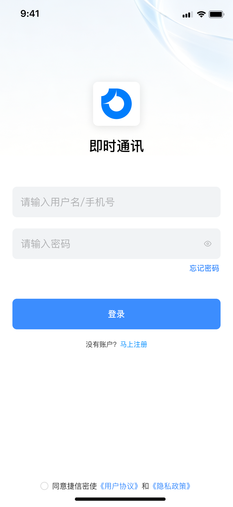

**状态：基本账号密码登录已实现；协议勾选和安全 Token 生命周期需改造。**

- 前端动作：账号、密码非空且已勾选协议后启用登录；密码仅驻留当前页面内存。
- 协议：已完成 `hi` 的 WebSocket 发送 `{login scheme:"basic"}`，`secret=base64(username:password)`；不得先登录再传企业码。
- 成功：读取 `{ctrl params.user/token/expires/authlvl}`，Token 存 Keychain/Keystore；立即 `sub me`，再加载会话。前端不解码 Token。
- 待改造：登录成功后签发短期 access token 与可轮换 refresh token；Token 绑定 `tenant_id/user_id/auth_version/device_id`。修改密码、封禁账号后旧 Token 失效。
- 错误：`AUTH_FAILED` 统一显示账号或密码错误；`TENANT_MISMATCH` 清 Token 并回企业码页；`ACCOUNT_DISABLED`、`REALNAME_REQUIRED`、`YOUTH_RESTRICTED` 按专用页面处理。

登录成功示例：

```json
{
  "ctrl": {
    "id": "login-1",
    "code": 200,
    "text": "ok",
    "params": {
      "user": "usr...",
      "authlvl": "auth",
      "token": "base64-opaque-token",
      "expires": "2026-08-11T10:30:15.123Z"
    }
  }
}
```

失败仍是同一 `{ctrl}` 结构，使用 `code` 和改造后的稳定 `params.reason` 分支；客户端不得用 `text` 做程序判断。

### 1.3 登录页面-密码错误.png

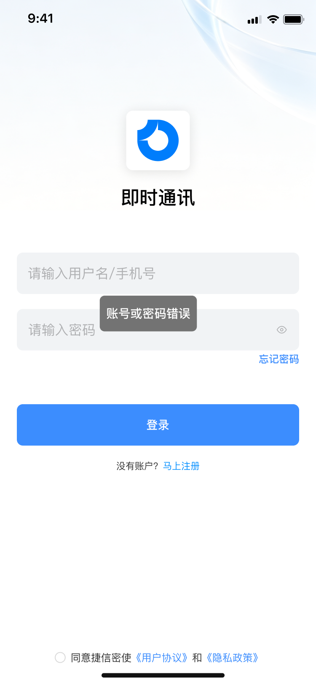

**状态：已实现基础错误，错误码和限流需改造。**

- 触发：`login` 返回 `{ctrl code:401}` 或产品错误 `AUTH_FAILED`。
- 前端：保留账号、清空密码、聚焦密码框；统一显示“账号或密码错误”，不得显示账号是否存在。
- 服务端：按 `tenant + account + device/IP` 限流，连续失败返回 `AUTH_RATE_LIMITED` 和 `retry_after_seconds`；日志仅记录账号哈希和 Request ID。
- 验收：同一不存在账号与错误密码在响应码、耗时区间、前端文案上保持一致。

### 1.4 注册页面.png

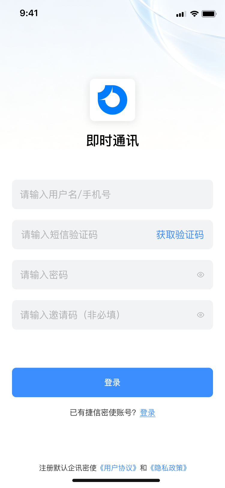

**状态：Tinode `{acc}` 基础注册已实现；短信预校验与租户配额需改造。**

- 获取验证码：调用 `POST /v1/im/auth/verification-codes`，Body `{"scene":"register","phone":"138****0000"}`；成功返回 `challenge_id`、`expires_in_seconds`、`resend_after_seconds`。
- 提交注册：前端校验密码一致和协议后，先调用 `POST /v1/im/auth/verification-codes/{challenge_id}/verify`，Body `{"code":"123456"}`，获得一次性 `verification_token`。
- WebSocket：把一次性验证结果放在 `{acc}.cred`，不得写入 `desc.private`。服务端必须在当前 Session 租户内消费该 Token。

```json
{"acc":{"id":"acc-1","user":"new","scheme":"basic","secret":"base64(username:password)","login":true,"tags":["tel:+86138..."],"cred":[{"meth":"tel","val":"+86138...","resp":"verification_token","params":{"challenge_id":"challenge-id"}}],"desc":{"public":{"fn":"用户昵称"}}}}
```
- 成功：返回新 `user` 和登录 Token，自动 `sub me`。创建用户前原子校验 `im_tenant_config.max_user_count`，超限返回 `TENANT_USER_QUOTA_EXCEEDED`。
- 安全：手机号在租户内唯一；验证码只保存摘要、单次消费；密码按服务端策略校验并使用强哈希保存。

### 1.5 注册页面-倒计时.png

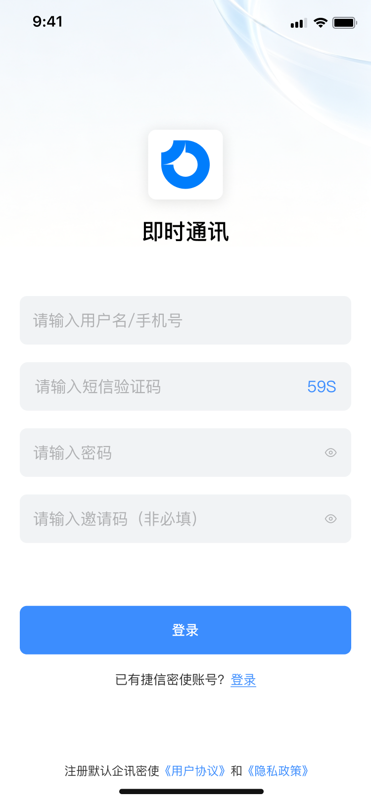

**状态：新增。**

- 倒计时以 1.4 返回的 `resend_after_seconds` 为准，并结合 `server_time` 计算，不能只依赖本地固定 60 秒。
- 倒计时内前端禁用按钮；即使绕过按钮重复调用，服务端返回 `VERIFICATION_RATE_LIMITED` 和剩余秒数。
- App 重进页面可使用内存/安全临时存储中的 `challenge_id` 恢复；超过 `expires_in_seconds` 必须重新发送，旧验证码失效。

### 1.6 忘记密码.png

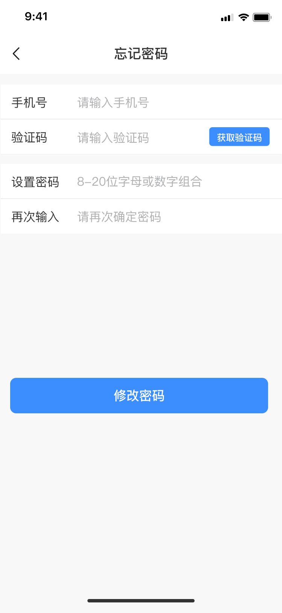

**状态：新增。**

- 发码：`POST /v1/im/auth/verification-codes`，Body `{"scene":"reset_password","phone":"..."}`。无论账号是否存在都返回相同受理响应。
- 校验：`POST /v1/im/auth/password-reset/challenges/{challenge_id}/verify`，Body `{"code":"123456"}`，成功返回短时、单次使用的 `reset_token`。
- 重置：`POST /v1/im/auth/password-reset/confirm`，Body `{"reset_token":"...","new_password":"..."}`，带幂等键。
- 成功：服务端更新密码、递增 `auth_version`、撤销该用户全部 access/refresh token 和在线 Session；客户端清理本租户凭证并返回登录页。
- 失败：`PASSWORD_POLICY_VIOLATION` 返回规则明细；验证码错误不返回账号存在性，达到上限后冻结 challenge。

### 1.7 身份验证（安卓）.png

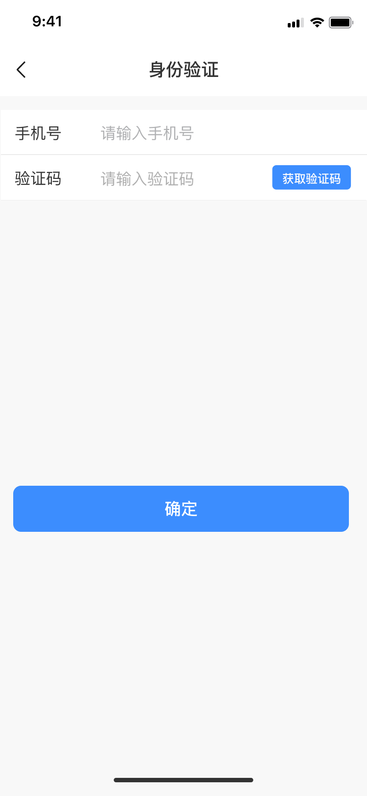

**状态：新增。**

- 敏感操作先调用 `POST /v1/im/security/challenges`，Body `{"scene":"close_youth_mode","channel":"sms"}`；手机号由登录身份读取，客户端不提交目标手机号。
- 发码/校验：服务端返回 `challenge_id` 和脱敏手机号；提交 `POST /v1/im/security/challenges/{id}/verify`，Body `{"code":"..."}`。
- 成功返回 `action_token`、`action`、`expires_at`；后续敏感接口以 `X-Action-Token` 携带，Token 只能用于指定动作且单次消费。
- 错误：`CHALLENGE_EXPIRED`、`CODE_INVALID`、`TOO_MANY_ATTEMPTS`；前端不得把短信验证码或 action token 落普通存储。

### 1.8 实名认证.png

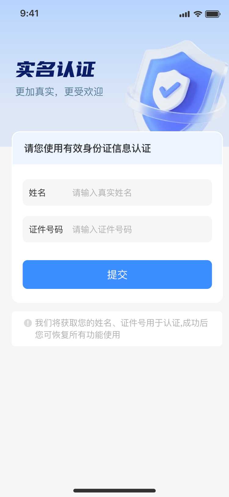

**状态：新增。**

- 查询：`GET /v1/im/security/realname` 返回 `status=unverified|pending|verified|rejected`、脱敏姓名/证件号和 `can_submit`。
- 提交：`POST /v1/im/security/realname/submissions`，Body `{"name":"张三","id_type":"cn_id","id_number":"..."}`，必须带幂等键。
- 成功：返回 `submission_id`、`status:"pending"`；前端禁用重复提交，通过 `GET /v1/im/security/realname` 或 `security.realname.updated` 系统事件更新状态。
- 安全：证件号传输和存储加密、展示脱敏；普通日志、搜索索引和消息中禁止出现原值；重复身份由租户策略决定并返回稳定错误。

### 1.9 实名认证-已实名.png

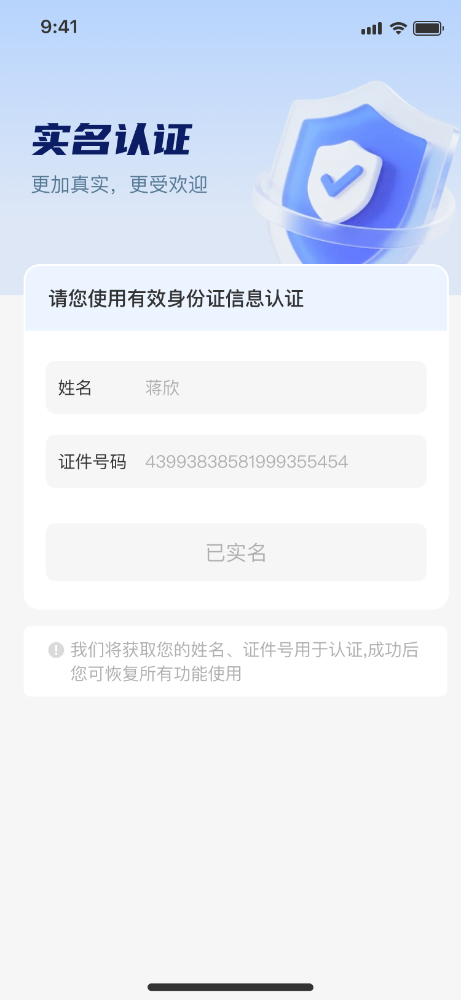

**状态：新增。**

- 页面只调用 `GET /v1/im/security/realname`。`verified` 时返回如 `masked_name:"张*"`、`masked_id_number:"110***********1234"`、`verified_at`。
- 前端只读展示，不缓存原始证件信息，不提供直接修改接口。
- 更正信息使用独立申诉 `POST /v1/im/security/realname/appeals`，需二次身份验证；不复用本页保存按钮。

### 1.10 实名认证（安卓）.png

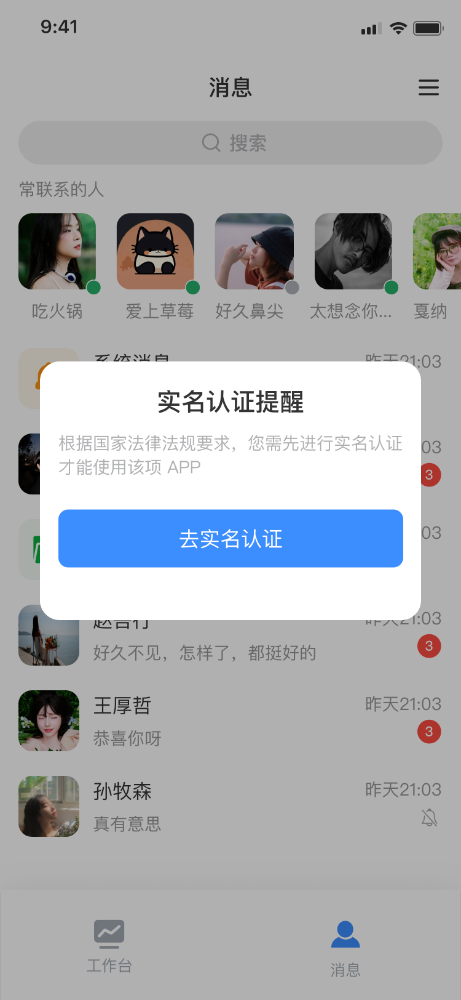

**状态：新增。**

- 登录后 `GET /v1/im/bootstrap` 返回 `security.realname{status,required,allow_skip,remind_after}`；只有 `required=true` 且未认证时显示弹窗。
- 点击“去认证”进入 1.8；点击稍后仅在 `allow_skip=true` 时本地关闭，并按 `remind_after` 控制再次提示。
- 服务端对必须实名的受限写操作仍返回 `REALNAME_REQUIRED`，前端弹窗不能作为授权依据。

### 1.11 设置独立密码（安卓）.png

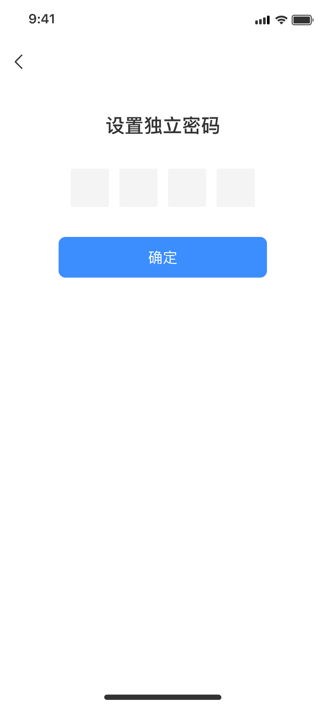

**状态：新增。**

- 设置：`POST /v1/im/settings/independent-password`，Body `{"password":"1234","purpose":"youth_mode","action_token":"..."}`；服务端只存强哈希，不返回密码。
- 验证：`POST /v1/im/settings/independent-password/verify` 返回短时 `action_token`，用于关闭青少年模式或修改密码。
- 规则：四位数字、禁止明显连续/重复组合；连续错误返回 `TOO_MANY_ATTEMPTS` 和 `retry_after_seconds`。前端输入框禁截屏/自动填充，离开页面立即清空。
- 忘记密码：跳转 1.7 的短信身份验证，验证后重置，不提供明文找回。

## 2. 消息首页、全局导航与系统通知

### 2.1 消息.png


**状态：会话订阅已实现；产品摘要和系统入口需改造。**

- 登录后发送 `sub me`，再通过 `get` 拉取 `sub` 元数据；每项使用 `topic`、`public`、`private`、`updated`、`seq/read/recv` 计算名称、摘要和未读数。
- 消息增量通过各 Topic 的 `{data}` 更新；未读数为 `max(seq-read,0)`，回执以服务端游标为准，不能只用本地计数。
- `GET /v1/im/bootstrap` 返回固定入口、功能开关、权限和系统 Topic；搜索调用 `GET /v1/im/search/conversations?q=&cursor=`。
- 本地缓存按 `tenant_code + user_id` 隔离。切租户、退出或账号变化时不得复用另一身份的会话摘要。

### 2.2 消息-无网络状态.png

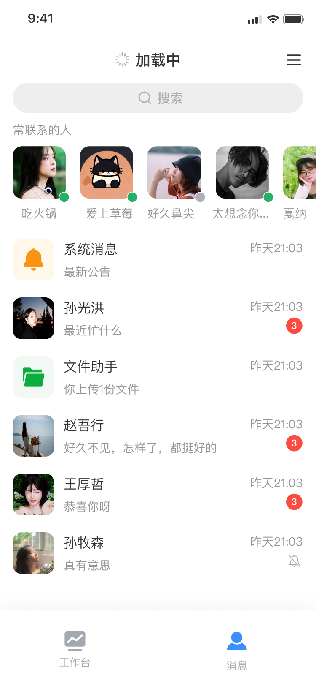

**状态：需改造客户端恢复流程和消息幂等。**

- 纯网络状态由客户端监听；断网时展示缓存并禁止需要在线确认的写操作，未发送消息进入本地 `pending` 队列。
- 使用指数退避加随机抖动重连；恢复后严格执行 `hi -> token login -> sub me -> 恢复 Topic -> get data`。
- 每个 Topic 按最后持久化的 `seq/read/recv` 增量拉取。重发消息复用 `x-im-client-mid`，服务端需实现去重并返回原 `seq`。
- Token 失效转登录页；租户停用返回企业不可用页；禁止无限快速重连。

### 2.3 消息-更多.png

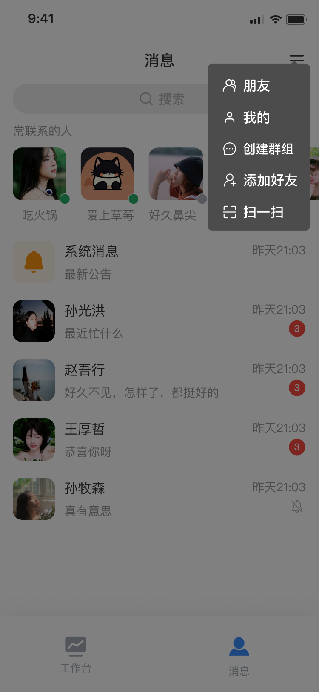

**状态：菜单为纯客户端；权限数据新增。**

- 菜单打开/关闭不调用服务端。菜单项来自登录后 `GET /v1/im/bootstrap` 的 `features` 与 `permissions`。
- `create_group=false` 时隐藏“创建群聊”；`user_search=false` 时隐藏“添加好友”；扫码权限只影响实际扫码，不影响服务端授权。
- 各入口协议分别见 5.3、6.1、10.1；服务端在实际写接口再次鉴权，不能只依赖隐藏按钮。

### 2.4 消息页面—长按弹出.png

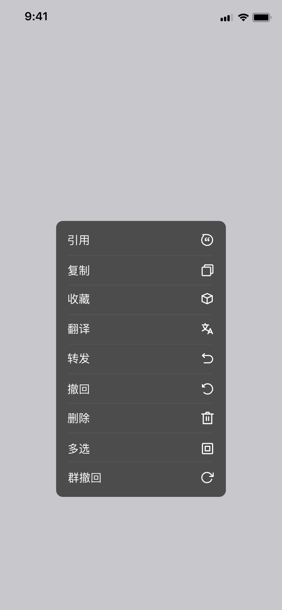

**状态：基础消息操作部分已实现；产品权限矩阵需改造。**

- 长按本身不请求。客户端根据消息的 `type/from/seq/created_at/status`、当前 Topic 权限和服务端下发的 `message_policy` 预裁剪菜单。
- 引用/复制为本地动作；收藏见 4.16；转发见 4.17～4.20；删除使用 Tinode `{del what:"msg",topic,delseq}`；撤回需新增 `POST /v1/im/topics/{topic}/messages/{seq}/recall`。
- 编辑使用 `POST /v1/im/topics/{topic}/messages/{seq}/revisions`，Body `{"content":...,"client_mid":"..."}`；仅文本且在时限内允许。
- 群回执调用 `GET /v1/im/topics/{topic}/messages/{seq}/receipts?cursor=`。所有最终操作由服务端验证消息归属、时限、群角色和租户。

### 2.5 系统消息.png

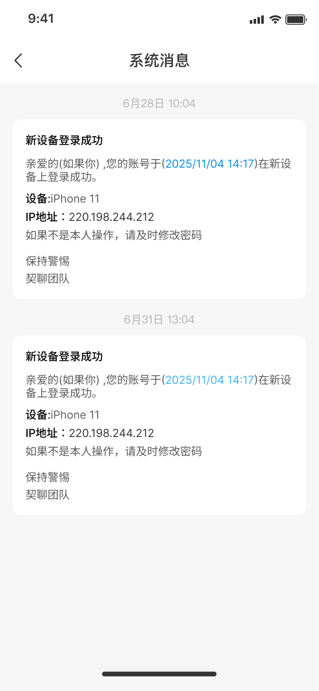

**状态：需改造。**

- `GET /v1/im/system-notifications?cursor=` 返回 `id,event_type,title,summary,created_at,read_at,action`；新通知通过服务端专用系统 Topic 的 `system_event` 消息推送。
- 新设备登录事件内容为 `device_name,platform,ip_masked,login_at,security_action`；IP 只下发必要脱敏值。
- 已读：`POST /v1/im/system-notifications/{id}/read`，带幂等键；跳转目标只接受服务端白名单 `action.type` 和内部参数。
- 当前普通认证用户可向 `sys` Topic 发布的路径必须封禁。客户端不得渲染普通用户伪造的系统卡片为可信通知。

## 3. 单聊会话、会话建立与消息状态

### 3.1 个人对话框（对方的状态）.png

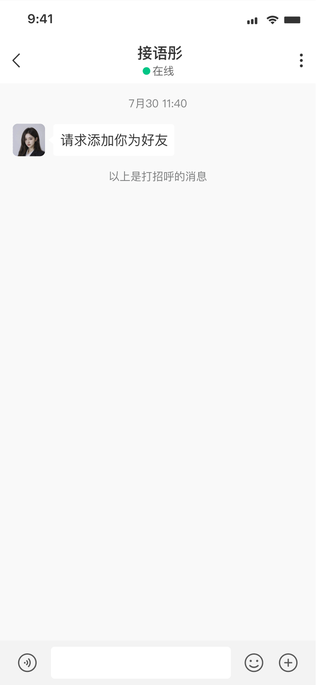

**状态：需改造好友关系状态。**

- 进入会话先 `GET /v1/im/conversations/{topic}/context`，返回 `relationship=pending_inbound`、`can_send=false`、对方公开资料和申请 ID。
- 历史申请提示由 `relationship_event` 系统消息渲染；普通消息仍通过 Topic `{data}` 下行。
- 输入区锁定；“通过/拒绝”调用 5.2 的好友申请接口。前端不可通过直接 `pub` 绕过，服务端发布路径必须校验好友关系。

### 3.2 个人对话框（对方的状态）(1).png

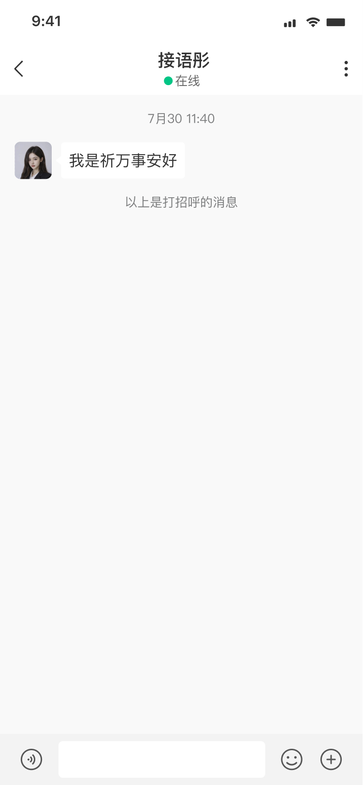

**状态：在线状态已具备基础能力；关系文案新增。**

- 订阅 P2P Topic 后用 `{pres}` 更新在线/离线，`last_seen` 仅在对方隐私允许时展示。
- `GET /v1/im/conversations/{topic}/context` 返回 `display_name,avatar_file_id,online_visibility,relationship`。
- 好友关系变化由服务端生成 `system_event{event_type:"friend_relationship_changed"}`，客户端不得根据本地动作自行永久插入系统记录。

### 3.3 个人对话框（我的状态）.png

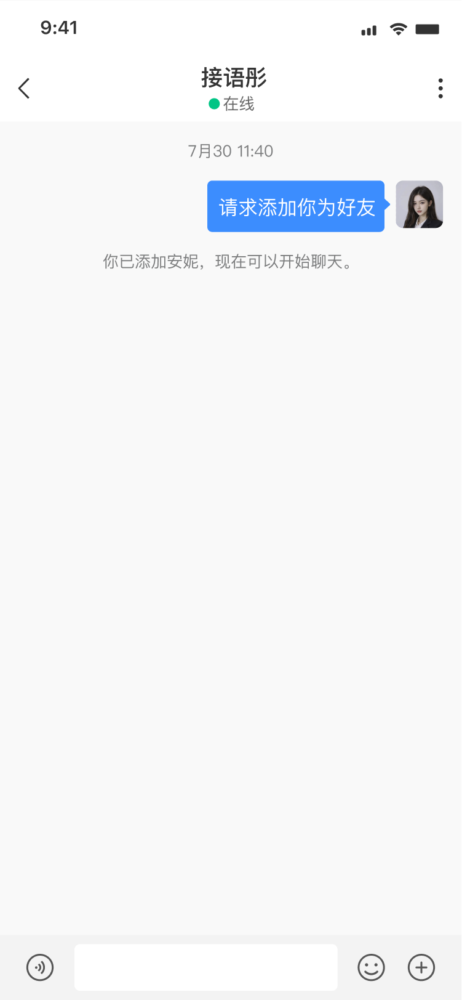

**状态：新增好友申请状态。**

- 发起申请使用 `POST /v1/im/friend-requests`，Body `{"target_user_id":"usr...","message":"我是...","source":"search"}`。
- 返回 `request_id,status:"pending",created_at`；页面以该服务端状态显示“已发送”，重复点击用同一幂等键返回原申请。
- 申请待处理时 `context.relationship=pending_outbound`、`can_send=false`，禁止重复创建和普通消息发送。

### 3.4 个人对话框（我的状态）(1).png

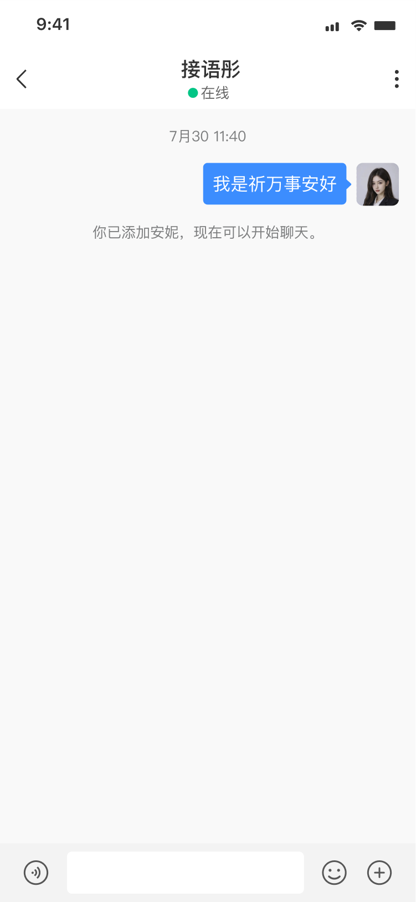

**状态：发送和读回执已实现基础能力；送达状态映射需统一。**

- 本地生成 `client_mid` 后显示 `sending`；`pub` 收到 `202 + seq` 更新为 `sent`；失败保留同一 `client_mid` 重试。
- 对方 `note what:"recv"` 更新 `delivered`，`note what:"read"` 更新 `read`；多设备取服务端最大游标。
- 状态只附着在气泡元数据，不修改消息正文。服务端拒绝时映射为 `failed(reason)`，不得伪装成已发送。

### 3.5 开启沟通页面.png

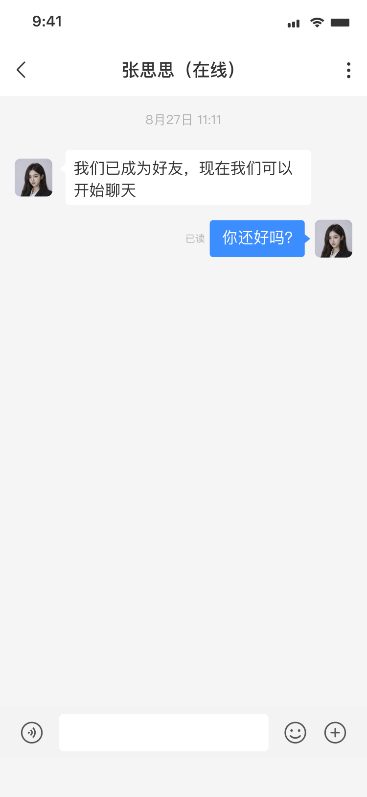

**状态：新增好友审批与 Topic 联动。**

- 好友申请通过后，服务端在同一事务内建立双方关系和 P2P 订阅，并生成 `friend_relationship_changed:accepted` 系统事件。
- 客户端收到事件或重新查询 `context.relationship=friend` 后解锁输入区；不得仅因本地“通过”按钮成功动画解锁。
- 首次进入订阅 P2P Topic，再按 `since` 拉取申请上下文和正常消息。

### 3.6 双方沟通状态.png

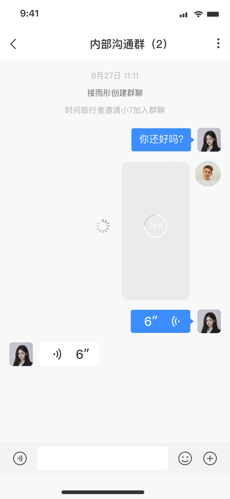

**状态：上传基础已实现；媒体消息 Schema、ACL 和恢复需改造。**

- 选择媒体后本地生成 `client_mid` 和稳定占位；调用文件上传，得到 `file_id` 后再 `pub x-im-type=image|video|voice`。
- `content` 至少含 `file_id,name,size,mime,width,height,duration_ms,thumbnail_file_id` 中适用字段；上传进度是客户端任务状态，不写成聊天消息。
- 服务端发布成功后关联文件与 Topic/消息；文件下载必须校验消息可见性。上传失败只重试上传，成功但 `pub` 失败时复用已上传 `file_id` 和 `client_mid`。

### 3.7 个人对话—拉黑状态／已读状态.png

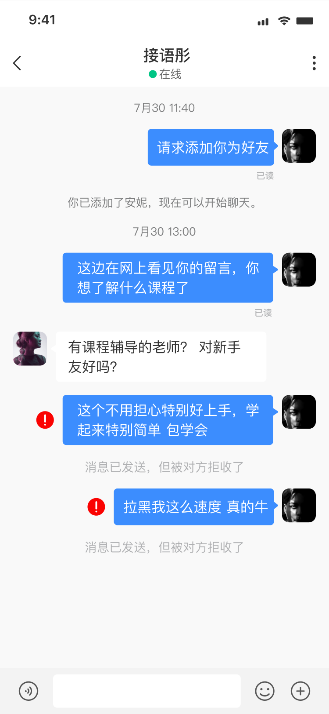

**状态：黑名单产品规则新增。**

- 拉黑后 `context.relationship=blocked_by_me|blocked_by_peer`、`can_send=false`；服务端 `pub` 返回统一 `MESSAGE_NOT_ALLOWED`，不得向发送者泄露具体是对方拉黑。
- 失败消息只保存在发送端本地并显示失败，不下发给对方、不写入正常消息表。
- 已读仍按历史最大 `read` 渲染；拉黑不能回滚既有回执。解除拉黑见 5.10、5.12。

### 3.8 个人对话—删除状态.png

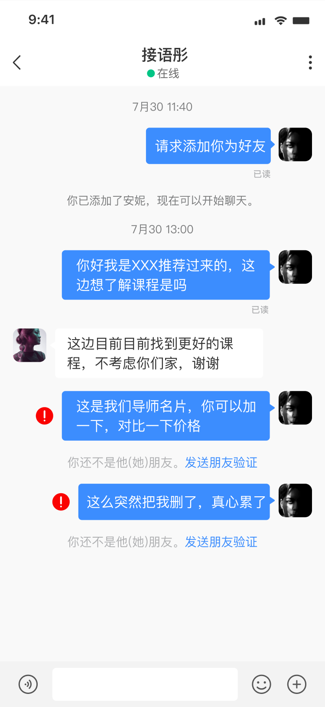

**状态：新增好友删除后的发送约束。**

- 删除好友使用 `DELETE /v1/im/friends/{user_id}`；成功后双方关系变为 `none`，服务端推送关系变化事件。
- 后续 `pub` 返回 `FRIEND_RELATION_REQUIRED`；前端保留失败草稿，提供“重新添加好友”入口，不自动发申请。
- 历史聊天是否保留由 Topic 权限决定，删除好友不等于删除双方历史消息。

### 3.9 个人对话-键盘收起状态.png

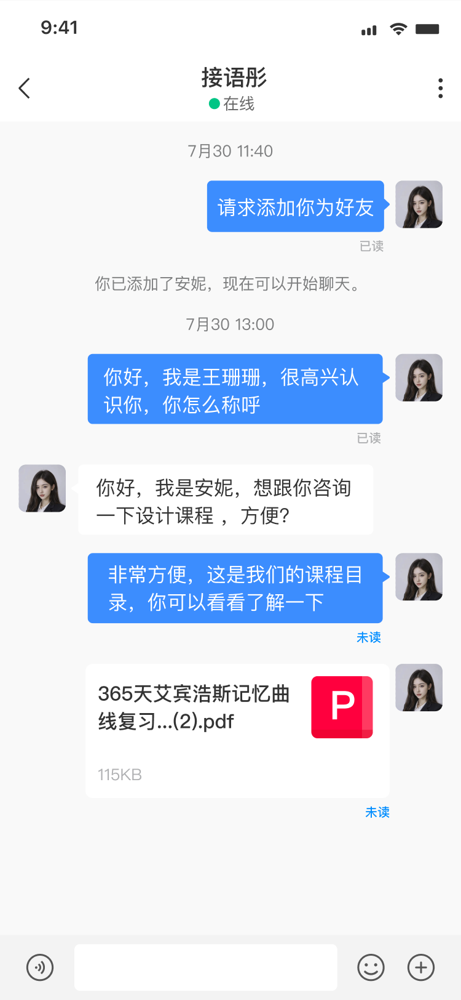

**状态：纯客户端。**

- 键盘、表情和附加面板收起不调用服务端；保持列表锚点和未发送草稿。
- 草稿默认按 `tenant + user + topic` 本地加密保存；若实现多端草稿，再单独调用 `PUT /v1/im/topics/{topic}/draft`，不得混入聊天消息。

### 3.10 个人对话-发各种文件状态.png

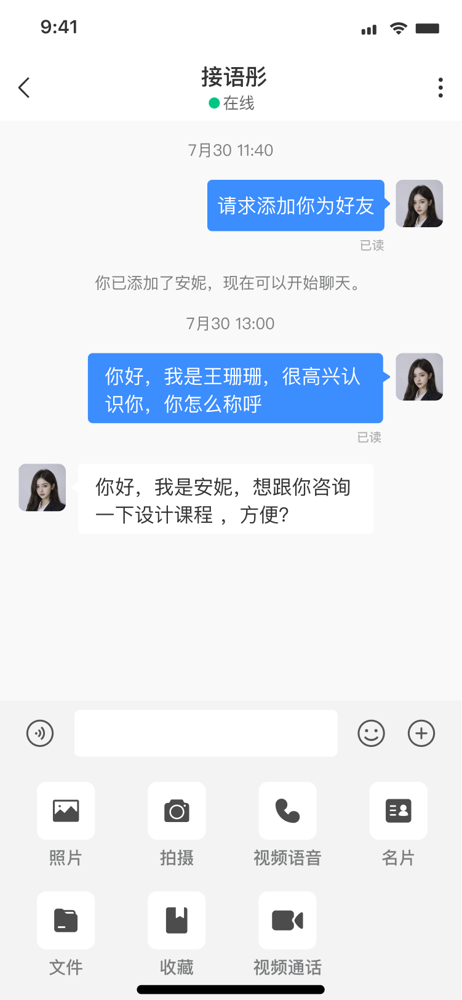

**状态：面板纯客户端；上传需改造。**

- 打开面板不请求。选择前依据 `context.capabilities` 判断图片、视频、语音、文件是否允许，调用系统选择器/相机。
- 上传前校验 `mime,size` 和 `bootstrap.limits.max_file_size`；服务端仍必须重新校验租户配额、文件类型和会话权限。
- 具体上传/发消息使用 3.6 协议；相机和麦克风授权见 10.20、10.21。

### 3.11 个人对话-发各种文件状态(1).png

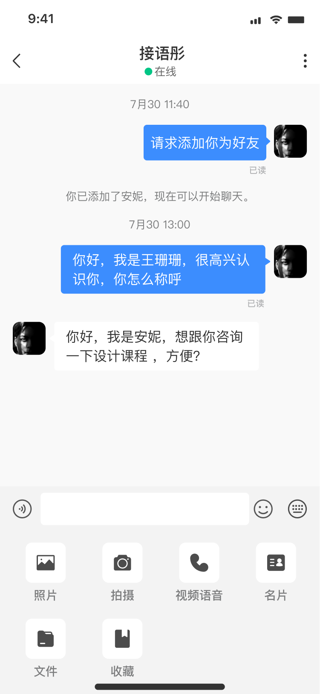

**状态：需改造产品消息 Schema。**

- 客户端按 `x-im-type` 选择文本、名片、文件等卡片，公共字段统一使用 `from,topic,seq,ts,head,content`。
- 每种卡片必须实现未知字段忽略、未知类型占位、发送/失败/回执状态和长按动作。
- 重新安装或换设备后仅凭服务端消息即可还原卡片，不能依赖发送端本地路径或临时 URL。

### 3.12 个人对话-发送名片状态.png

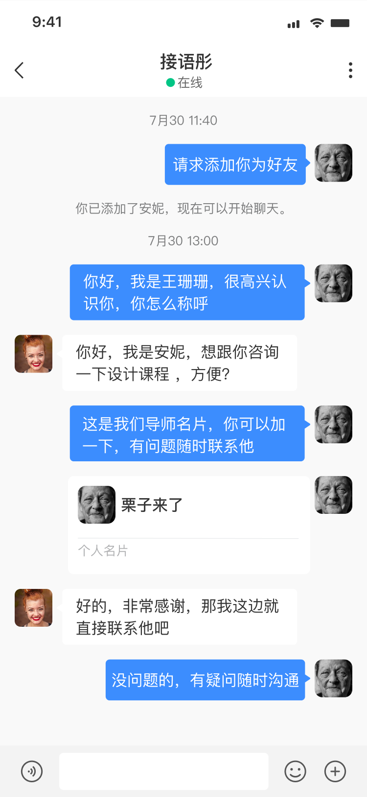

**状态：新增产品消息类型。**

- 选人：`GET /v1/im/friends?query=&cursor=`；选择后发送 `x-im-type:"contact_card"`。
- `content` 为 `{"user_id":"usr...","display_name":"张三","avatar_file_id":"...","public_account":"A1024"}`；服务端按目标用户当前公开资料生成/校正快照，禁止手机号、证件号等敏感字段。
- 点击卡片调用 `GET /v1/im/users/{user_id}/profile`；用户不可见或已离职时显示失效卡片，不跨租户查询。

## 4. 消息输入、媒体内容与消息操作

### 4.1 键盘展开.png

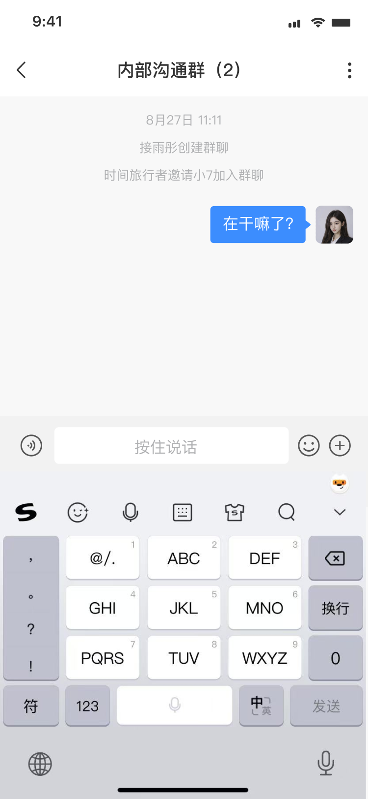

**状态：纯客户端。**

- 键盘展开、列表上推和光标变化不调用服务端；草稿按 `tenant + user + topic` 保存。
- 点击发送时才校验 `context.can_send` 并执行 `pub text`；正文去首尾策略、最大长度从 `bootstrap.limits.max_text_length` 获取，服务端再次校验。

### 4.2 @人员—选择提醒人.png

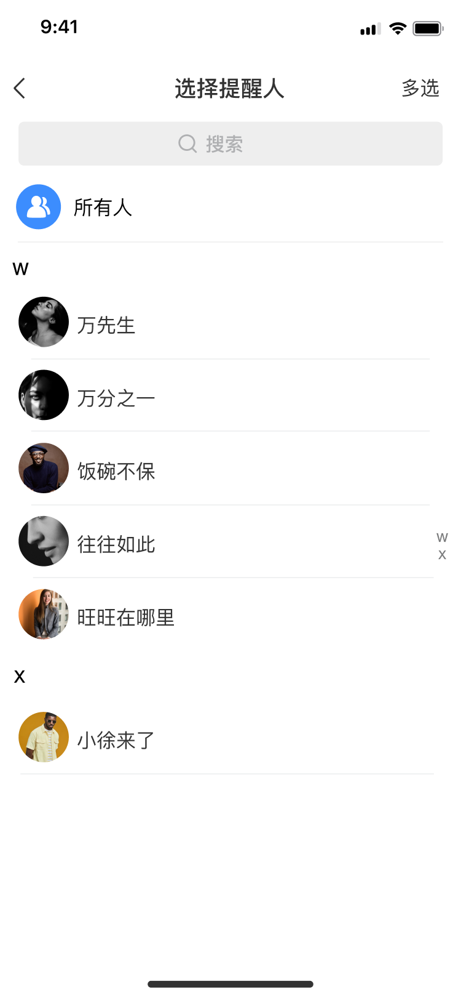

**状态：新增群成员查询。**

- 输入 `@` 后调用 `GET /v1/im/groups/{topic}/members?query=&cursor=&mentionable=true`，返回 `user_id,display_name,avatar_file_id,role,mentionable`。
- `@所有人` 是虚拟项，只有响应 `permissions.can_mention_all=true` 时展示，不以特殊用户 ID 表示。
- 搜索做 300ms 防抖并取消旧请求；服务端只返回当前租户且仍在群内的成员。

### 4.3 @人员—完成.png

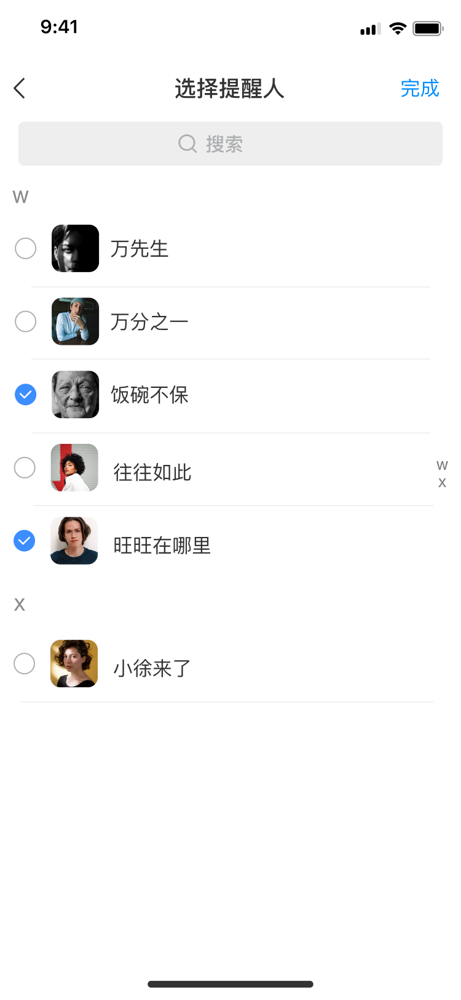

**状态：纯客户端选择；发送协议需改造。**

- 完成后在编辑器插入带范围的 Mention 节点，内部保存 `user_id`，显示昵称只是快照。
- 发送时 `pub.head.mentions=[{"user_id":"usr...","offset":0,"length":3}]`；`@所有人` 使用 `mention_all:true`，不得伪造用户 ID。
- 服务端验证成员身份和 `mention_all` 权限；无效成员可删除提醒语义但保留可读文本，越权 `@所有人` 返回 `MENTION_ALL_FORBIDDEN`。

### 4.4 @人员状态.png

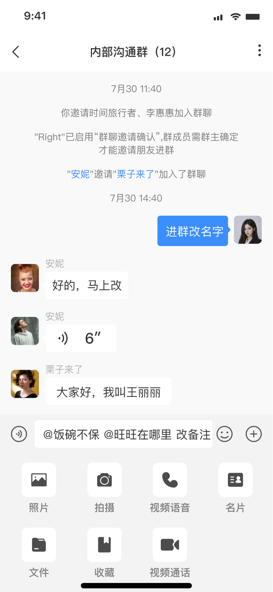

**状态：需改造提醒和 Push。**

- 消息仍通过 `{data}` 下行，客户端使用结构化 `mentions` 高亮，禁止通过字符串扫描昵称判断。
- 当前用户被提及时会话摘要标记 `mentioned=true`；读到对应 `seq` 后随 `note read` 清除。
- Push 服务按结构化目标生成“有人@你”文案；已退群用户不能收到新提醒，但历史消息仍按快照渲染。

### 4.5 表情包展开（发送按钮默认状态）.png

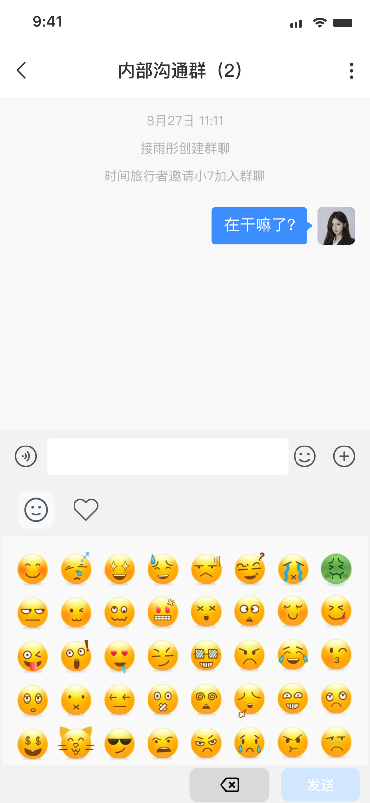

**状态：纯客户端。**

- 面板、分类、最近使用和删除键均本地处理；未选择内容且文本为空时禁用发送。
- Unicode 表情作为普通 `text` 内容发送。自定义表情资源首版未定义，不得把本地资源路径直接发送。

### 4.6 表情包发送页面.png

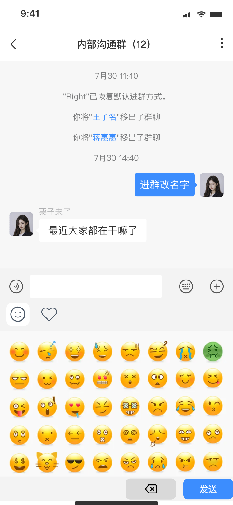

**状态：Unicode 表情使用已实现文本消息；独立表情包新增。**

- 文本表情按 `pub x-im-type:text` 发送。独立自定义表情若启用，使用 `x-im-type:"sticker"`，`content={pack_id,sticker_id,file_id,width,height}`。
- 自定义表情发送前服务端校验表情包属于当前租户且可用；未知表情显示占位，不使用任意外链 URL。

### 4.7 语音—按住说话.png

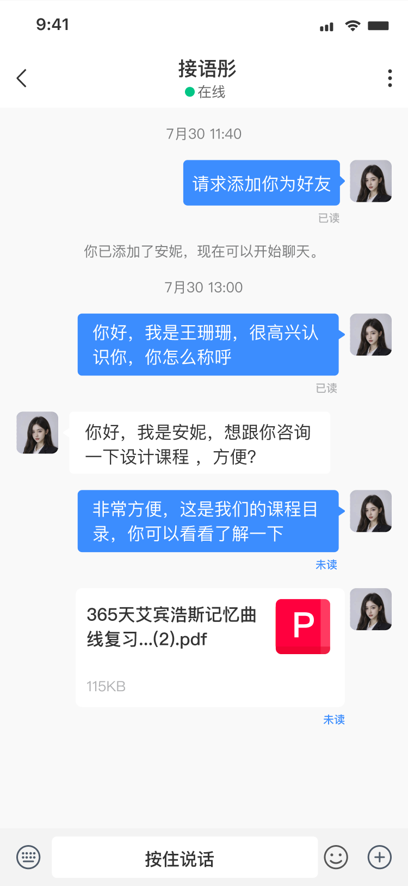

**状态：录音纯客户端；上传和语音消息需改造。**

- 按下前检查麦克风权限和 `context.capabilities.voice`；权限不足进入 10.21，不发请求。
- 松开发送：编码为服务端允许的 MIME，校验最短/最长时长，上传后 `pub x-im-type:voice`，内容含 `file_id,duration_ms,size,mime,waveform`。
- 上滑取消、过短、系统来电打断时删除临时文件，不调用上传接口。

### 4.8 语音按住说话.png

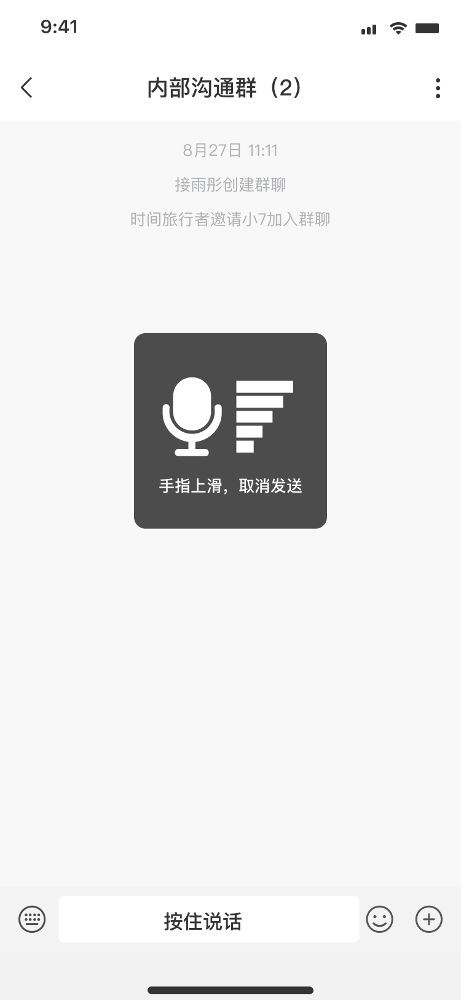

**状态：纯客户端。**

- 音量幅度、上滑取消区域和浮层颜色来自本地录音会话，不上传实时音量。
- 进入取消区只改变本地状态；最终抬手决定删除或执行 4.7 的上传发送。

### 4.9 内容沟通对话3-语音录音中.png

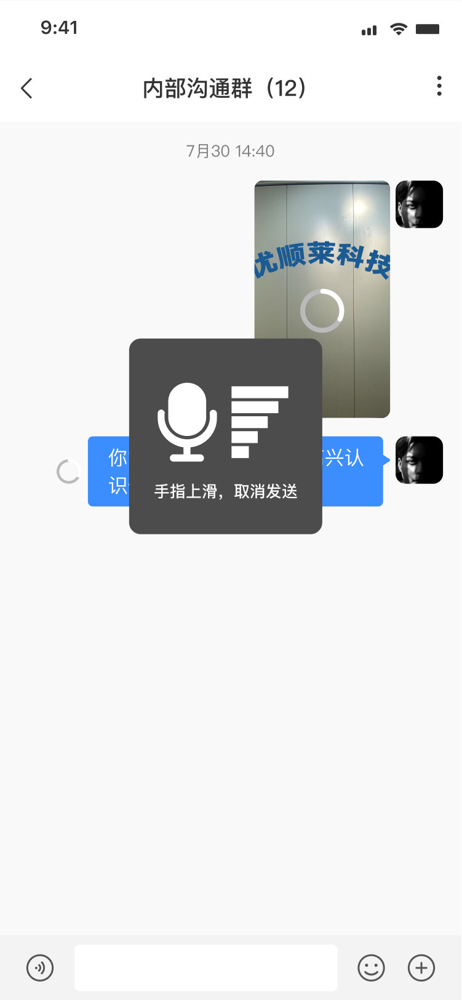

**状态：录音纯客户端；临时状态可选改造。**

- 录音期间客户端锁定其他媒体入口。默认不向群成员广播“正在录音”，以减少隐私暴露和状态风暴。
- 若产品确认需要，可发送不落库的 `{note what:"kpa",topic}`；服务端限频，其他端超时自动消失，不能作为聊天记录。

### 4.10 内容沟通对话3-图片和语音发送中.png

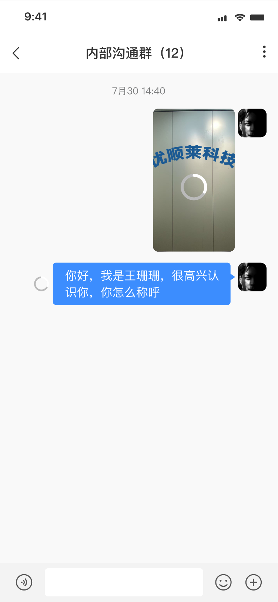

**状态：客户端任务管理新增；服务端上传需改造。**

- 每个待发送项保存 `client_mid,local_uri,type,upload_id,progress,state`；同一文件可分片/断点续传时使用稳定 `upload_id`。
- 上传完成后再发布消息；多任务可并发但必须各自保持原排序号。离开页面不取消，退出账号必须暂停并隔离任务。
- 服务端返回 `FILE_TOO_LARGE`、`FILE_TYPE_NOT_ALLOWED`、`STORAGE_QUOTA_EXCEEDED` 时不可自动无限重试。

### 4.11 内容沟通对话3-语音／视频／图片状态.png

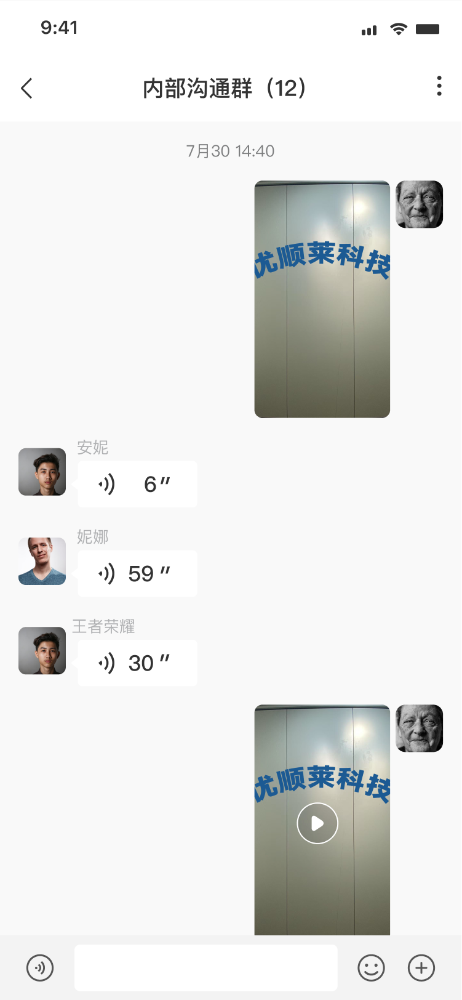

**状态：需改造媒体 Schema 和受权下载。**

- 语音渲染 `duration_ms,waveform`，未听状态保存在客户端并可选跨端同步；视频渲染 `thumbnail_file_id,duration_ms,width,height`；图片渲染缩略图和原图 ID。
- 预览前使用认证文件接口获取，服务端校验当前用户仍可访问引用消息；附件撤回或过期返回 `FILE_UNAVAILABLE`。
- 缩略图和原文件分别授权，客户端缓存键必须包含租户与用户。

### 4.12 语音图片发送状态.png

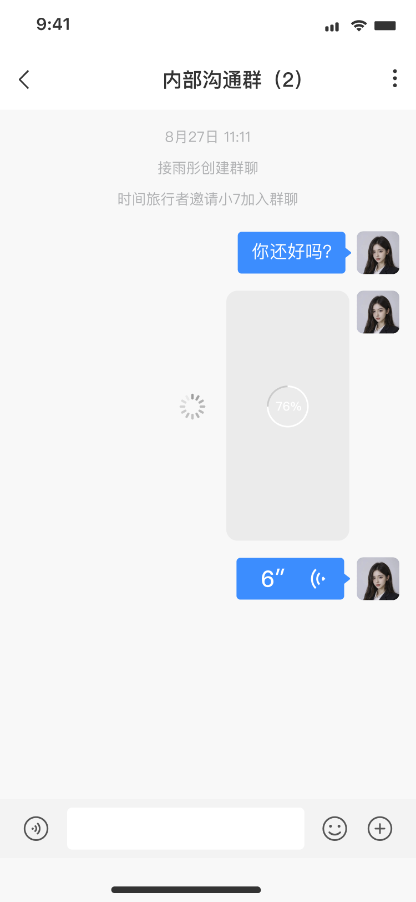

**状态：需改造。**

- 图片选择后立即显示本地缩略图，上传成功后只替换资源来源，不改变 `client_mid` 或列表位置。
- 失败展示重试按钮；重试复用同一上传任务和消息幂等 ID。语音播放与图片上传状态相互独立。

### 4.13 上传文件.png


**状态：纯客户端视觉资源。**

- 该图片仅定义统一上传图标和无障碍名称“上传文件”，不产生网络请求。
- 文件助手、群文件、会话附件、反馈证据实际上传时统一走 0.2 文件接口，并额外提交业务 `purpose` 以便服务端执行权限和保留期策略。

### 4.14 文件发送状态.png

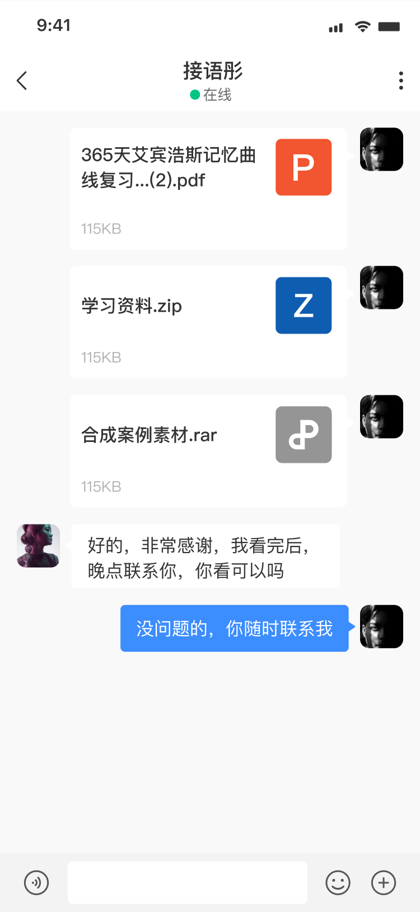

**状态：上传已实现基础能力；消息引用和 ACL 需改造。**

- 上传成功后发送 `x-im-type:file`，`content={file_id,name,size,mime,extension,checksum}`；文件名做长度和控制字符清理。
- 服务端在消息落库事务中关联文件；未关联的临时上传按 TTL 清理。卡片下载见 7.9～7.11。
- 多文件逐个生成 `client_mid`，某个失败不能改变其他文件状态。

### 4.15 多选-选中对话框.png

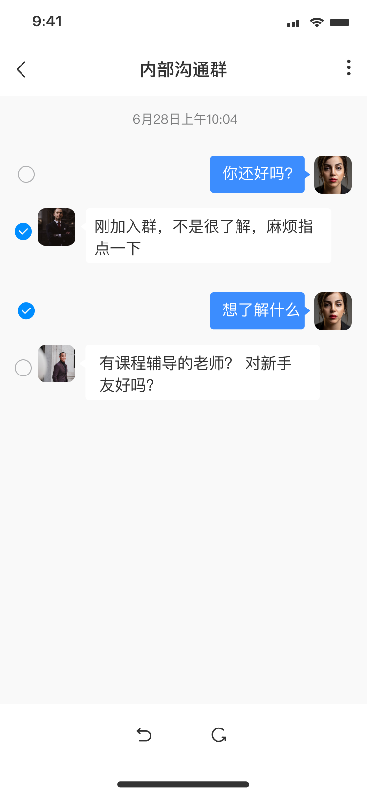

**状态：选择纯客户端；批量动作新增。**

- 客户端按 `(topic,seq)` 保存已选项并显示数量；默认最多 100 条，超限在本地阻止。
- 转发、收藏、删除前把选中列表提交对应接口；服务端逐条校验仍可见、类型支持和权限，返回 `succeeded[]` 与 `failed[{seq,reason}]`。
- 不允许只因第一条可操作就假定整批可操作。

### 4.16 多选-选中对话内容-收藏成功.png

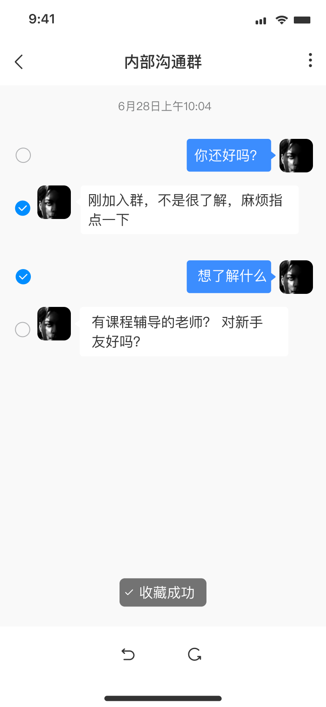

**状态：新增。**

- `POST /v1/im/favorites/batch`，Body `{"messages":[{"topic":"grp...","seq":"123"}]}`，带幂等键。
- 返回 `created_count,existing_count,failed[]`；同一用户对同一 `topic+seq` 重复收藏不新增记录。
- 收藏保存原消息引用、不可变展示快照和附件授权关系；成功 Toast 只在至少一项成功时展示，部分失败需给出汇总。

### 4.17 转发-单选.png

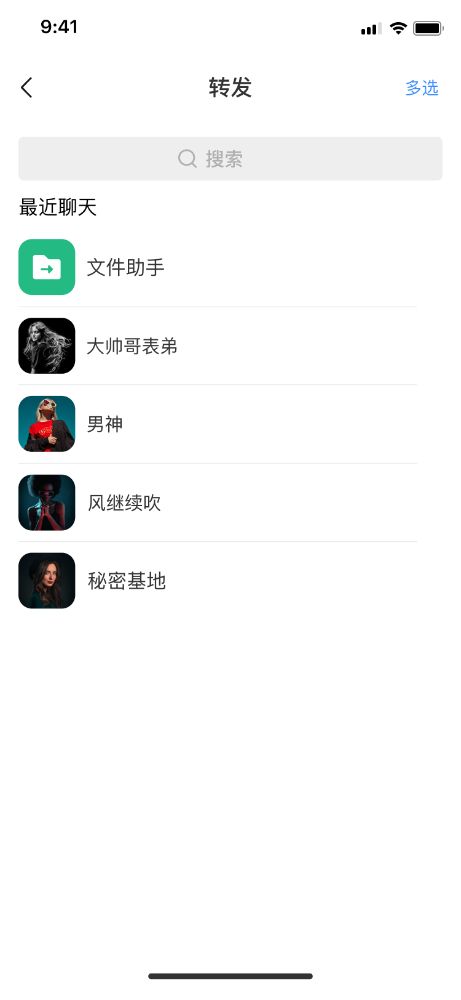

**状态：新增。**

- 目标列表：`GET /v1/im/forward-targets?query=&cursor=`，只返回 `can_receive_forward=true` 的会话和文件助手。
- 选中后本地进入确认页，不立即发送；服务端在最终转发接口再次校验目标 Topic、原消息和附件权限。

### 4.18 转发-多选.png

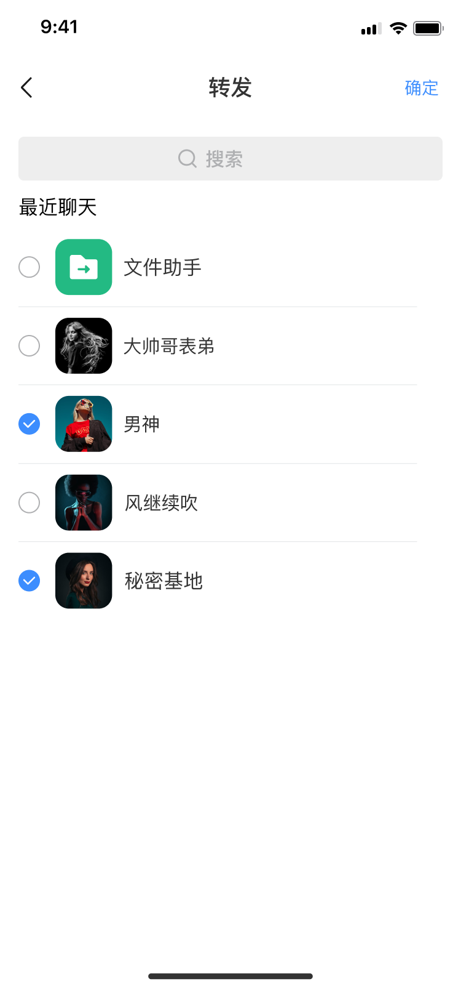

**状态：新增。**

- 目标查询同 4.17；多选最多取 `bootstrap.limits.max_forward_targets`，首版建议 9。
- 确认前只保存目标 Topic 字符串；不得缓存或提交 `tenant_id`。跨租户 Topic 在服务端统一拒绝。

### 4.19 转发—逐条转发.png

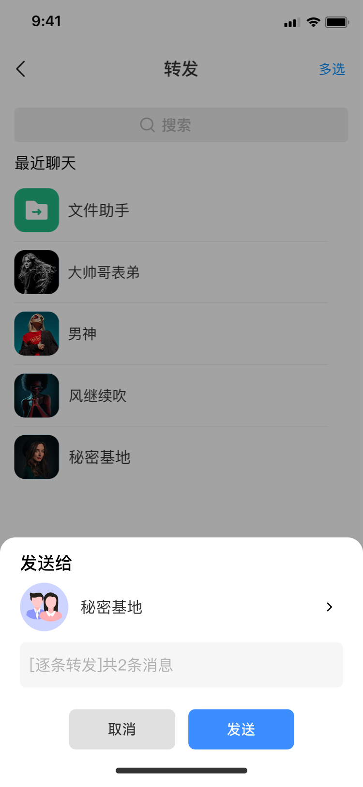

**状态：新增。**

- `POST /v1/im/messages/forward`，Body `{"mode":"separate","sources":[{"topic":"p2p...","seq":"12"}],"target_topics":["grp..."],"comment":"..."}`。
- 返回每个目标和源消息的 `client_mid/seq/status`；服务端保持源顺序，重新生成目标消息，不能复用原 `seq`。
- 附件必须建立新的授权引用；原消息已撤回、过期或不可见时该项失败。留言作为每个目标的一条独立文本消息发送。

### 4.20 转发—合并转发—多选状态.png

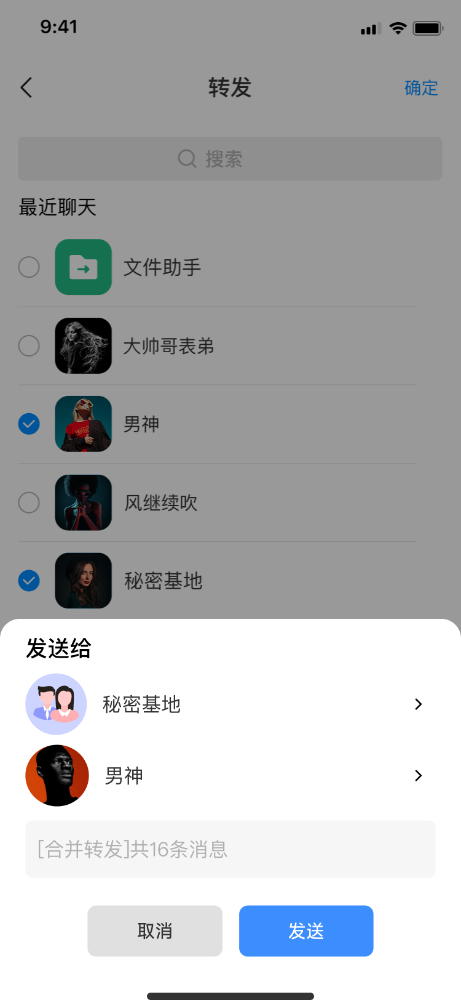

**状态：新增。**

- 调用 4.19 接口，`mode:"bundle"`；服务端生成 `forward_bundle`，内容含 `bundle_id,title,item_count,preview[]`，完整内容通过 `GET /v1/im/forward-bundles/{bundle_id}?cursor=` 获取。
- 快照保留显示名、时间和内容摘要，对撤回/敏感字段按策略脱敏；不得允许接收端利用 Bundle 获取原会话额外权限。
- 多目标共享不可变 Bundle 内容但分别生成目标消息与授权记录。

## 5. 通讯录、好友关系与黑名单

### 5.1 通讯录.png

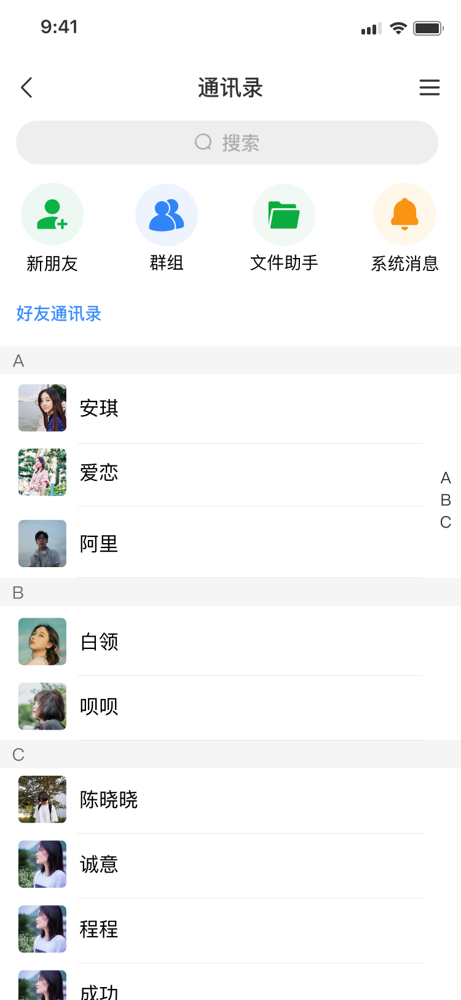

**状态：新增产品通讯录接口。**

- 好友列表：`GET /v1/im/friends?query=&initial=&cursor=`，返回 `user_id,display_name,remark,avatar_file_id,initial,online_visibility`；显示名优先级为备注名、昵称、账号。
- 组织成员：`GET /v1/im/organization/members?query=&department_id=&cursor=`；好友和组织成员是两种关系，前端不得混为一个可发消息权限。
- 新朋友未处理数、群列表、文件助手和系统消息入口由 `GET /v1/im/bootstrap` 返回。列表缓存以租户和用户隔离。

### 5.2 新朋友.png

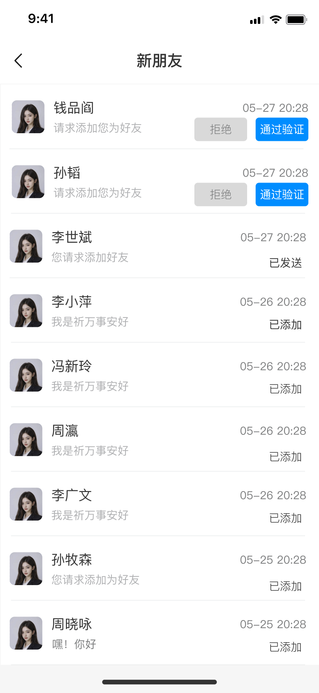

**状态：新增。**

- 列表：`GET /v1/im/friend-requests?direction=inbound&status=all&cursor=`，返回 `request_id,applicant,message,source,status,created_at,handled_at`。
- 同意：`POST /v1/im/friend-requests/{request_id}/accept`；拒绝：`POST /v1/im/friend-requests/{request_id}/reject`，均带幂等键和可选 `version`。
- 成功返回最终 `status` 和 P2P `topic`。重复审批返回原结果；并发冲突返回 `REQUEST_ALREADY_HANDLED` 并附当前状态，前端刷新该项。

### 5.3 添加好友.png

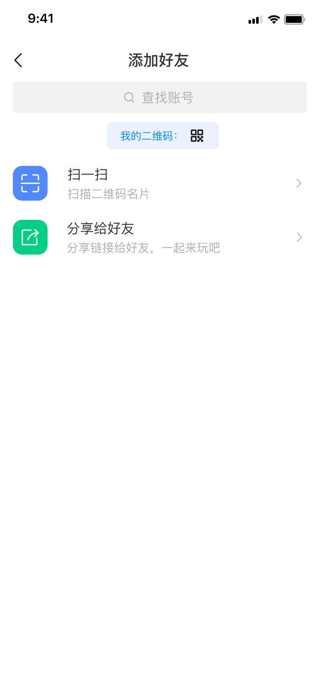

**状态：新增。**

- 账号搜索：`GET /v1/im/users/search?q=&type=account&cursor=`；扫码后调用 `POST /v1/im/qrcodes/resolve`，Body `{"token":"...","purpose":"add_friend"}`。
- 结果统一返回 `relationship=none|friend|pending_inbound|pending_outbound` 和 `can_add`；隐私不允许或未找到统一为 `USER_NOT_DISCOVERABLE`。
- 分享/二维码见 5.4；发申请见 5.6。服务端按租户配置 `allow_user_search` 和用户隐私再次拦截。

### 5.4 添加好友(1).png


**状态：新增。**

- 获取二维码：`POST /v1/im/me/qrcodes`，Body `{"purpose":"add_friend","expires_in_seconds":86400}`，返回 `qr_token,qr_payload,expires_at,display_profile`。
- 二维码只含不透明、签名、带租户和用途约束的短期 Token，不直接放手机号、用户 ID 或 access token。
- 分享/保存图片是客户端动作；扫码解析始终调用 5.3，过期返回 `QR_CODE_EXPIRED`，篡改返回 `QR_CODE_INVALID`。

### 5.5 添加好友-输入精准用户ID.png

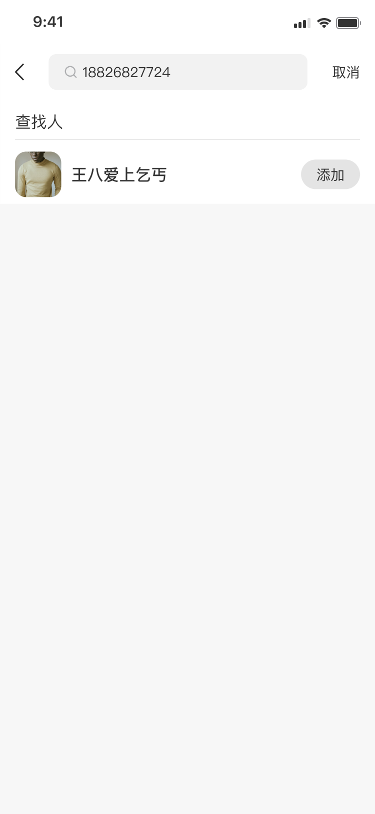

**状态：新增。**

- 精准查询仍调用 `GET /v1/im/users/search?q=&type=exact_account`；手机号查询仅当租户和目标隐私同时允许时使用 `type=phone`。
- 每项返回公开资料和 `action=add|chat|pending|none`。前端不得根据是否返回手机号推断账户存在。
- 搜索限流返回 `SEARCH_RATE_LIMITED`；禁止客户端批量枚举 ID。

### 5.6 添加好友验证.png

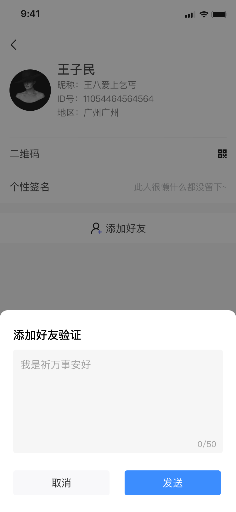

**状态：新增。**

- `POST /v1/im/friend-requests`，Body `{"target_user_id":"usr...","message":"验证留言","source":"search|qr|group","source_topic":"grp..."}`。
- 留言最多 50 个 Unicode 字符，服务端做敏感内容审核；`source_topic` 只能是双方当前可见的同租户群。
- 成功返回 `request_id,status:"pending"`；重复有效申请返回原记录，目标隐私关闭时返回统一 `FRIEND_REQUEST_NOT_ALLOWED`。

### 5.7 好友个人主页.png


**状态：新增。**

- `GET /v1/im/users/{user_id}/profile` 返回按当前查看人裁剪后的 `display_name,remark,avatar_file_id,gender,region,public_account,signature,relationship,capabilities`。
- 发消息使用返回的 P2P `topic`；没有 Topic 时调用 `POST /v1/im/conversations/p2p`，Body `{"peer_user_id":"..."}` 并由服务端验证好友关系。
- 音视频按钮只按 `capabilities.can_call` 展示，真正呼叫时再次鉴权。隐藏字段必须从响应中省略，不能只由前端遮挡。

### 5.8 群聊—非好友个人主页.png


**状态：新增。**

- `GET /v1/im/groups/{topic}/members/{user_id}/profile` 返回群内昵称、角色和允许公开的账号资料。
- `can_add_friend` 同时受群 `allow_member_add_friend`、目标隐私和租户策略控制；为 false 时隐藏添加入口。
- 从该页申请时 5.6 传 `source:"group"` 和当前 Topic；服务端校验双方仍在群内。

### 5.9 好友—聊天设置—未拉黑状态.png

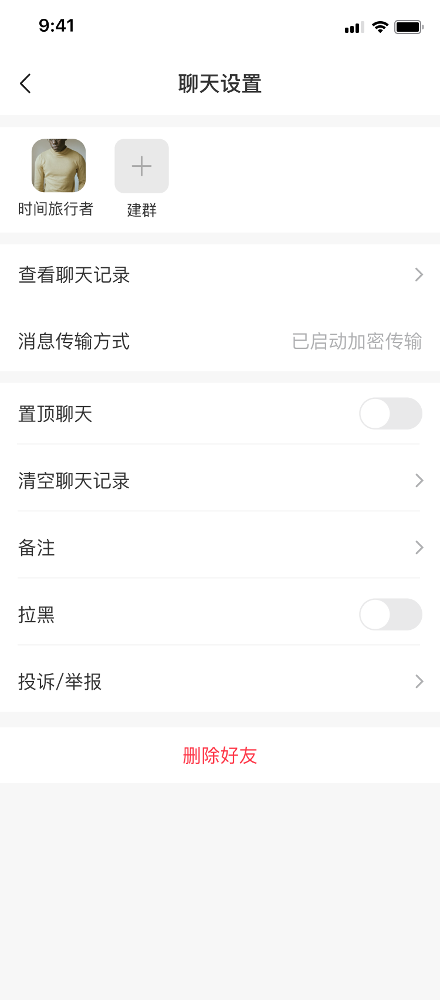

**状态：部分 Topic 设置已实现；产品设置新增。**

- 查询：`GET /v1/im/conversations/{topic}/settings` 返回 `pinned,mute_notifications,message_retention,blocked,remark,permissions`。
- 更新置顶/免打扰/保存方式：`PATCH /v1/im/conversations/{topic}/settings`，Body 只提交变更字段并带 `version`；返回最新完整设置。
- 备注：`PATCH /v1/im/friends/{user_id}`，Body `{"remark":"..."}`；查记录见第 7 章，举报见第 11 章，删除见 5.11。

### 5.10 好友—聊天设置—拉黑状态.png

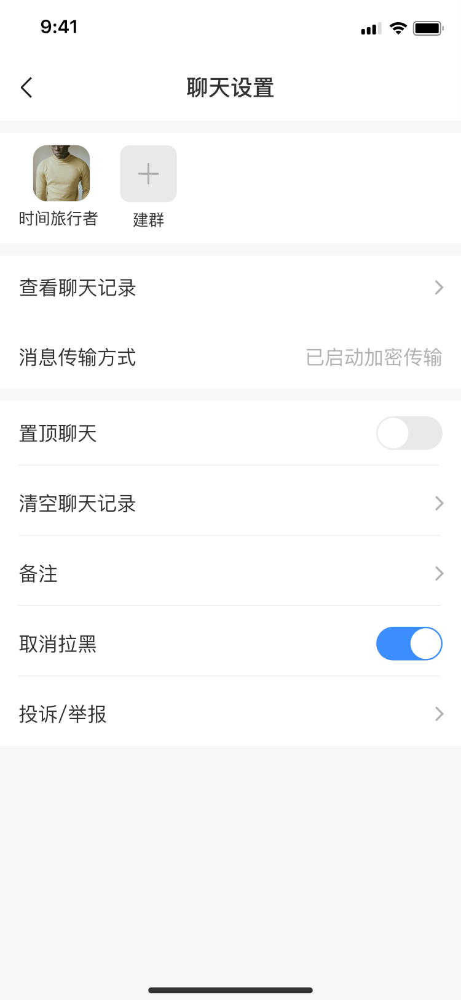

**状态：新增。**

- 开启拉黑：`PUT /v1/im/blocks/{user_id}`；解除：`DELETE /v1/im/blocks/{user_id}`，均带幂等键。
- 成功返回 `blocked,relationship,updated_at` 并向当前用户其他设备推送 `privacy.block.updated`。拉黑后服务端拦截对方消息和呼叫。
- 解除拉黑只恢复黑名单 ACL；若双方已非好友，`relationship` 仍为 `none`，不能自动恢复好友。

### 5.11 删除好友提示.png

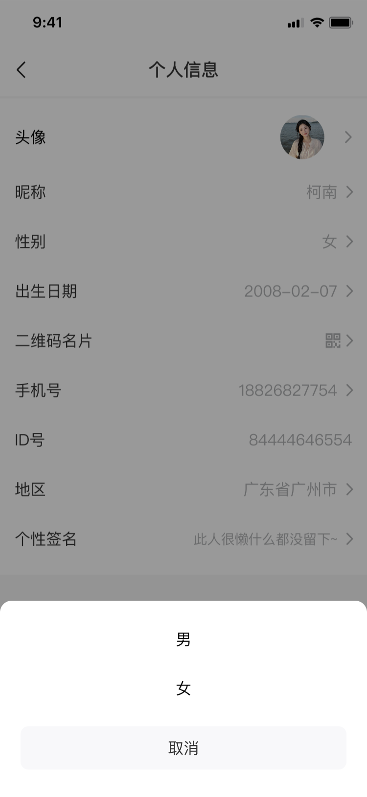

**状态：确认框纯客户端；删除接口新增。**

- 确认调用 `DELETE /v1/im/friends/{user_id}`，带幂等键。是否清除本地历史由客户端在成功后独立处理，不放入删除好友请求。
- 服务端解除双向好友关系但不替对方删除历史；返回 `relationship:"none",topic`。当前用户是否删除本地/服务端可见记录是独立选择。
- 取消不请求；确认后清理页面缓存并等待关系事件校正其他设备。

### 5.12 黑名单.png

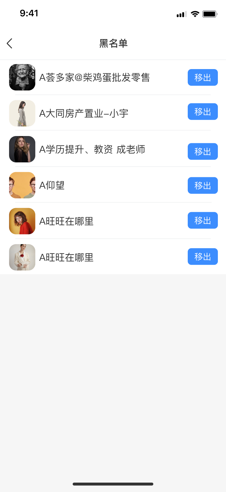

**状态：新增。**

- `GET /v1/im/blocks?cursor=` 返回 `user,blocked_at`；移出调用 5.10 的 DELETE。
- 批量解除：`POST /v1/im/blocks/batch-delete`，Body `{"user_ids":[...]}`，返回逐项结果；最多 100 人。
- 用户资料不可见时仍用受控占位显示黑名单记录，不能因资料删除而无法解除。

### 5.13 黑名单提示(1).png

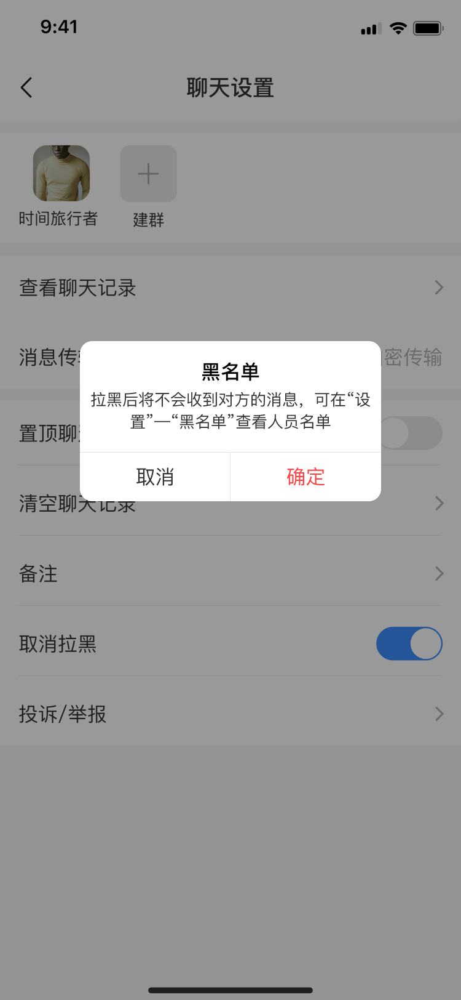

**状态：确认框纯客户端；写接口新增。**

- 确认后调用 `PUT /v1/im/blocks/{user_id}`，相同幂等键重复提交返回当前 `blocked=true`。
- 服务端在同一事务内更新黑名单和通信 ACL，并写审计；取消不调用接口。
- 若对象跨租户或不存在统一返回 `RESOURCE_NOT_FOUND`。

### 5.14 黑名单提示.png

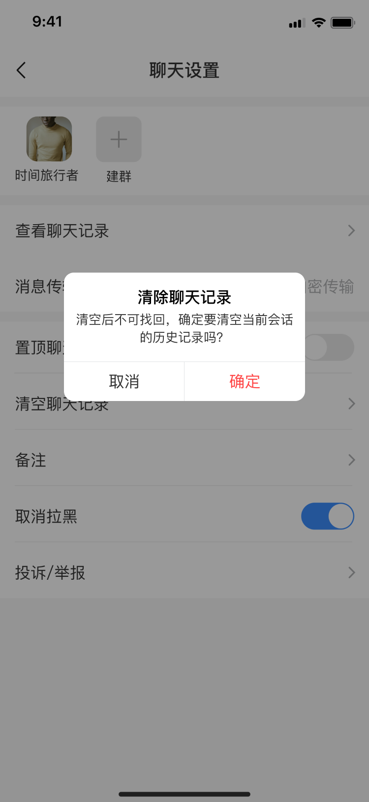

**状态：图片文件名与画面语义不一致；按“清除聊天记录”实施，需改造。**

- 确认调用 Tinode `{del what:"msg",topic,delseq:[{"low":1,"hi":last_seq+1}],hard:false}`，仅删除当前用户视图；或封装 `DELETE /v1/im/conversations/{topic}/messages`。
- 不解除好友、不影响对方历史、不删除收藏；附件仅在无任何有效引用且过保留期后回收。
- 前端需在确认文案明确“仅清除自己的聊天记录”，成功后清本地 Topic 消息缓存并保留会话关系。

## 6. 群聊创建、资料维护与成员治理

### 6.1 群聊.png

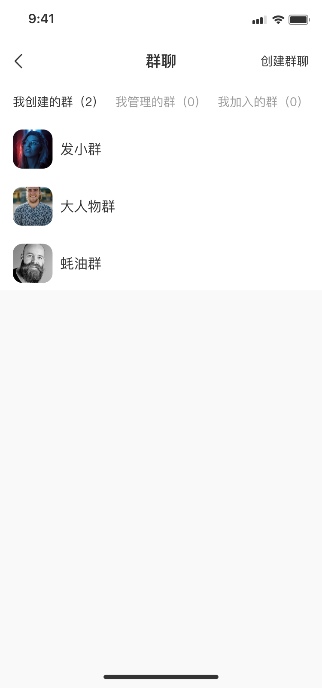

**状态：Tinode 群 Topic 已实现基础能力；产品群列表与配额需改造。**

- 列表：`GET /v1/im/groups?category=owned|managed|joined&query=&cursor=`，返回 `topic,name,avatar_file_id,member_count,my_role,updated_at`。
- 创建：`POST /v1/im/groups`，Body `{"name":"...","member_user_ids":[],"avatar_file_id":"..."}`；原子校验租户群数上限和群成员上限，返回 `topic`。
- 分类由服务端 `my_role` 决定；创建成功或角色变化后通过系统事件刷新，不由前端自行移动分组。

### 6.2 空白页.png

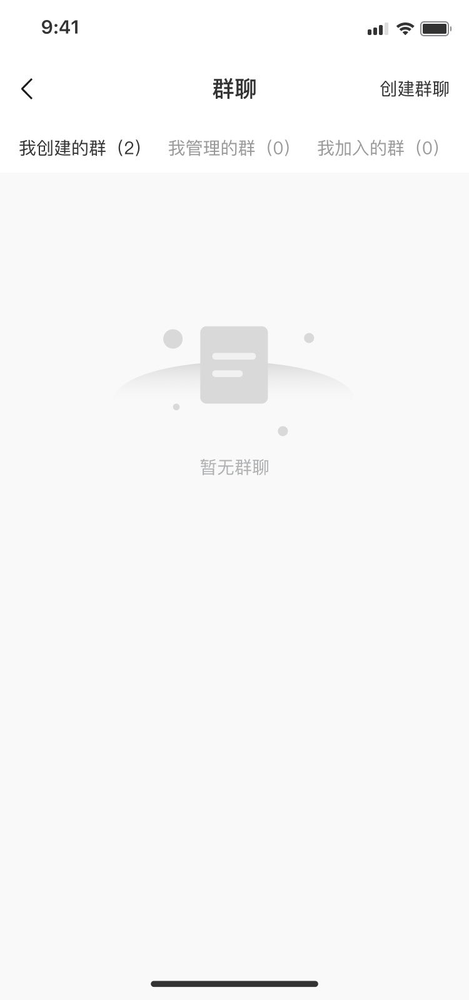

**状态：纯客户端。**

- 对 6.1 任一分类返回 `items=[]` 且 `has_more=false` 时显示对应空状态，不追加空白占位数据。
- 收到 `group.membership.updated` 或创建成功后重新拉取当前分类。

### 6.3 加入群聊.png

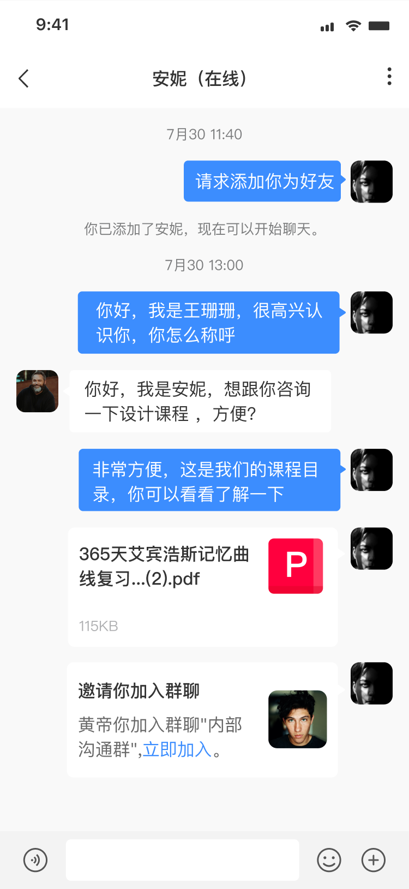

**状态：新增邀请卡片和加入接口。**

- 邀请卡下行 `system_event{event_type:"group_invitation",invitation_id,group,inviter,status,expires_at}`。
- 点击加入：`POST /v1/im/group-invitations/{invitation_id}/accept`，带幂等键；返回 `status=joined|pending_approval` 和 `topic`。
- 服务端校验邀请租户、有效期、群状态、成员资格和成员数上限；重复加入返回当前状态，过期返回 `INVITATION_EXPIRED`。

### 6.4 内容沟通对话3-开启进群验证与拉人状态.png

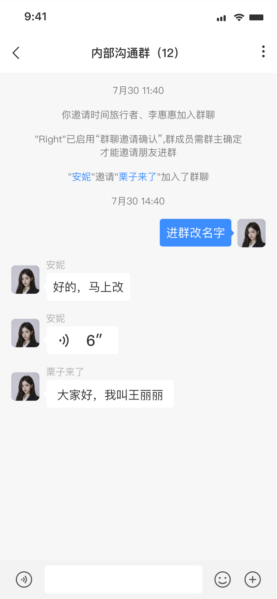

**状态：新增群成员事件。**

- 邀请：`POST /v1/im/groups/{topic}/invitations`，Body `{"user_ids":[],"message":""}`；按群策略直接加入或创建待审批申请。
- 加入、审批、拒绝等结果由服务端生成 `system_event{event_type:"group_membership_changed",operator,target_users,action,result}` 并写入群时间线。
- 客户端只渲染可信系统事件；服务端同时更新成员表、Topic 订阅和成员数，不允许三者不一致。

### 6.5 邀请进群申请.png

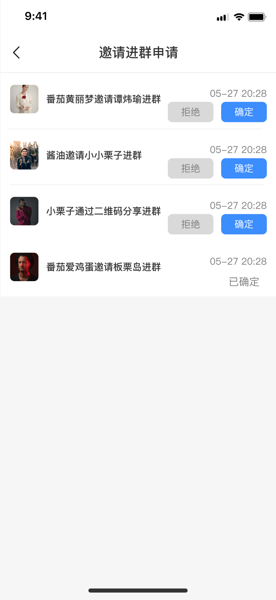

**状态：新增。**

- `GET /v1/im/groups/{topic}/join-requests?status=pending&cursor=` 返回申请人、邀请人、来源、时间、状态和 `version`。
- 同意：`POST /v1/im/groups/{topic}/join-requests/{id}/accept`；拒绝：`POST /v1/im/groups/{topic}/join-requests/{id}/reject`，带幂等键与 `version`。
- 仅群主/管理员可处理；同意时原子校验群成员上限。并发处理返回 `REQUEST_ALREADY_HANDLED` 和最终状态。

### 6.6 新邀请进群申请.png

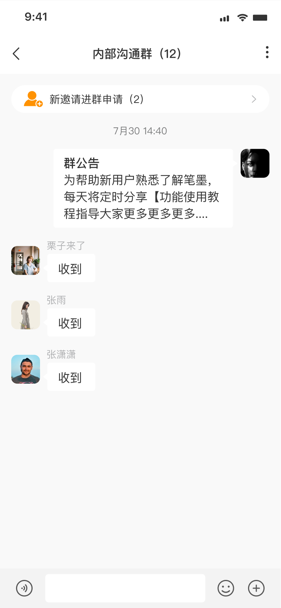

**状态：新增。**

- `GET /v1/im/groups/{topic}/summary` 返回 `pending_join_request_count`、最新公告和权限；新申请通过 `group.join_request.created` 推送给有审批权限的成员。
- 审批完成后服务端广播新数量；前端归零时移除入口。普通成员响应中不得得到申请人敏感信息或数量。

### 6.7 群公告状态.png

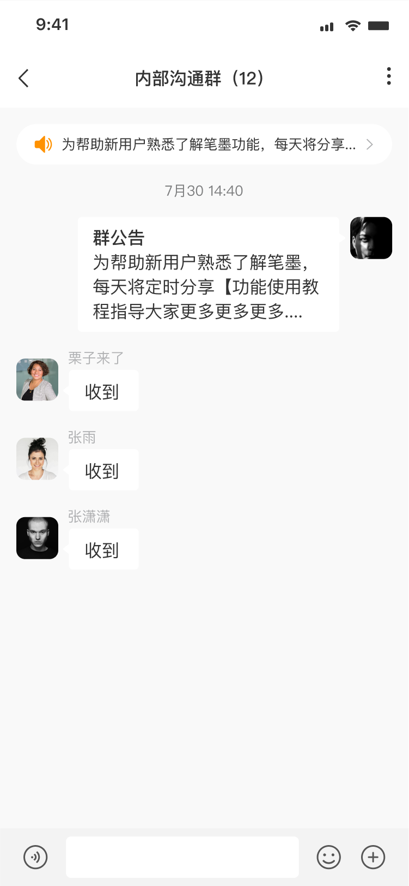

**状态：新增。**

- 查询最新公告：`GET /v1/im/groups/{topic}/announcements/latest`；发布/更新：`PUT /v1/im/groups/{topic}/announcements/current`，Body `{"content":"...","version":1}`。
- 返回 `announcement_id,content,author,version,published_at`。仅有权限角色可写，使用乐观锁防覆盖。
- 发布成功后服务端生成群系统事件；顶部摘要使用接口返回数据，不解析聊天文本猜测。

### 6.8 群公告状态／邀请进群申请同时存在.png

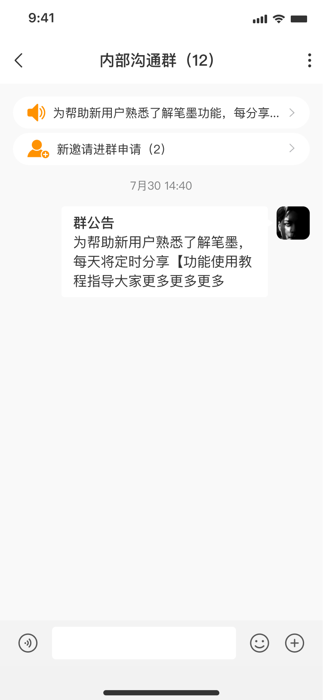

**状态：纯客户端组合；数据接口新增。**

- 页面一次调用 `GET /v1/im/groups/{topic}/summary`，分别读取 `announcement` 和 `pending_join_request_count`，按产品固定顺序渲染两个入口。
- 处理申请只刷新计数，不清公告；更新公告只替换公告对象，不影响申请入口。

### 6.9 群公告（对方查看状态）.png

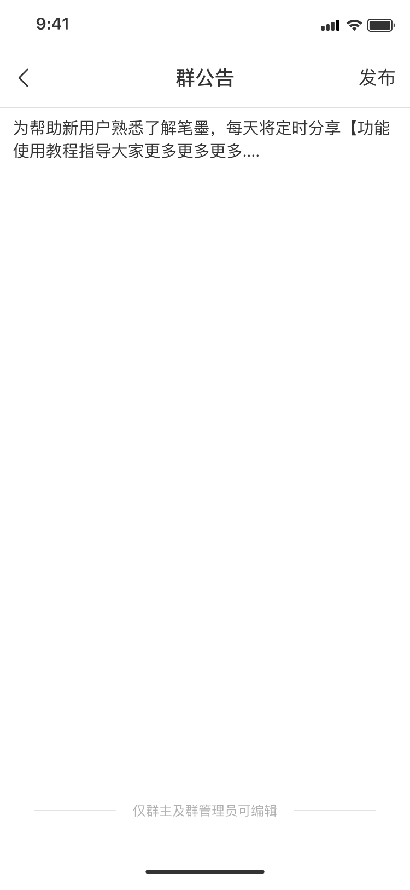

**状态：新增。**

- 详情：`GET /v1/im/groups/{topic}/announcements/{announcement_id}`；普通成员响应不含编辑权限。
- 已读：`POST /v1/im/groups/{topic}/announcements/{id}/read`，带幂等键，返回 `read_at`；用于清除新公告标记。
- 服务端校验当前群成员资格，退群后不可借历史 ID 读取新公告。

### 6.10 群聊设置.png

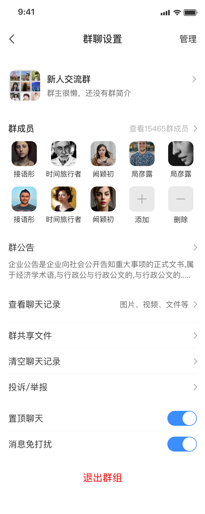

**状态：部分订阅设置已实现；产品菜单新增。**

- `GET /v1/im/groups/{topic}/settings` 返回 `my_role,permissions,profile,announcement,member_count,pinned,mute_notifications` 和群治理开关。
- 个人置顶/免打扰通过 `PATCH /v1/im/groups/{topic}/member-settings`；群级设置必须使用 6.17，不混在个人设置里。
- 退出：`POST /v1/im/groups/{topic}/leave`；群主必须先转让或解散。清记录、举报分别见 5.14、11.3。

### 6.11 群资料.png

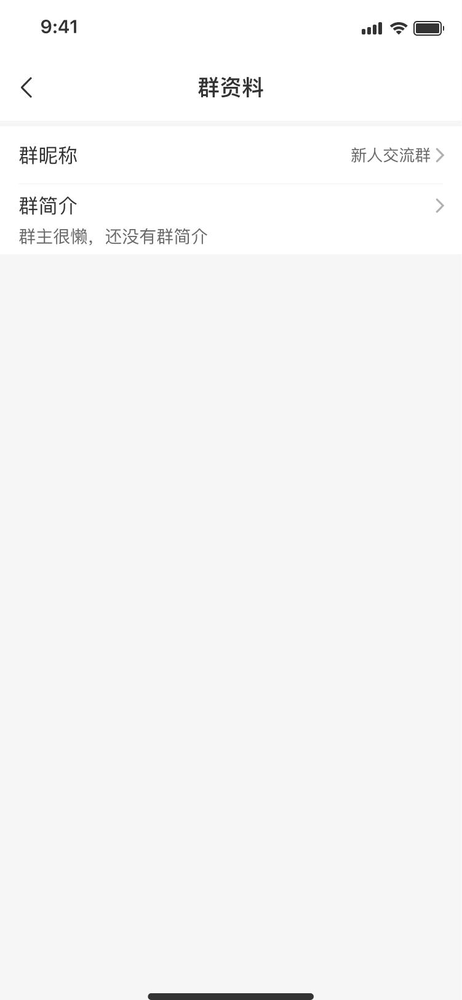

**状态：需改造。**

- `GET /v1/im/groups/{topic}` 返回 `name,avatar_file_id,description,owner,member_count,version,permissions`。
- 更新：`PATCH /v1/im/groups/{topic}`，Body 可含 `name,avatar_file_id,description,version`；成功返回最新对象并推送 `group.profile.updated`。
- 服务端做角色、长度、敏感内容、文件归属校验；前端只展示 `permissions.can_edit_profile` 允许的入口。

### 6.12 设置群头像.png

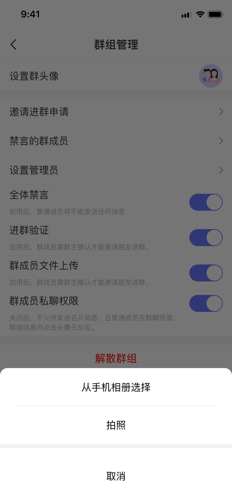

**状态：上传基础已实现；用途绑定需改造。**

- 来源选择、裁剪是客户端动作。上传使用 `purpose=group_avatar`，服务端校验图片 MIME、尺寸、大小并返回 `file_id`。
- 上传后调用 6.11 PATCH `{"avatar_file_id":"...","version":n}`；只有 PATCH 成功才替换正式头像。
- 取消或 PATCH 失败的临时文件按 TTL 回收，不能污染群文件列表。

### 6.13 设置昵称(1).png

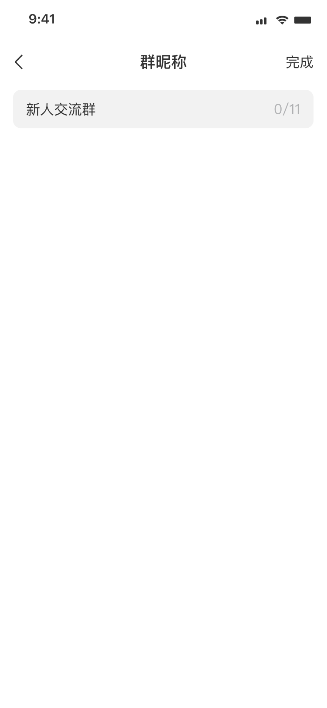

**状态：新增。**

- `PUT /v1/im/groups/{topic}/members/me/profile`，Body `{"nickname":"...","version":n}`。
- 服务端校验成员资格、长度和敏感词，返回 `nickname,version,updated_at` 并推送成员资料变化。
- 该昵称仅作用当前群，不能修改全局用户昵称或其他群资料。

### 6.14 群简介.png


**状态：同 6.11，需改造。**

- 保存调用 `PATCH /v1/im/groups/{topic}`，Body `{"description":"...","version":n}`；空字符串表示清空，省略表示不修改。
- 服务端返回 `VALIDATION_FAILED` 的 `details.field/max_length` 或 `CONTENT_REJECTED`；前端保留草稿供修正。

### 6.15 群标识.png

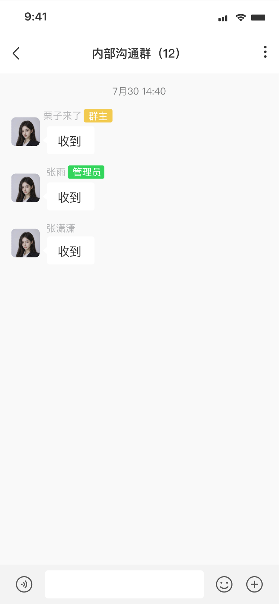

**状态：角色已有基础数据；产品渲染需统一。**

- 群消息下行增加服务端确认的 `sender_snapshot{display_name,role}`，角色枚举固定 `owner|admin|member`。
- 成员角色变化事件到达后刷新成员缓存；历史消息可以保留发送时角色快照，详情以当前角色接口为准。
- 客户端不得根据本地管理员列表给消息自行加可信标识。

### 6.16 群二维码页面.png

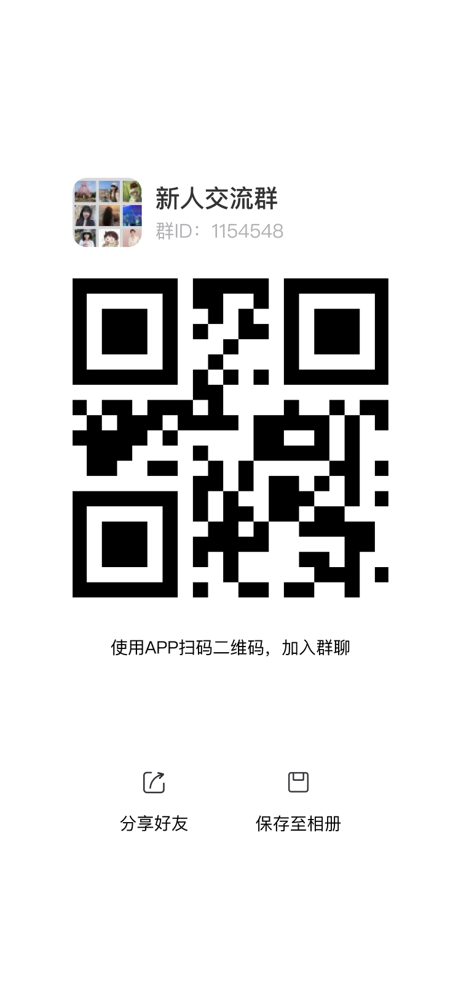

**状态：新增。**

- `POST /v1/im/groups/{topic}/qrcodes`，Body `{"expires_in_seconds":86400}`，返回签名 `qr_token,qr_payload,expires_at,group_snapshot`。
- 扫码调用 `POST /v1/im/qrcodes/resolve`，`purpose:"join_group"`；随后 `POST /v1/im/groups/{topic}/join-requests` 并携带 `qr_token`。
- 群解散、二维码过期或管理员撤销后必须失效；二维码不得直接承载内部群权限。

### 6.17 群组管理.png

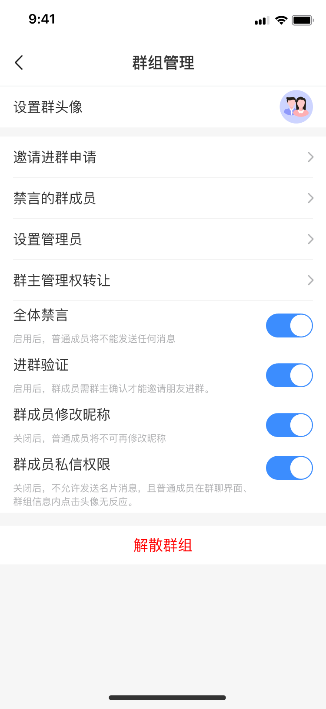

**状态：新增。**

- 查询/更新：`GET/PATCH /v1/im/groups/{topic}/governance`，字段为 `join_approval,mute_all,member_upload_files,member_private_chat,member_invite` 和 `version`。
- 每个字段返回 `editable`；PATCH 仅群主或被授权管理员可用，记录操作者、旧值、新值和 Request ID。
- 解散：`DELETE /v1/im/groups/{topic}`，需二次 `X-Action-Token` 和幂等键；成功后撤销 Topic、二维码、邀请和文件新增权限。

### 6.18 设置群管理员.png

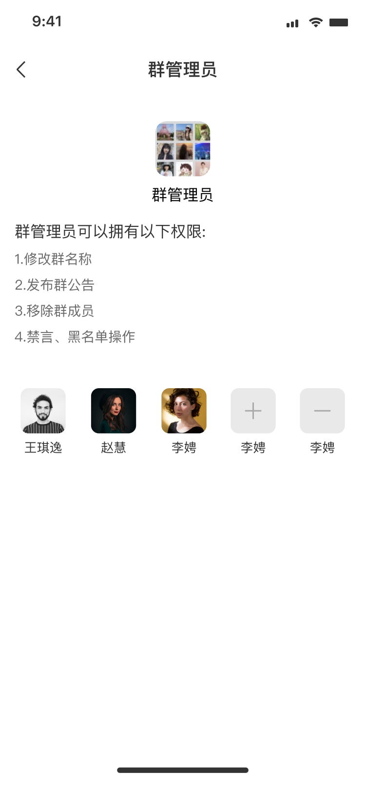

**状态：新增。**

- `GET /v1/im/groups/{topic}/members?role=admin&cursor=` 返回管理员列表；`GET /v1/im/groups/{topic}/role-limits` 返回 `max_admin_count,current_admin_count`。
- 只有群主可进入。群主本人以 `owner` 单独展示，不计入普通管理员列表和名额。

### 6.19 添加管理员.png

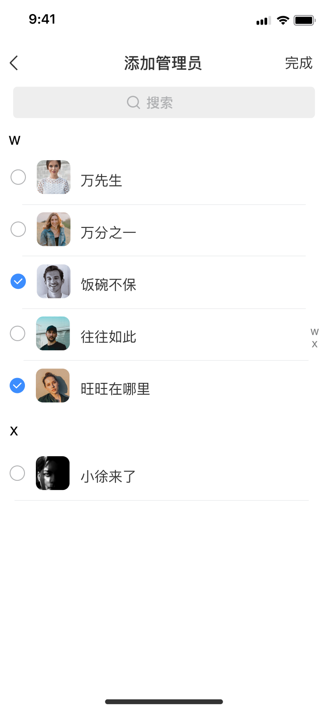

**状态：新增。**

- 候选：`GET /v1/im/groups/{topic}/members?eligible_role=admin&query=&cursor=`，返回 `eligible` 和不可选原因。
- 提交：`POST /v1/im/groups/{topic}/admins/batch`，Body `{"user_ids":[],"version":n}`；服务端原子校验群主身份、成员资格和管理员上限。
- 超限返回 `GROUP_ADMIN_LIMIT_EXCEEDED`，并附 `max/current/requested`。

### 6.20 添加管理员-设置成功.png

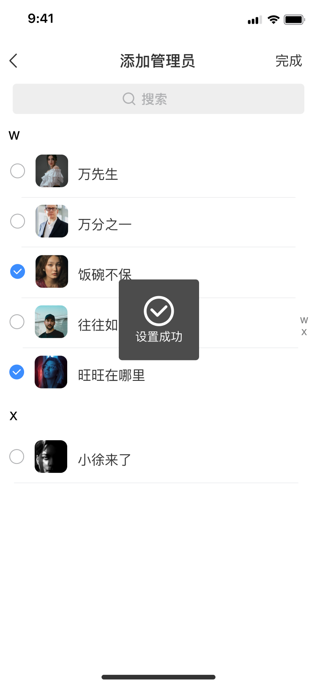

**状态：新增。**

- 6.19 成功返回 `admins,version,updated_at`；前端用响应替换列表并显示成功，不在请求完成前自行修改角色。
- 服务端推送 `group.role.updated`，新管理员收到后刷新菜单权限和群标识。

### 6.21 添加管理员-设置成功(1).png

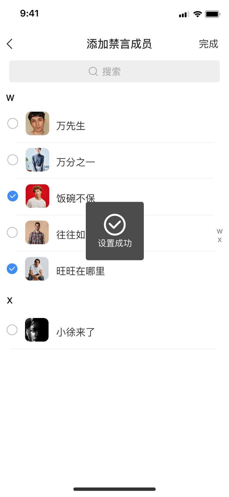

**状态：新增。**

- 提交期间按幂等键禁重复点击。批量接口返回 `succeeded[]`、`failed[{user_id,reason}]` 和最新 `admins`。
- 部分失败时保留成功角色，不做整批客户端回滚；前端展示失败原因并以服务端列表为准。

### 6.22 删除管理员-设置成功.png

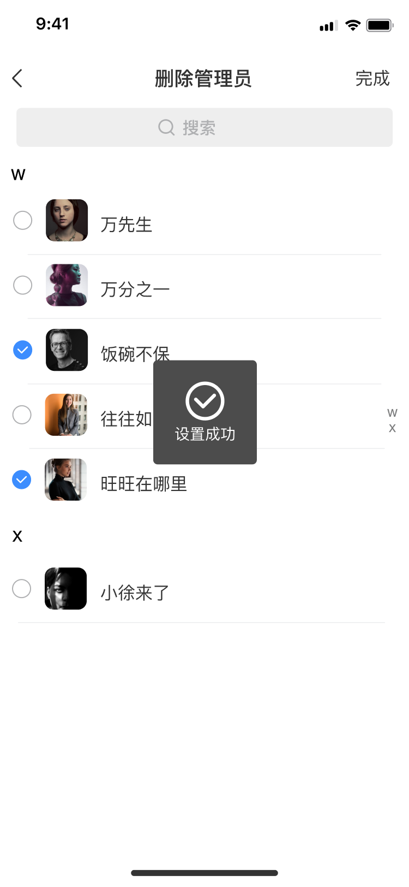

**状态：新增。**

- `DELETE /v1/im/groups/{topic}/admins/{user_id}`，带幂等键和 `If-Match`/`version`。
- 成功后目标角色变为 `member`，保留群成员关系；服务端立即撤销管理权限并广播角色事件。
- 删除群主、非成员或最后状态冲突分别返回稳定错误，不允许前端拼接通用成功。

### 6.23 添加禁言成员.png

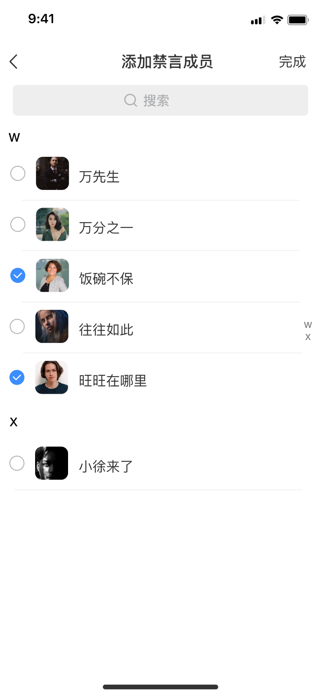

**状态：新增。**

- 候选：`GET /v1/im/groups/{topic}/members?mute_eligible=true&query=&cursor=`。
- 提交：`POST /v1/im/groups/{topic}/mutes/batch`，Body `{"members":[{"user_id":"usr...","expires_at":null}],"reason":""}`。
- 服务端校验操作者角色层级；管理员不能禁言群主，普通管理员互相操作规则由治理策略确定。

### 6.24 禁言的群成员.png

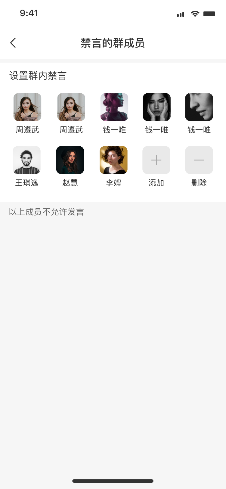

**状态：新增。**

- `GET /v1/im/groups/{topic}/mutes?cursor=` 返回 `user,muted_by,muted_at,expires_at`；解除 `DELETE /v1/im/groups/{topic}/mutes/{user_id}`。
- 禁言成员发送消息时服务端返回 `GROUP_MUTED` 和可选 `expires_at`；不能只禁用前端输入框。
- 退群时清理禁言记录；过期由服务端自动失效并推送更新。

### 6.25 选择新群主.png

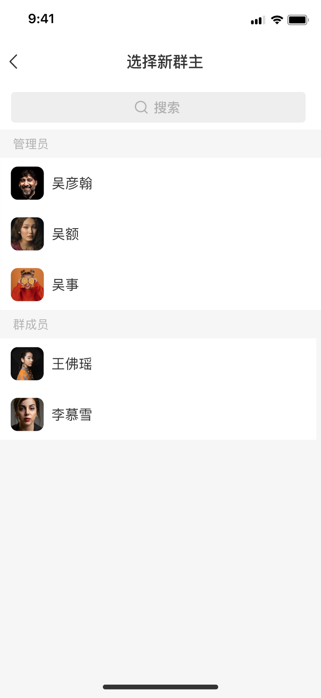

**状态：新增。**

- `GET /v1/im/groups/{topic}/members?eligible_role=owner&query=&cursor=`，只返回状态正常的当前成员。
- 前端单选并保存 `target_user_id`；当前群主、已退出、停用账号返回 `eligible=false`。
- 此步骤不修改权限，真正转让仅在 6.26 确认后执行。

### 6.26 选择新群主提示.png

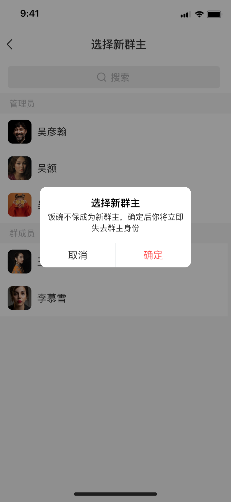

**状态：新增。**

- `POST /v1/im/groups/{topic}/owner-transfer`，Body `{"target_user_id":"usr...","version":n}`，必须带幂等键和二次认证 `X-Action-Token`。
- 服务端事务内把旧群主降为管理员或成员、目标升为群主、更新权限和审计，再生成系统事件。
- 成功返回 `owner,previous_owner,roles,version`；并发成员变化返回 `GROUP_VERSION_CONFLICT`，前端重新确认，不自动重试。

### 6.27 群文件.png

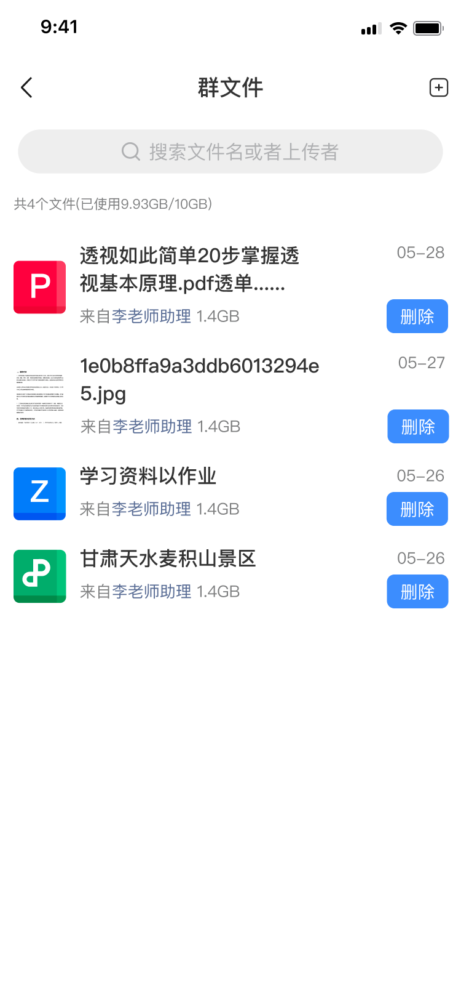

**状态：新增群文件索引；底层文件存储已实现。**

- `GET /v1/im/groups/{topic}/files?query=&type=&cursor=` 返回 `group_file_id,file_id,name,size,mime,uploader,created_at,download_state,permissions`。
- 下载使用认证文件接口，服务端校验当前群成员和文件状态；删除 `DELETE /v1/im/groups/{topic}/files/{group_file_id}` 需上传者或管理员权限。
- 退群后不可继续使用旧 URL 下载；缓存文件是否保留由客户端隐私策略处理。

### 6.28 群文件-上传状态.png

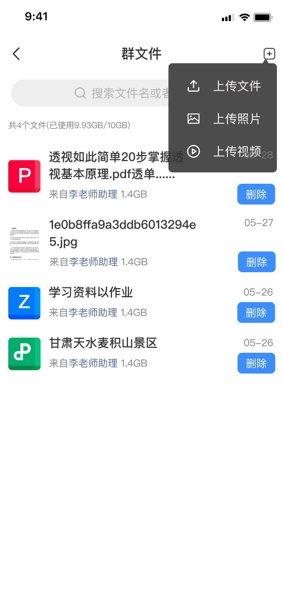

**状态：需改造。**

- 先用 `purpose=group_file,topic=...` 上传，再 `POST /v1/im/groups/{topic}/files`，Body `{"file_id":"..."}` 建立群文件记录。
- 服务端校验 `member_upload_files`、单文件上限、租户总存储和群成员身份；成功返回完整群文件项。
- 上传失败可复用 `upload_id`；登记失败不得在列表显示，孤立文件按 TTL 回收。

## 7. 文件下载、收藏管理与聊天记录检索

### 7.1 我的收藏.png

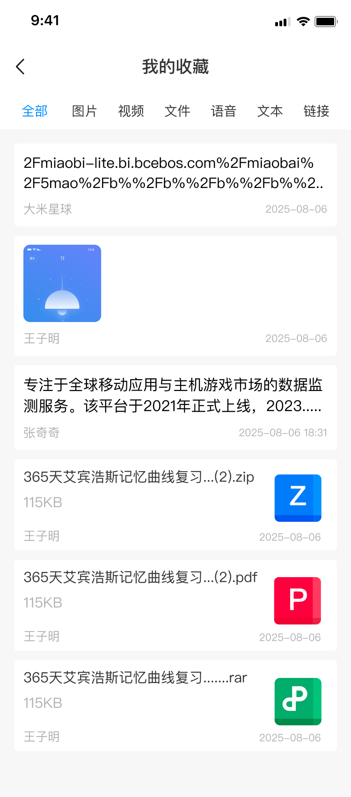

**状态：新增。**

- `GET /v1/im/favorites?type=all|text|image|video|voice|file|link&q=&cursor=`，返回 `favorite_id,type,snapshot,source,collected_at,availability`。
- 类型与关键词由服务端过滤，客户端不下载全部收藏再筛选。`source` 仅下发用户仍可知晓的会话摘要。
- 收藏数据属于当前租户当前用户；跨租户登录不得合并列表。

### 7.2 我的收藏(1).png

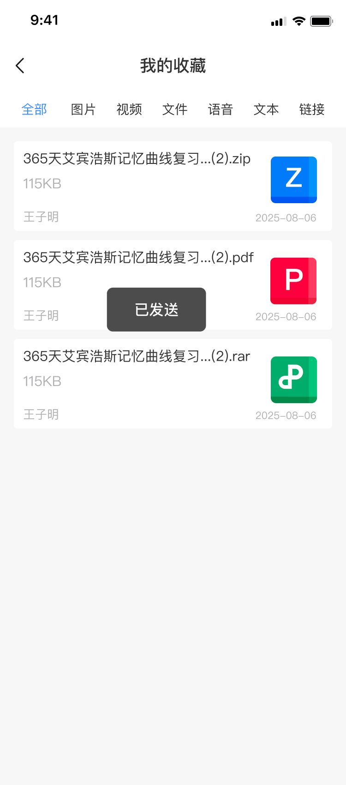

**状态：新增。**

- 详情：`GET /v1/im/favorites/{favorite_id}`；删除：`DELETE /v1/im/favorites/{favorite_id}`；转发使用 7.8。
- 收藏创建时保存受控快照和附件引用，因此原消息对当前用户删除后仍可按保留策略展示；原资源因合规删除时返回 `availability:"removed"`。
- 删除收藏不删除原消息或已转发消息。

### 7.3 我的收藏-文件.png

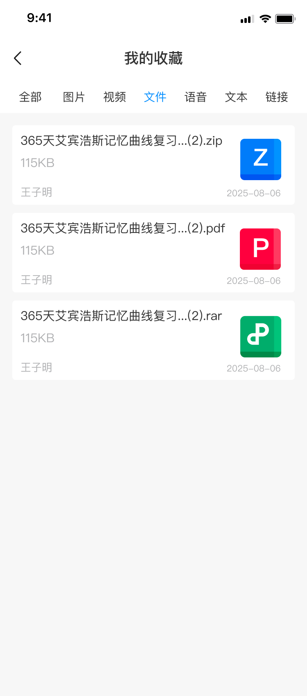

**状态：新增。**

- 调用 7.1，固定 `type=file`；项中使用 `snapshot.file{name,size,mime,file_id}` 和 `availability`。
- 点击前调用收藏详情获得当前授权，下载仍走 7.9 文件协议；失效显示原因，不反复请求公共 URL。

### 7.4 我的收藏-文本.png

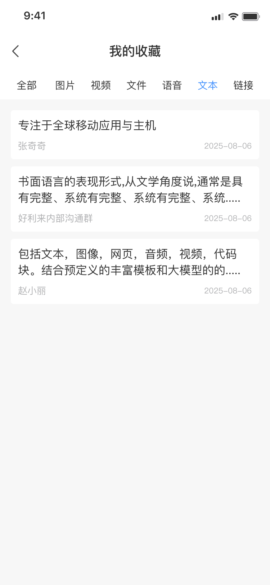

**状态：新增。**

- 调用 7.1，固定 `type=text`；服务端返回纯文本/结构化 Drafty 快照和安全高亮区间 `matches[]`。
- 展开、折叠、复制为本地动作；复制前遵守企业 DLP 策略 `permissions.can_copy`。

### 7.5 我的收藏-语音.png

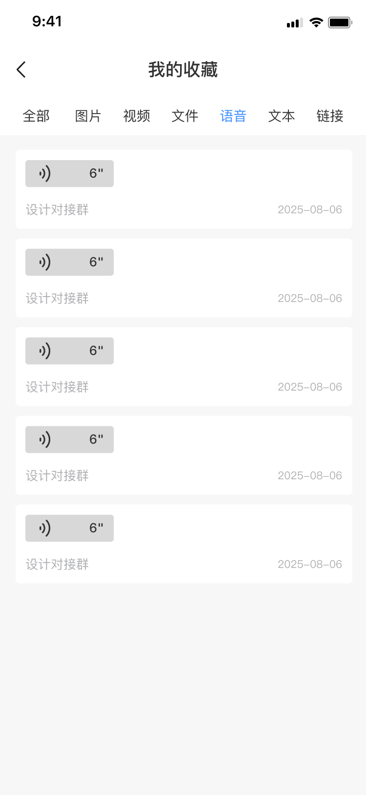

**状态：新增。**

- 调用 7.1，固定 `type=voice`；播放前获取认证文件，返回 `duration_ms,waveform,availability`。
- 播放/暂停和单实例播放器是客户端状态；服务端不接收逐秒播放进度，除非后续定义跨端收听状态。

### 7.6 我的收藏—链接.png

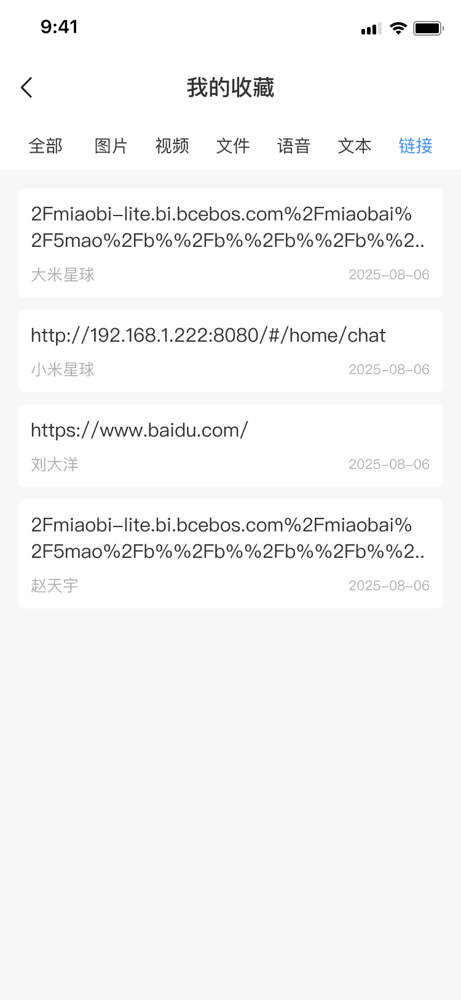

**状态：新增。**

- 调用 7.1，固定 `type=link`；服务端快照返回 `url,title,summary,thumbnail_file_id,risk_level`。
- 点击前 `POST /v1/im/security/urls/check`，Body `{"url":"...","source":"favorite"}`；返回 `allow|warn|block` 和 `risk_challenge_id`。
- 客户端不得在未确认时自动打开或预加载高风险外链。

### 7.7 收藏—文件（多选）.png

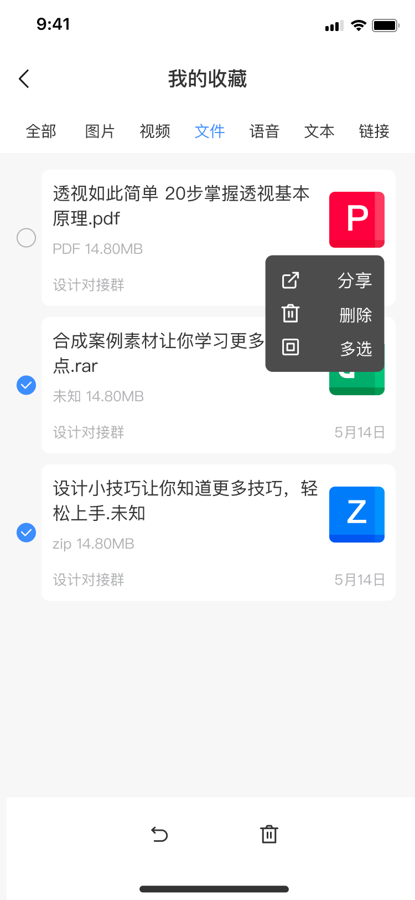

**状态：新增。**

- 选择状态本地维护；批量删除 `POST /v1/im/favorites/batch-delete`，Body `{"favorite_ids":[]}`；批量转发见 7.8。
- 返回逐项成功/失败；删除必须二次确认并带幂等键。跨页选择只保存 ID，不保留失效的临时下载地址。

### 7.8 收藏文件—分享给好友页面.png

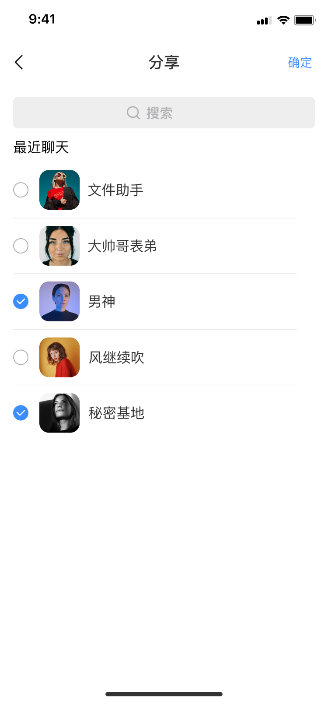

**状态：新增。**

- 目标列表使用 4.17；提交 `POST /v1/im/favorites/forward`，Body `{"favorite_ids":[],"target_topics":[],"comment":""}`。
- 服务端从收藏的受控附件引用生成新消息和新 ACL，返回每个目标的消息结果；收藏原件不变。
- 文件失效、目标禁言或无发送权限按目标逐项失败，不允许客户端直接复用旧下载 URL 发送。

### 7.9 文件-下载.png

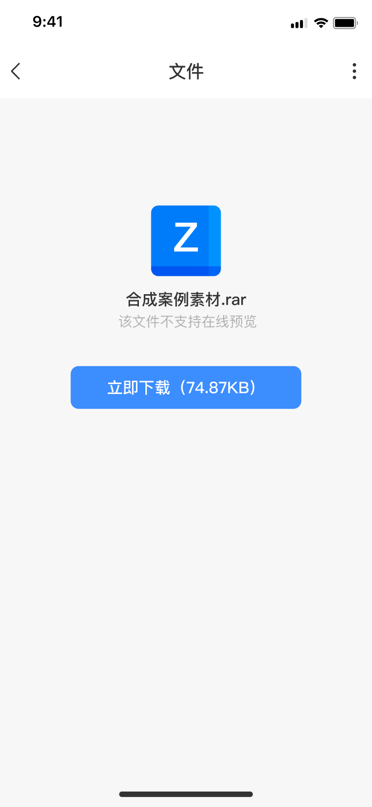

**状态：底层下载已实现租户校验；资源 ACL 需改造。**

- 客户端使用 `GET /v0/file/s/{file_id}`，Header 传 API Key 与 `X-Tinode-Auth: token <base64_token>`；禁止 `?auth=&secret=`。
- 服务端除 Token 租户外，还必须校验该用户通过消息、群文件或收藏拥有有效引用，并支持 `Range`、`ETag`、内容长度和安全文件名。
- 下载前客户端校验本地空间和网络策略；`FILE_FORBIDDEN` 不自动重试，`FILE_UNAVAILABLE` 显示失效。

### 7.10 文件-下载中.png

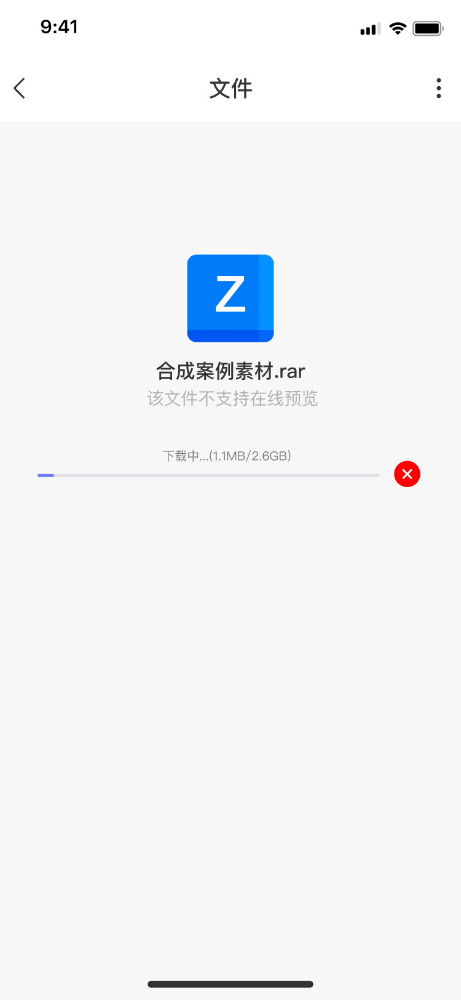

**状态：客户端任务管理；服务端需支持 Range。**

- 下载任务保存 `file_id,etag,total_bytes,downloaded_bytes,temp_path,state`；恢复时携带 `Range` 与 `If-Range: <etag>`。
- ETag 改变或服务端返回完整 200 时丢弃旧分片重新下载；取消时关闭连接并清理临时文件。
- Token 过期先完成一次刷新后续传，不能把 Token 写入任务文件或日志。

### 7.11 文件-下载完成.png

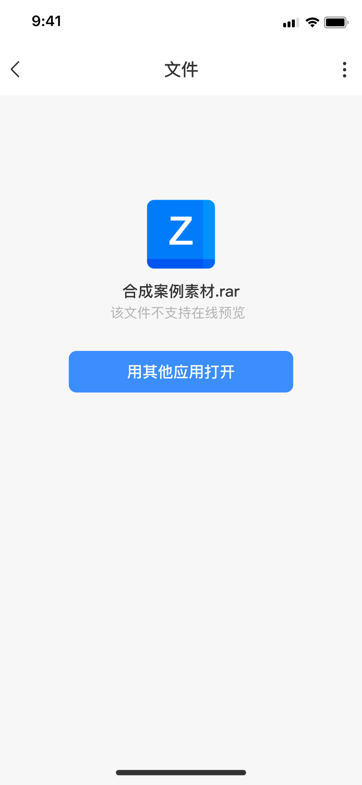

**状态：纯客户端完成态。**

- 完成后校验长度和服务端提供的 checksum，再原子移动到受控目录；校验失败删除并标记重试。
- 打开/分享遵守系统沙箱和企业 DLP。每次展示页面检查本地文件存在性，不存在则恢复“可下载”。

### 7.12 查找聊天记录-搜索关键词选中状态（点击后跳出对应聊天内容）.png

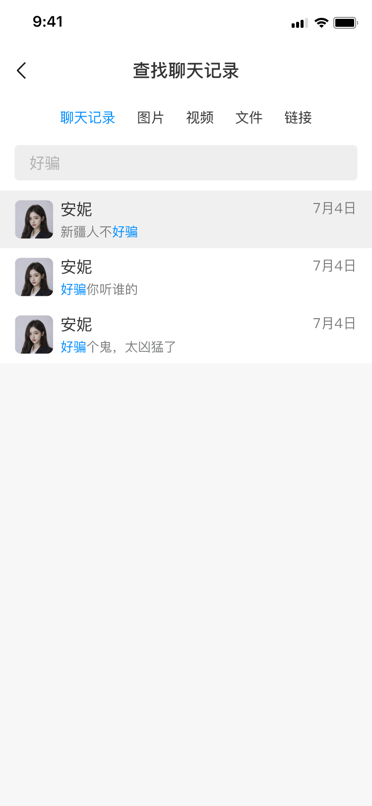

**状态：新增服务端搜索。**

- `GET /v1/im/topics/{topic}/messages/search?q=&type=text&cursor=` 返回 `seq,from,ts,snippet,matches[]`。
- 点击结果后 `GET /v1/im/topics/{topic}/messages/{seq}/context?before=20&after=20`，返回锚点及上下文；客户端定位 `seq` 并高亮。
- 服务端只搜索当前用户可见且未硬删除的消息，关键词做长度/频率限制，搜索日志不得记录原文。

### 7.13 查找聊天记录-文件.png

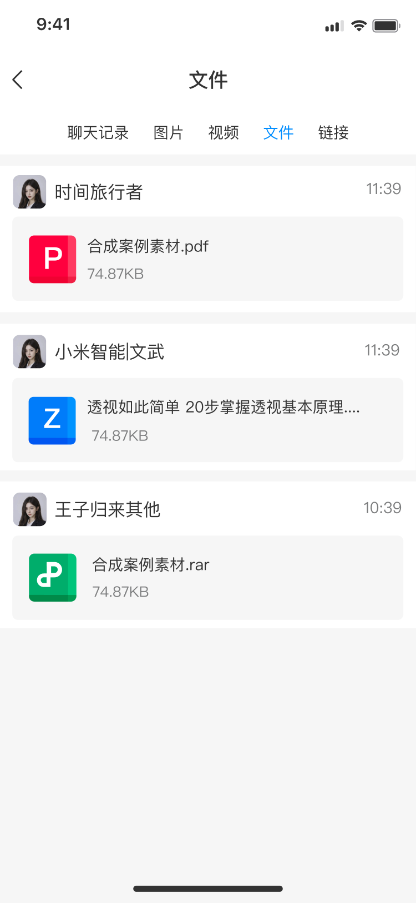

**状态：新增。**

- 调用 `GET /v1/im/topics/{topic}/messages/search?type=file&q=&cursor=`，返回消息 `seq` 与文件快照、发送者、时间、`availability`。
- 预览/下载使用 7.9；撤回或无授权时显示失效。点击来源用 7.12 上下文接口定位。

### 7.14 查找聊天记录-链接.png

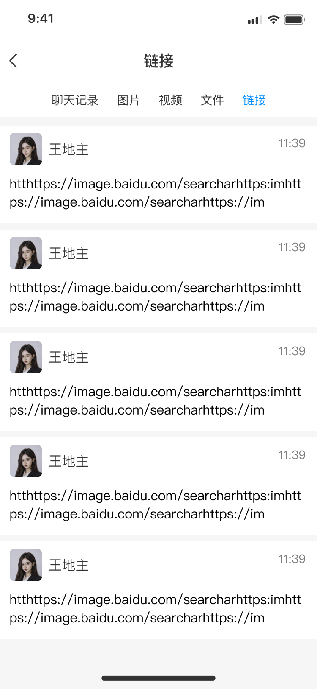

**状态：新增。**

- 调用搜索接口 `type=link`，返回 `url,title,summary,seq,ts,risk_level`；打开前执行 7.6 URL 安全检查。
- 链接预览由服务端受控抓取和缓存，客户端不直接抓取内网地址，防止 SSRF 和隐私泄露。

### 7.15 查看聊天记录-图片.png

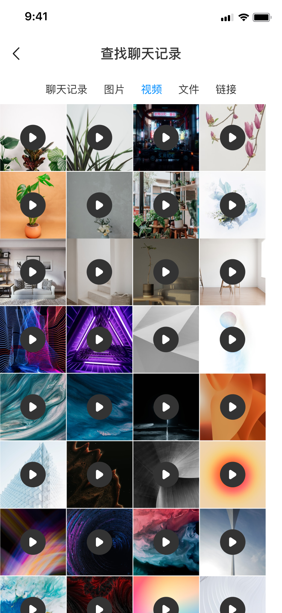

**状态：新增。**

- `GET /v1/im/topics/{topic}/media?type=image&cursor=` 返回 `seq,thumbnail_file_id,file_id,width,height,ts,availability`。
- 缩略图懒加载使用认证文件请求；大图前再次授权。多选仅保存 `(topic,seq)`，操作使用第 4 章批量接口。

### 7.16 查看聊天记录-视频.png


**状态：新增。**

- 调用 7.15 接口，`type=video`，额外返回 `duration_ms,mime,size`。
- 播放器使用支持 Range 的认证下载/流式读取；文件失效、Token 过期和网络中断分别映射可理解状态，返回列表保持游标与滚动位置。

## 8. 实时语音与视频通话

### 8.1 各种通话提示状态.png

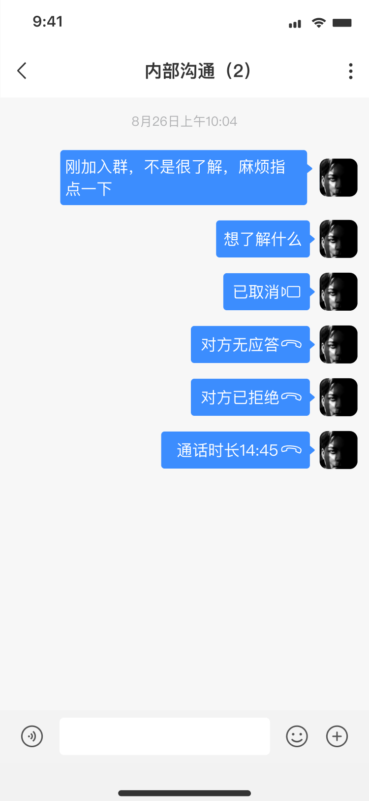

**状态：已实现基础通话记录替换；产品文案映射需统一。**

- 发起呼叫时的持久消息就是通话记录。服务端以相同 `seq` 写 replacement `{data}`，`head.replace=":{seq}"`，并把 `head.webrtc` 更新为 `accepted|finished|disconnected|missed|declined`。
- 已接通结束时 `head.webrtc-duration` 为服务端计算的毫秒数。客户端映射：`finished=已结束`、`missed=未接听/已取消`、`declined=已拒绝`、`disconnected=异常结束`。
- 双方使用原消息 `content.callId/callType` 和同一 `seq`；客户端不得另发一条“通话结果”消息或相信本地传入的 duration。

### 8.2 对方状态.png


**状态：在线邀请已实现；Push 与产品鉴权需改造。**

- 来电是 Topic 下行的初始 `{data}`：`head.webrtc="started"`、`head.x-im-type="call"`，`content` 至少含 `callId,callType,audio,video`。客户端保存该消息 `seq` 作为后续所有 call note 的关联 ID。
- 来电端开始响铃后发送 `{note:{topic,what:"call",event:"ringing",seq,payload:{"callId":"..."}}}`；接听发送 `event:"accept"`；拒绝发送 `event:"hang-up"`。
- 后台 Push 只携带 `callId,topic,seq,caller_display,callType,expires_at`，不含 SDP、ICE 或 Token；用户操作后必须回 WebSocket 鉴权。

### 8.3 语音通话-对方待接受状态.png

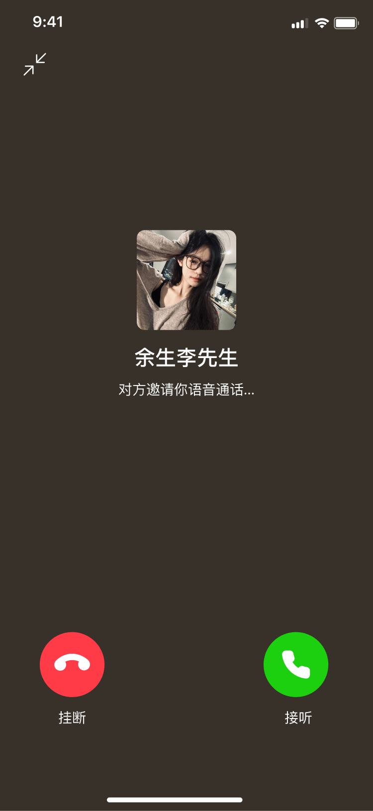

**状态：发起与超时已实现基础；好友/拉黑/租户开关校验需改造。**

- 发起前查询 `capabilities.can_call`，再发布持久邀请消息：

```json
{"pub":{"id":"call-1","topic":"p2p...","head":{"mime":"application/json","webrtc":"started","x-im-type":"call"},"content":{"callId":"01K...","callType":"audio","audio":true,"video":false}}}
```

- `{ctrl code:202,params.seq}` 的 `seq` 是后续 `ringing/accept/offer/answer/ice-candidate/hang-up` 必填关联值。服务端只允许 P2P 双方参与，并校验好友、拉黑、租户通话开关和当前 Topic 无并发呼叫。
- 发起方取消发送 `{note event:"hang-up",seq,payload:{"callId":"...","reason":"cancelled"}}`；等待超时由服务端结束并把原消息替换为 `missed`。

### 8.4 语音通话-双方语音沟通中.png

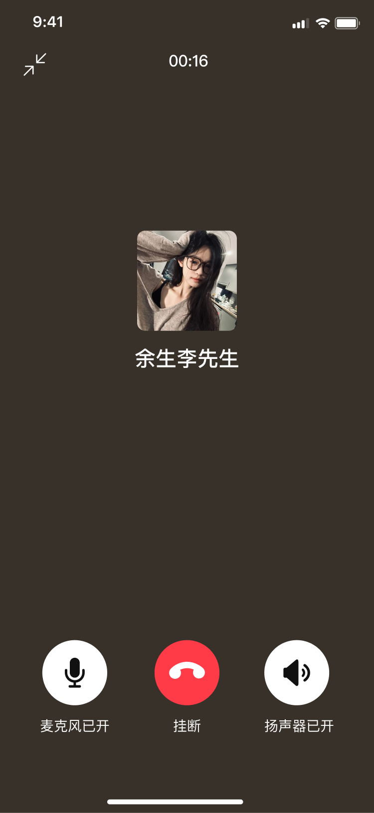

**状态：WebRTC 客户端能力；信令和服务端计时已实现。**

- 被叫发送 `accept` 后，服务端把原消息替换为 `webrtc:"accepted"` 并向主叫发送 `{info what:"call",event:"accept",seq}`。
- 双方随后用 `{note what:"call",event:"offer|answer|ice-candidate",seq,payload:{"callId":"...",...}}` 交换 SDP/ICE。ICE 配置使用 `hi.ctrl.params.iceServers`，不得在 App 中硬编码 TURN 长期凭证。
- 任一端发送 `hang-up`，服务端按接受时间计算 duration 并替换原通话消息。异常断线后按原 `topic+seq+callId` 恢复或结束，不新建第二通呼叫。

### 8.5 语音通话-麦克风与扬声器已关.png

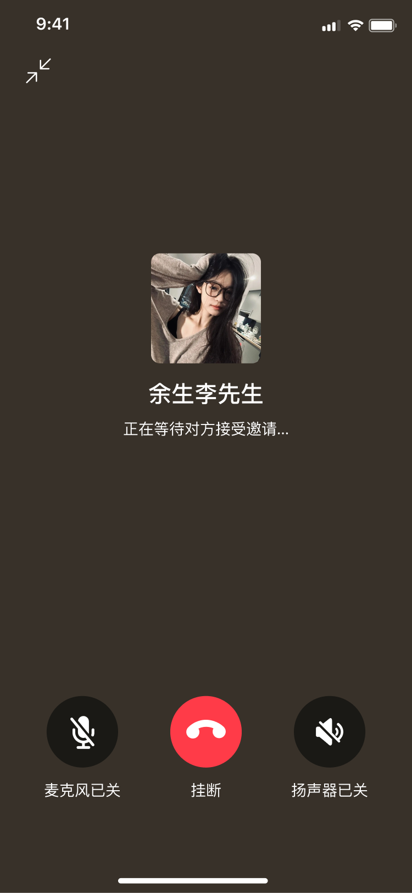

**状态：纯客户端设备控制。**

- 麦克风关闭通过禁用本地音轨，扬声器关闭/听筒切换通过系统音频路由完成，不调用业务 HTTP。
- UI 必须读取实际音轨和路由状态；权限撤销时强制更新。是否告知对方静音可发送临时 `media-state`，不落聊天记录。

### 8.6 语音通话-麦克风与扬声器已开.png

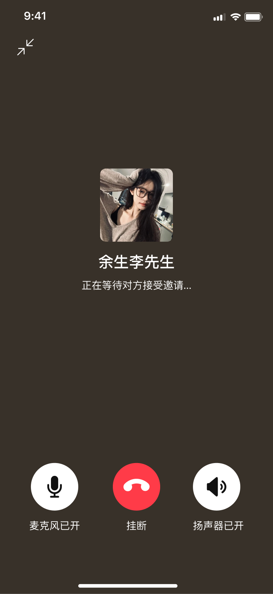

**状态：纯客户端设备控制。**

- 开启麦克风恢复本地音轨，开启扬声器选择实际输出设备；蓝牙/耳机变化以操作系统回调为准。
- 不把设备名称、系统音量上传服务端。切换失败恢复真实按钮状态并给本地提示。

### 8.7 视频通话—等待对方接受接受邀请中.png


**状态：基础通话信令已实现；隐私约束需落实。**

- 发起协议同 8.3，`media_type:"video"`。本地预览只在设备显示，接听前媒体轨默认不发给对方，SDP 只声明能力。
- 切换摄像头纯客户端；取消发送 `hang-up:cancelled`。相机权限不足时改为音频呼叫或取消，不伪装视频已开启。

### 8.8 视频通话—等待对方接受接受邀请-摄像头关闭.png

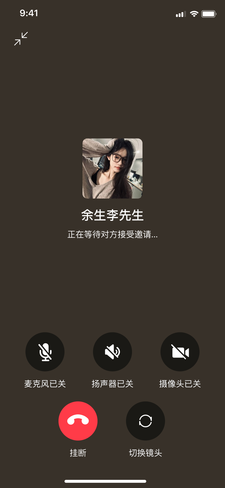

**状态：纯客户端状态；媒体状态事件需改造。**

- 关闭本地视频轨并显示头像；接听后沿用 `video_enabled=false`。
- 当前服务端只允许 `ringing/accept/offer/answer/ice-candidate/hang-up`；首版应直接通过 WebRTC 轨道 mute 状态呈现。若后续新增 `media-state`，必须先修改 `server/calls.go` 事件白名单、参与者校验和限频，客户端不能提前发送未知事件。

### 8.9 双方视频通话中.png


**状态：WebRTC 客户端能力；服务端信令已具备基础。**

- 主/小窗布局、拖动和横竖屏纯客户端；WebRTC offer/answer/ICE 与 8.2～8.4 相同。
- 服务端只做身份鉴权、信令路由、TURN 配置和通话审计，不接收前端伪造的通话时长。
- 网络恶化可本地降码率或关闭视频轨；最终结束必须发 `hang-up`。服务端未支持 `media-state` 前不得发送该事件。

### 8.10 双方视频通话中-对方关闭摄像头状态.png

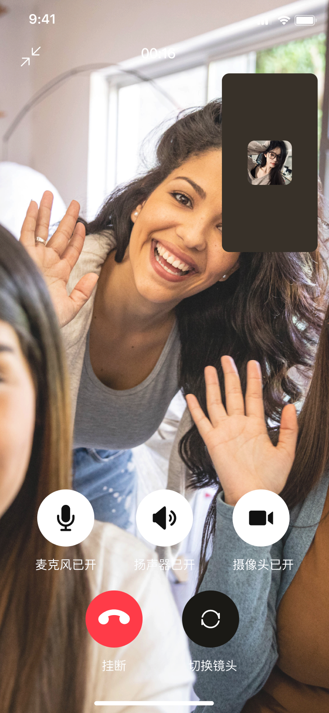

**状态：现阶段纯客户端；可选媒体状态事件需改造。**

- 以对端 WebRTC 视频轨的 mute/unmute 作为真实信号；关闭时显示资料缓存中的对方头像并保留音频，轨道恢复后自动显示视频。
- 不需要业务 HTTP。可选 `media-state` 必须等服务端扩展事件白名单后另行启用，且不持久化、不改变通话结果。

### 8.11 视频与语音通话悬浮状态中.png

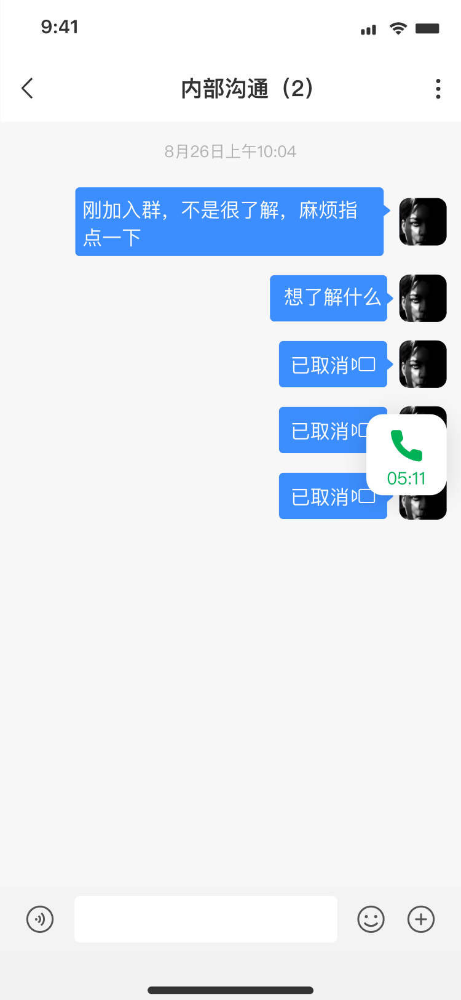

**状态：纯客户端。**

- 最小化不结束 WebRTC 或 WebSocket，会话仍以同一 `call_id` 运行；点击恢复全屏不发送新 invite。
- 系统悬浮窗权限、画中画和安全区域按平台实现。收到 `hang-up`、Token 失效或媒体会话结束后立即关闭悬浮窗并落正确结果态。

## 9. 企业工作台与办公协同

### 9.1 工作台.png

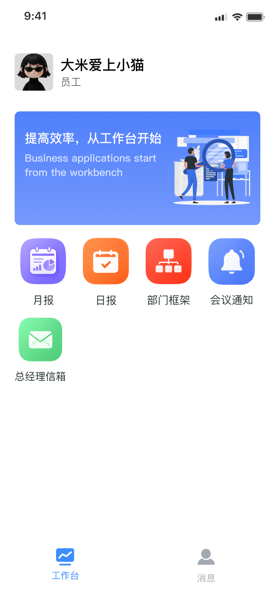

**状态：新增。**

- `GET /v1/im/workbench` 返回 `modules[{code,name,icon_file_id,route,unread_count,enabled,permission}]`、布局版本和企业配置。
- 服务端按当前 Token 的租户、组织角色和功能开关裁剪；前端只接受白名单内部 `route`，禁止直接执行服务端任意 URL。
- 未读数通过 `workbench.badge.updated` 系统事件增量更新；切租户必须重新加载，不复用另一企业工作台。

### 9.2 部门组织框架.png

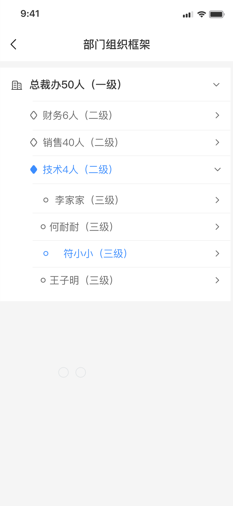

**状态：新增。**

- 根节点：`GET /v1/im/organization/departments?parent_id=root&cursor=`；子部门同接口传 `parent_id`；成员 `GET /v1/im/organization/departments/{id}/members?cursor=`。
- 部门返回 `department_id,name,parent_id,child_count,member_count,version`；成员只返回当前查看人可见字段。
- 全局搜索：`GET /v1/im/organization/search?q=&types=department,user&cursor=`。服务端执行组织范围授权，离职用户标记不可联系或从结果移除。

### 9.3 会议通知-发起人状态.png

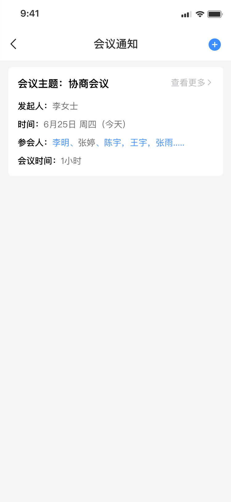

**状态：新增。**

- 创建：`POST /v1/im/meetings`，Body `{"title":"...","start_at":"...","end_at":"...","location":"...","attendee_user_ids":[],"reminder_minutes":[]}`。
- 详情：`GET /v1/im/meetings/{meeting_id}` 返回会议、参会人的 `response=pending|accepted|declined|tentative`、权限和 `version`。
- 更新/取消：`PATCH /v1/im/meetings/{id}`、`POST /v1/im/meetings/{id}/cancel`；提醒未响应者 `POST /v1/im/meetings/{id}/reminders`。所有写操作带幂等键并生成通知和审计。

### 9.4 会议通知-接收人状态.png

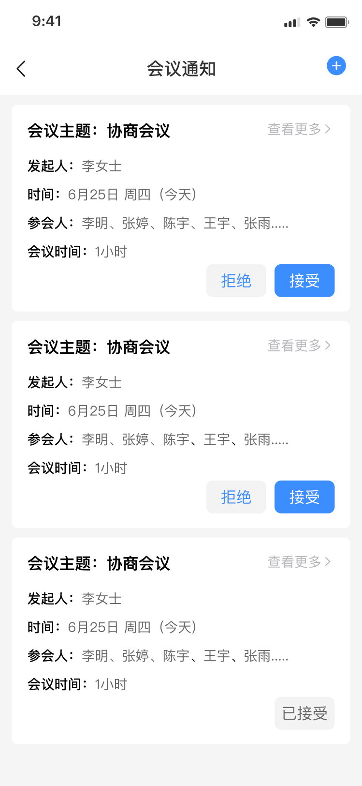

**状态：新增。**

- 详情同 9.3；响应：`PUT /v1/im/meetings/{meeting_id}/my-response`，Body `{"response":"accepted|declined|tentative","version":n}`。
- 返回我的最终响应和会议版本，并实时通知发起人；重复提交同状态幂等。
- 会议过期返回 `MEETING_CLOSED` 并只读展示；客户端本地日历写入是可选系统动作，不替代服务端响应。

### 9.5 日报.png

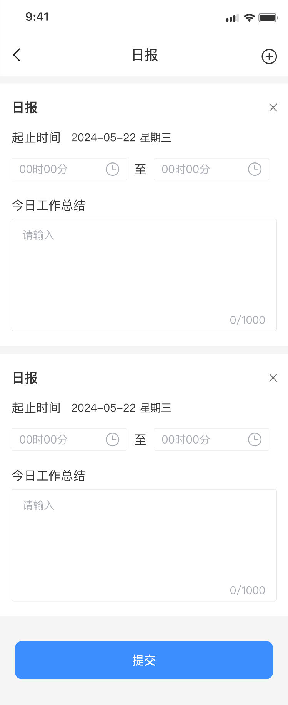

**状态：新增。**

- `GET /v1/im/reports/daily?scope=mine&from=&to=&status=&cursor=` 返回 `report_id,report_date,status,draft_updated_at,submitted_at,read_state`。
- 新建草稿 `POST /v1/im/reports/daily`，Body `{"report_date":"2026-08-11"}`；同一用户同一天唯一，重复创建返回原草稿。
- `permissions.can_create` 和可补交日期由服务端返回，前端不自行判断工作日规则。

### 9.6 日报-普通用户页面.png

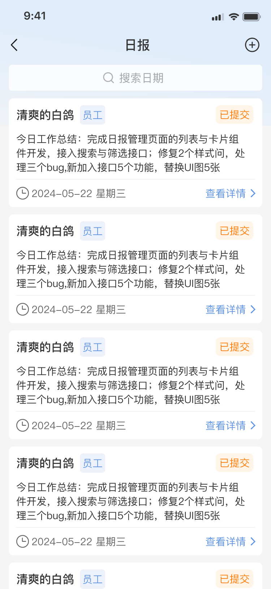

**状态：新增。**

- 编辑：`PUT /v1/im/reports/daily/{id}/draft`，Body `{"content":"...","attachments":[],"version":n}`；提交 `POST /v1/im/reports/daily/{id}/submit`。
- 服务端返回自动保存版本，客户端用 2～5 秒防抖且串行保存；版本冲突返回 `REPORT_VERSION_CONFLICT` 并给最新版本。
- 提交后按 `editable_until` 决定是否可修改；附件使用 `purpose=daily_report` 上传并做权限绑定。

### 9.7 日报-管理员页面.png

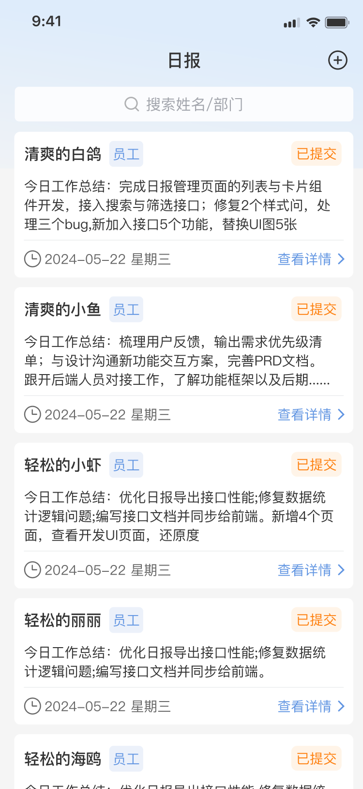

**状态：新增。**

- `GET /v1/im/reports/daily/statistics?date=&department_id=` 返回 `expected_count,submitted_count,missing_count` 和组织权限范围。
- 明细：`GET /v1/im/reports/daily?scope=managed&date=&status=submitted|missing&department_id=&cursor=`。
- 提醒：`POST /v1/im/reports/daily/reminders`，Body `{"date":"...","user_ids":[]}`；服务端过滤无管理权限对象并限流，返回逐项结果。

### 9.8 日报-查看详情.png

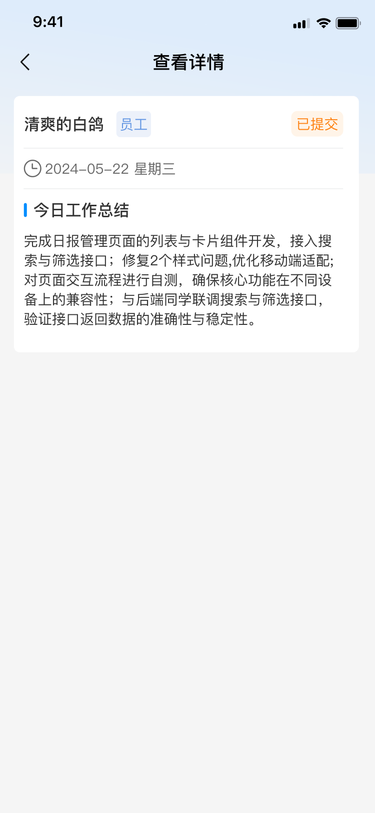

**状态：新增。**

- `GET /v1/im/reports/daily/{report_id}` 返回填报人、日期、内容、附件、状态、版本、修改时间和 `permissions`。
- 管理员查看时服务端记录必要的已读状态；附件下载复用第 7 章 ACL。
- 撤回或修订使用专用状态和版本，客户端必须显示最新版本与 `revised_at`，不能混合旧缓存。

### 9.9 月报(1).png

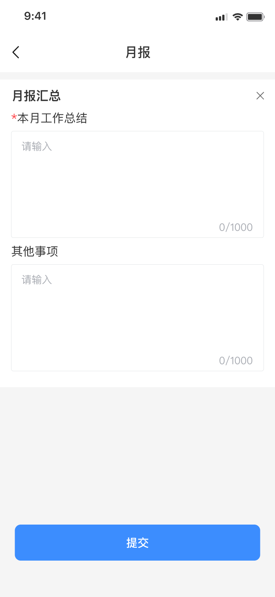

**状态：新增。**

- 创建/取得当月草稿：`POST /v1/im/reports/monthly`，Body `{"month":"2026-08"}`。
- 保存：`PUT /v1/im/reports/monthly/{id}/draft`，Body `{"work_summary":"...","next_plan":"...","attachments":[],"version":n}`；提交 `POST /v1/im/reports/monthly/{id}/submit`。
- 字段必填、最大长度、提交截止时间由响应 `validation` 提供；自动保存和冲突处理同 9.6。

### 9.10 月报.png

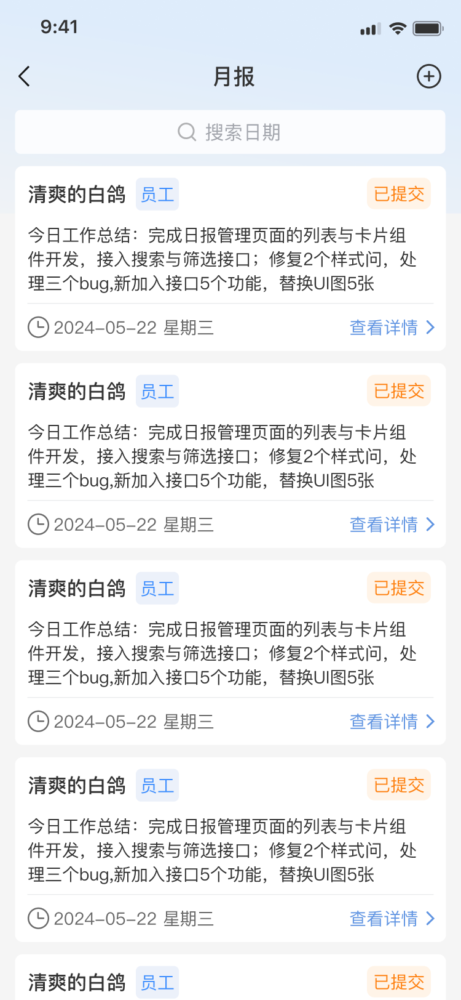

**状态：新增。**

- `GET /v1/im/reports/monthly?scope=mine|managed&from_month=&to_month=&status=&cursor=` 返回月份、填报人、状态和时间。
- 管理员统计 `GET /v1/im/reports/monthly/statistics?month=&department_id=`；普通用户响应中不下发团队统计入口权限。
- 未提交项进入 9.9，已提交项进入 9.11，路由由返回 `action=edit|view` 决定。

### 9.11 月报-详情页.png

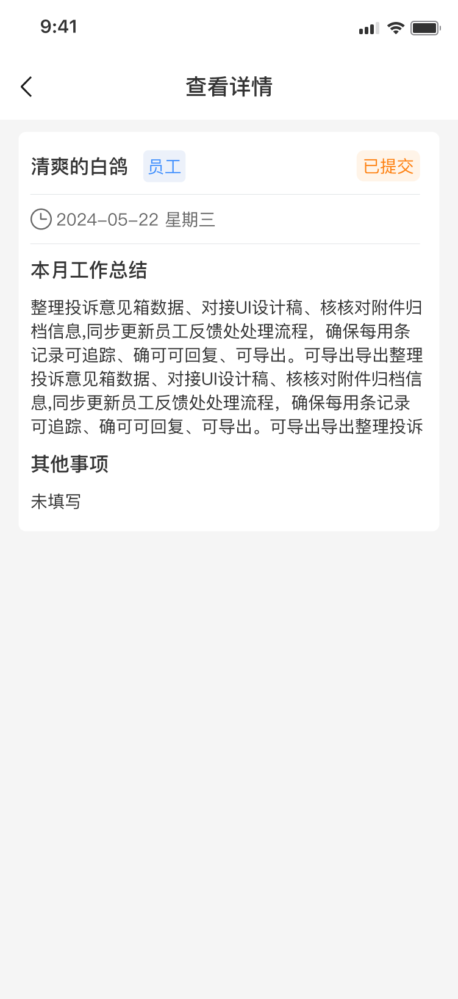

**状态：新增。**

- `GET /v1/im/reports/monthly/{report_id}` 返回 `month,author,work_summary,next_plan,attachments,status,submitted_at,updated_at,version,permissions`。
- `permissions.can_edit=true` 时进入草稿更新；否则只读。修改已提交月报需专用 `POST /v1/im/reports/monthly/{id}/reopen` 或审核流程，不直接覆盖。

### 9.12 总经理信箱.png

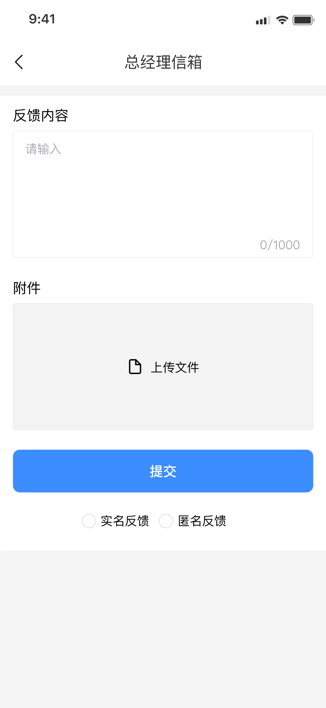

**状态：新增。**

- 页面配置：`GET /v1/im/executive-mailbox/config` 返回 `enabled,allow_anonymous,required_fields,max_length,attachment_policy,notice`。
- 提交：`POST /v1/im/executive-mailbox/submissions`，Body `{"subject":"...","content":"...","anonymous":false,"attachment_file_ids":[]}`，带幂等键。
- 成功仅返回 `submission_id,status:"received",submitted_at`；匿名模式下业务接收方不见身份，但安全审计是否保留内部追踪按企业政策执行并提前告知。

### 9.13 总经理信箱-文案提示.png

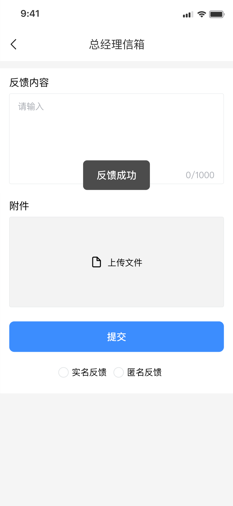

**状态：新增配置接口。**

- 文案使用 9.12 配置中的 `notice{title,content,updated_at}`，由租户后台配置；客户端不得硬编码实名/匿名承诺。
- 提交按钮前必须展示当前版本文案；请求可携带 `notice_version`，服务端发现关键政策已变更时返回 `NOTICE_RECONFIRM_REQUIRED`。

## 10. 个人资料、通用设置、隐私与青少年模式

### 10.1 我的.png

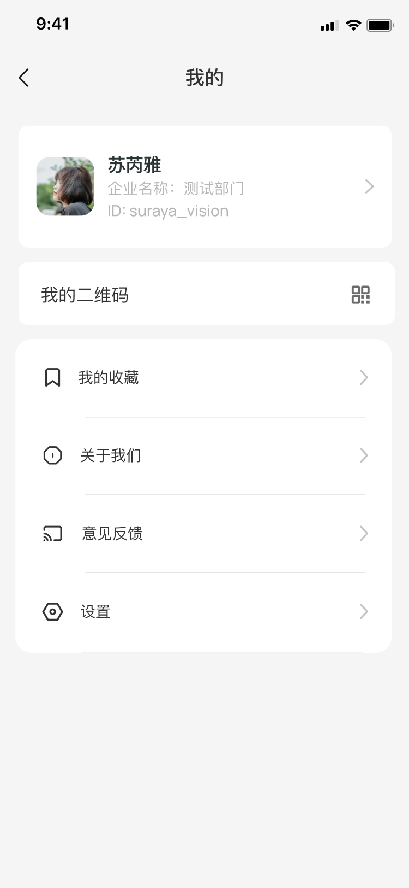

**状态：基础用户资料已有；产品菜单新增。**

- `GET /v1/im/me` 返回公开账号资料、实名/青少年模式摘要和资料版本；`GET /v1/im/bootstrap` 返回个人菜单与权限。
- 头像、昵称更新事件到达后刷新头部；收藏和设置入口分别进入第 7、10 章。
- 账号 ID 按字符串展示，客户端不得展示内部数据库 ID 或 tenant_id。

### 10.2 个人信息.png

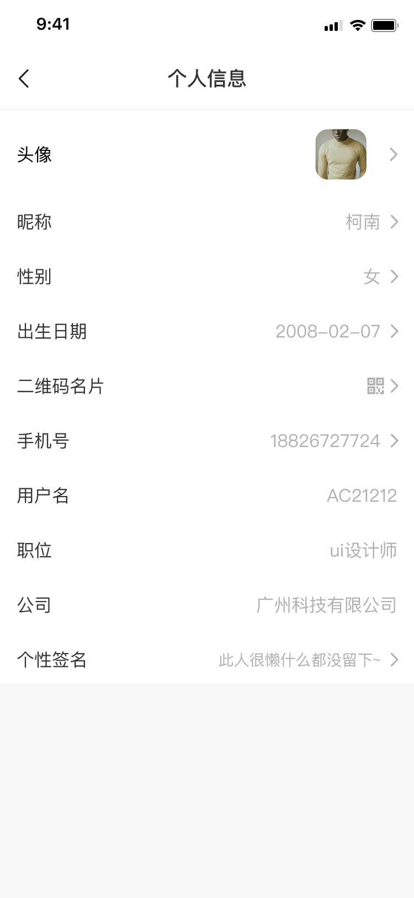

**状态：Tinode `me` 资料更新已有基础；目标产品接口需改造。**

- 查询 `GET /v1/im/me/profile` 返回 `avatar_file_id,nickname,birth_date,signature,gender,region,public_account,version,field_rules`。
- 更新统一使用 `PATCH /v1/im/me/profile`，仅提交变更字段并带 `version`；服务端更新后同步 Tinode `me.public` 并推送资料事件。
- 头像先以 `purpose=user_avatar` 上传再 PATCH；任何字段的可见性由隐私策略裁剪。

### 10.3 设置昵称.png

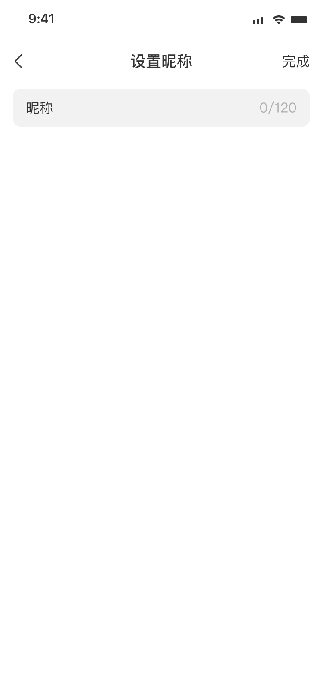

**状态：需改造。**

- `PATCH /v1/im/me/profile`，Body `{"nickname":"新昵称","version":n}`。
- 服务端校验 Unicode 长度、全空白、控制字符和敏感内容；返回更新后的 `nickname,version,updated_at`。
- 成功刷新全局资料和联系人快照，但不得覆盖各群昵称。版本冲突先拉最新资料再由用户确认。

### 10.4 出生日期.png

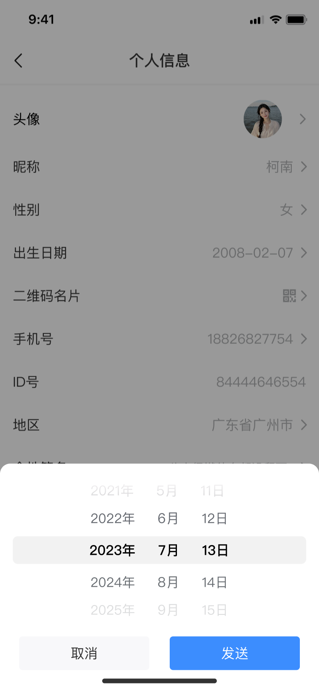

**状态：新增产品字段。**

- 保存同 10.3，Body `{"birth_date":"2000-01-02","version":n}`；仅传 ISO 日期，不传本地化文本或时区时间戳。
- 服务端校验不晚于当前租户日期及合理范围，返回 `PROFILE_FIELD_INVALID`。展示格式由客户端本地化。

### 10.5 个性签名.png


**状态：需改造。**

- 保存同 10.3，Body `{"signature":"...","version":n}`；空字符串表示清空。
- 服务端按 `field_rules.signature.max_length` 和内容审核处理；失败保留本地草稿，成功刷新引用页面。

### 10.6 二维码.png


**状态：图标纯客户端；二维码协议新增。**

- 点击入口进入 5.4 并创建短期个人二维码。每次主动刷新调用 `POST /v1/im/me/qrcodes` 获取新 Token。
- 二维码不能使用静态 `user_id`、手机号或登录 Token；过期、撤销和切租户后必须重新生成。

### 10.7 设置（iOS）.png

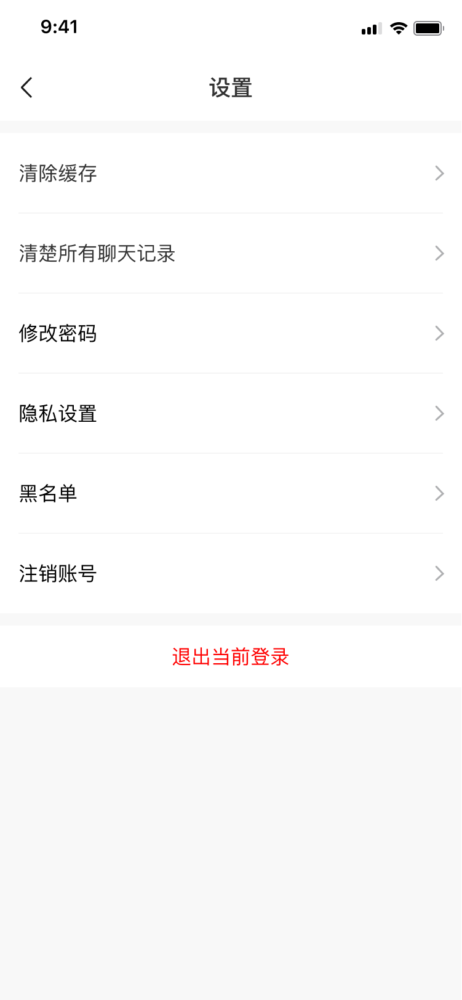

**状态：菜单纯客户端；数据接口部分新增。**

- 菜单来自 `bootstrap.settings_menu`，安全、通知、隐私、通用、关于按权限展示。系统通知权限状态由 iOS API 读取，不由服务端伪造。
- 退出：`POST /v1/im/auth/logout` 撤销当前 refresh/access token 和设备会话，成功或 Token 已失效后关闭 WS、清安全存储和本租户用户缓存。
- 多设备退出使用 `DELETE /v1/im/security/sessions/{session_id}`，需二次验证。

### 10.8 设置（安卓）.png

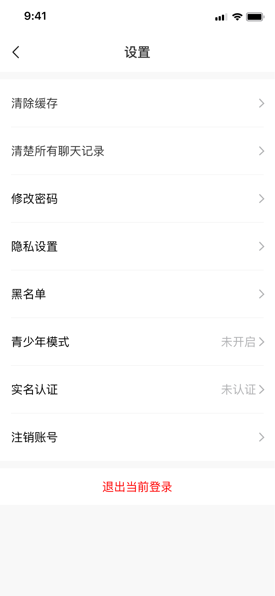

**状态：菜单纯客户端；业务协议同 10.7。**

- 使用相同 `bootstrap.settings_menu` 与退出协议；Android 系统权限、通知渠道和应用更新使用平台实现。
- 服务端只保存应用内通知偏好与设备 Push Token，不把系统设置页面是否打开当作已授权。

### 10.9 清空缓存的提示.png

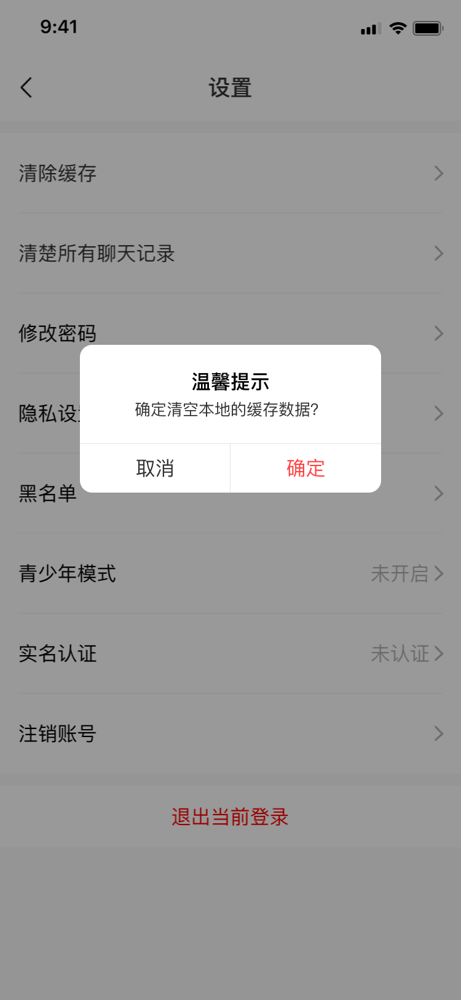

**状态：纯客户端。**

- 确认后只删除缩略图、可重下文件、临时上传下载和搜索缓存；不调用服务端删除消息、收藏或账号接口。
- 不删除安全存储中的登录凭证，除非用户选择退出登录。完成后重新计算本地占用并显示结果。

### 10.10 版本更新页面.png

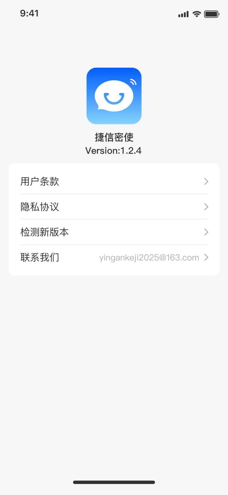

**状态：新增 App 配置接口。**

- `GET /v1/im/app/releases/latest?platform=ios|android&current_version=1.0.0&channel=stable`，未登录可在企业解析后调用。
- 返回 `latest_version,min_supported_version,update_type=none|optional|required,release_notes,store_url,package_url,checksum,published_at`。
- 客户端按平台只打开受信任商店/签名下载地址；Android 包必须校验签名和 checksum，服务端 URL 使用允许域名。

### 10.11 发现新版本.png

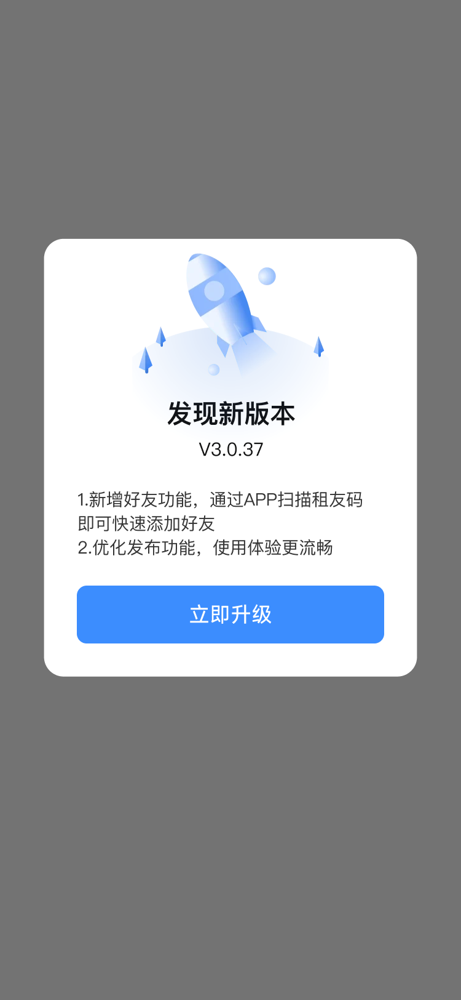

**状态：纯客户端弹窗；数据来自 10.10。**

- `optional` 显示稍后/更新，记录本地已忽略版本并按服务端 `remind_after` 再提示；`required` 不显示绕过入口。
- 下载和安装状态由平台管理；接口异常时不得误判为强制更新，除非本地已有有效签名的最低版本策略缓存。

### 10.12 隐私设置.png

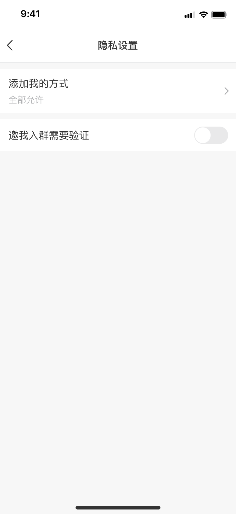

**状态：新增。**

- `GET /v1/im/me/privacy` 返回 `add_me_methods,profile_visibility,last_seen_visibility,read_receipts,version` 和各字段 `editable`。
- `PATCH /v1/im/me/privacy` 只提交变更字段和 `version`；成功返回完整最新配置并向其他设备推送 `privacy.updated`。
- 黑名单入口使用 5.12。服务端在搜索、主页、回执等实际读写路径执行隐私规则，不能只保存开关。

### 10.13 隐私设置-添加我的方式选项.png

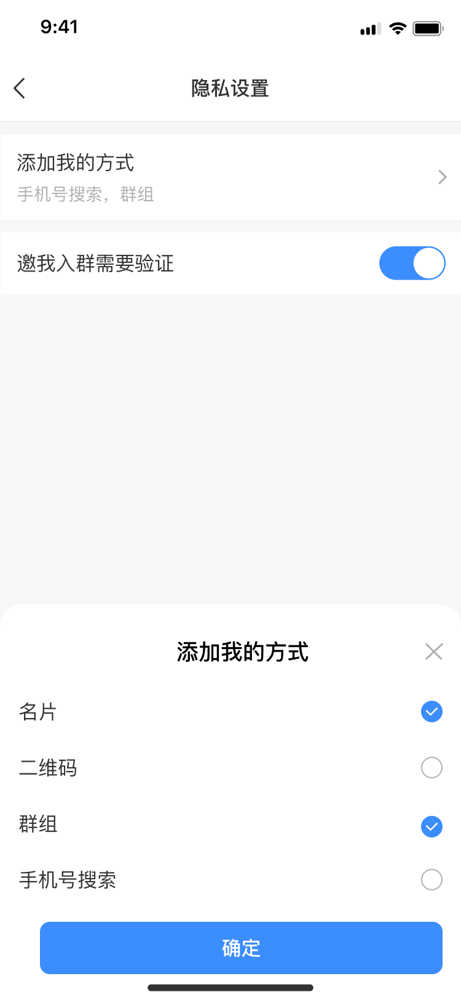

**状态：新增。**

- `add_me_methods` 固定字段 `account,phone,qr,group`，每项为布尔值；更新用 10.12 PATCH，如 `{"add_me_methods":{"phone":false},"version":n}`。
- 关闭后对应搜索/二维码/群来源申请由服务端统一返回 `FRIEND_REQUEST_NOT_ALLOWED` 或 `USER_NOT_DISCOVERABLE`，不泄露具体关闭项。
- 企业强制策略可令字段 `editable=false`，前端禁用并显示服务端提供的通用说明。

### 10.14 青少年模式未开启（安卓）.png

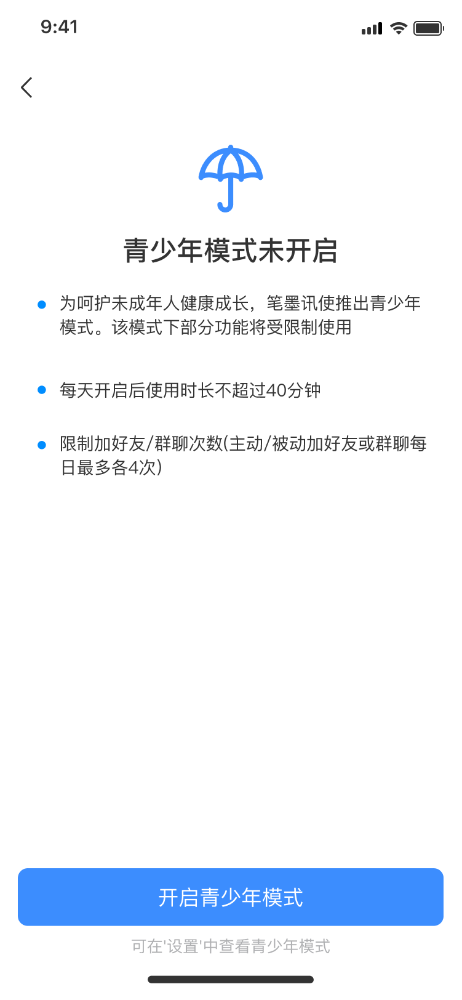

**状态：新增。**

- `GET /v1/im/settings/youth-mode` 返回 `enabled,policy_version,restrictions,password_set,can_enable`。
- 点击开启先展示 10.15，再按 1.7 完成身份验证和 1.11 设置独立密码；最后调用 `POST /v1/im/settings/youth-mode/enable`，Body `{"policy_version":n,"action_token":"..."}`。
- 服务端持久化到用户租户范围并推送所有设备，不能仅设置本地标志。

### 10.15 青少年模式提示（安卓）.png

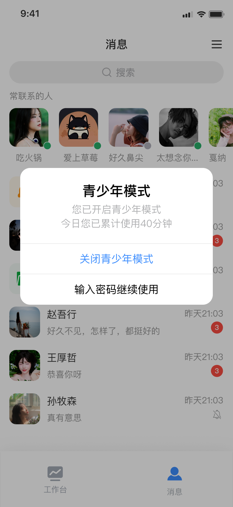

**状态：弹窗纯客户端；文案由服务端配置。**

- 使用 10.14 返回的 `restrictions` 与 `policy_version` 渲染；取消不请求，确认进入密码设置/验证。
- 最终 enable 请求携带用户确认的 `policy_version`；若策略更新返回 `POLICY_RECONFIRM_REQUIRED`，重新展示新内容。

### 10.16 青少年模式已开启（安卓）.png

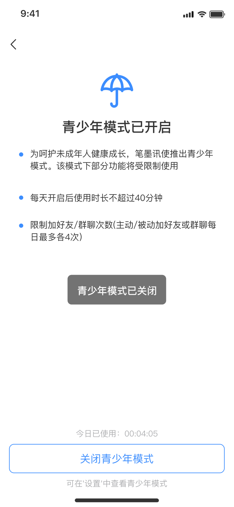

**状态：新增。**

- 页面调用 10.14，`enabled=true` 时展示 `enabled_at,restrictions`。`bootstrap` 同时返回受限模块和动作。
- 受限接口服务端返回 `YOUTH_MODE_RESTRICTED`；前端隐藏只是体验优化，不能作为安全控制。
- 登录、App 重启和另一设备均从服务端恢复状态；收到 `youth_mode.updated` 即刷新。

### 10.17 关闭青少年模式（安卓）.png

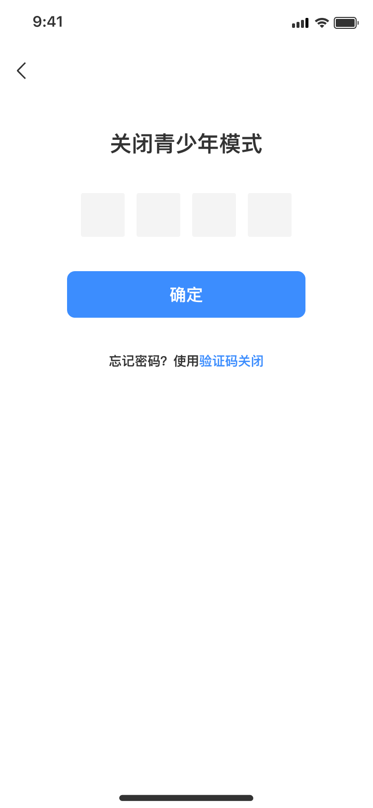

**状态：新增。**

- 先调用 1.11 的独立密码验证，获得 `action_token`；再 `POST /v1/im/settings/youth-mode/disable`，Header `X-Action-Token`，带幂等键。
- 成功返回 `enabled:false,updated_at` 并广播；连续密码错误按服务端 `retry_after_seconds` 锁定。
- 忘记密码走 1.7 身份验证后重置，不能绕过密码直接修改本地状态。

### 10.18 获取推送权限（安卓）.png

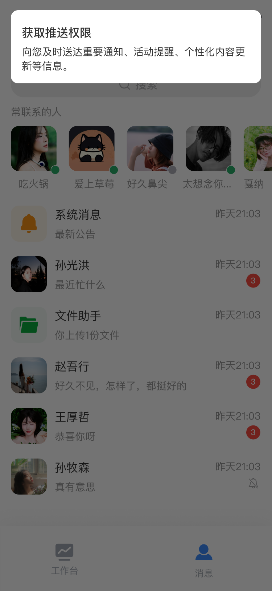

**状态：权限引导纯客户端；设备注册需改造。**

- 用户确认后调用 Android 系统权限；拒绝状态本地记录，最终以系统回调为准。
- 获取 Push Token 后 `PUT /v1/im/devices/{device_id}/push-token`，Body `{"provider":"fcm","token":"...","app_version":"..."}`；Token 轮换时覆盖。
- 退出登录删除/解绑该用户设备 Token。Push Token 属敏感凭证，不写日志。

### 10.19 提醒（安卓）.png

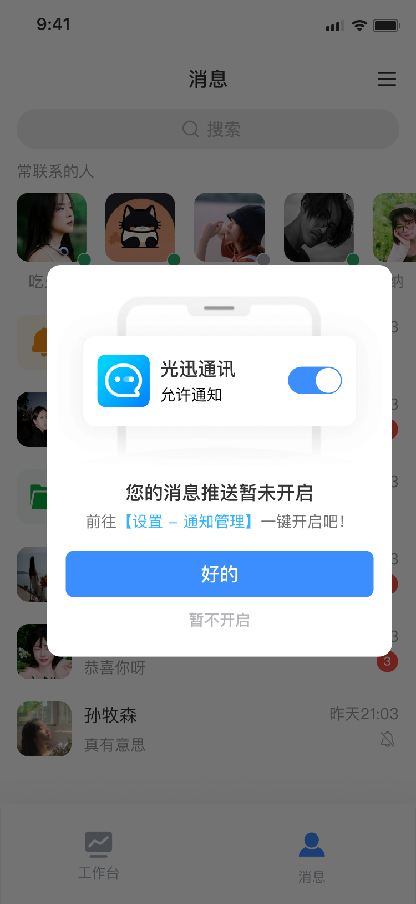

**状态：纯客户端。**

- 仅在功能因系统权限不可用时显示；取消和“前往设置”不调用业务服务端。
- 回到应用后重新读取真实权限，不能因用户打开过设置页就假定授权成功。

### 10.20 相机说明（安卓）.png

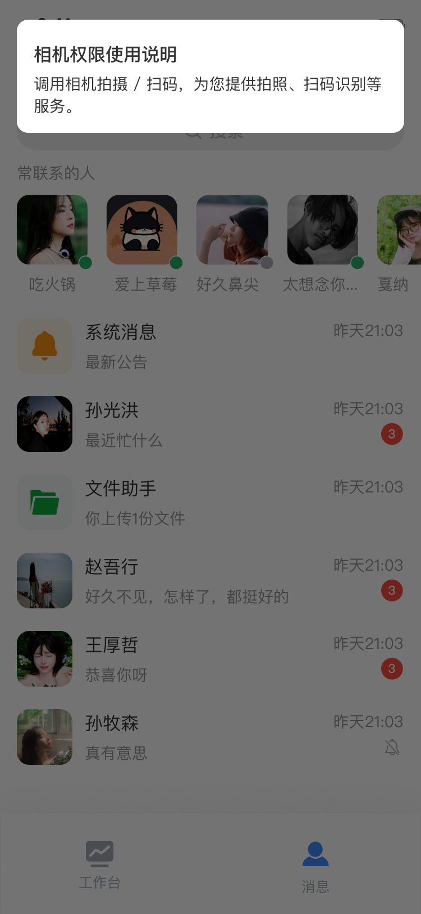

**状态：纯客户端。**

- 首次拍照、扫码或视频通话前展示用途说明，确认后再触发系统权限；拒绝不发媒体/扫码请求。
- 永久拒绝时提供系统设置入口；允许从相册选择等替代能力。客户端不得上传系统权限状态作为服务端授权依据。

### 10.21 麦克风说明（安卓）.png

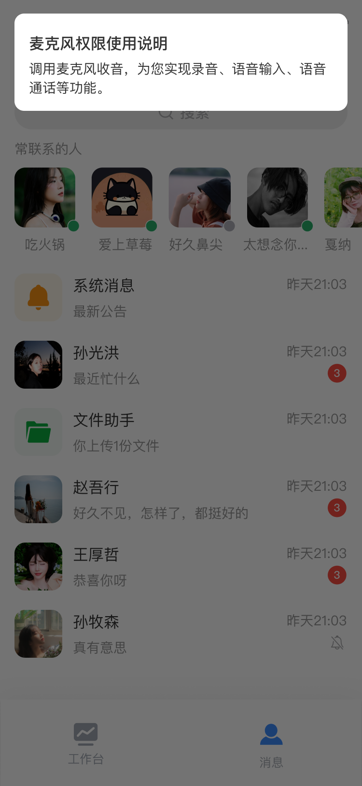

**状态：纯客户端。**

- 首次录音或通话前说明并申请系统权限；未授权时不得创建录音文件或发送 call invite。
- 永久拒绝后进入系统设置引导；恢复授权后重新执行 4.7 或第 8 章动作，不复用过期媒体会话。

## 11. 反诈安全、举报与意见反馈

### 11.1 反诈弹窗（安卓）.png

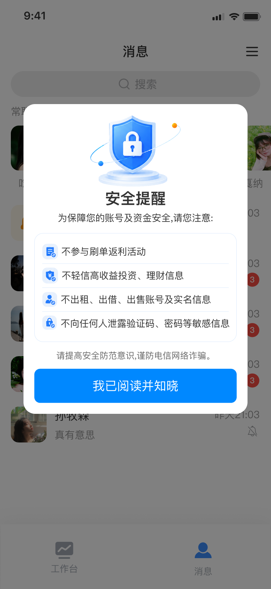

**状态：新增风控决策协议。**

- 高风险动作在原业务接口返回 `409 RISK_CONFIRMATION_REQUIRED`，`details={risk_challenge_id,level,notice_code,notice_params,expires_at,action}`。
- 客户端用 `notice_code` 映射经过审核的本地文案，不显示服务端规则、分数或命中特征；取消不重试原操作。
- 低风险提示也可由可信 `security.risk_notice` 系统事件触发。普通消息不得伪装成系统反诈弹窗。

### 11.2 反诈弹窗（二次提示安卓）.png

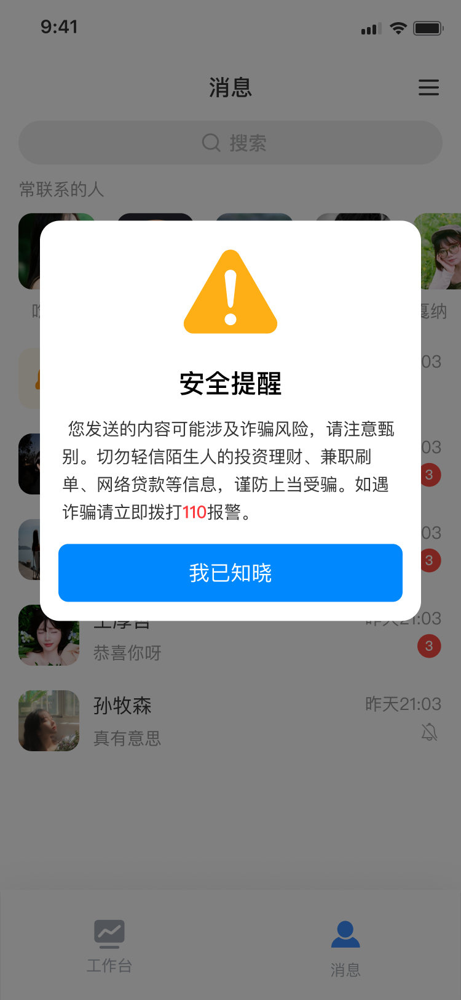

**状态：新增。**

- 确认：`POST /v1/im/security/risk-challenges/{risk_challenge_id}/confirm`，Body `{"decision":"continue|cancel"}`，带幂等键。
- `continue` 成功返回单次、短期 `risk_action_token`；客户端在重试原业务接口时以 `X-Risk-Action-Token` 携带，原请求幂等键保持不变。
- 服务端可返回 `RISK_ACTION_BLOCKED` 直接阻断；确认、取消、过期均写审计，客户端不得无限创建 challenge 绕过。

### 11.3 举报.png

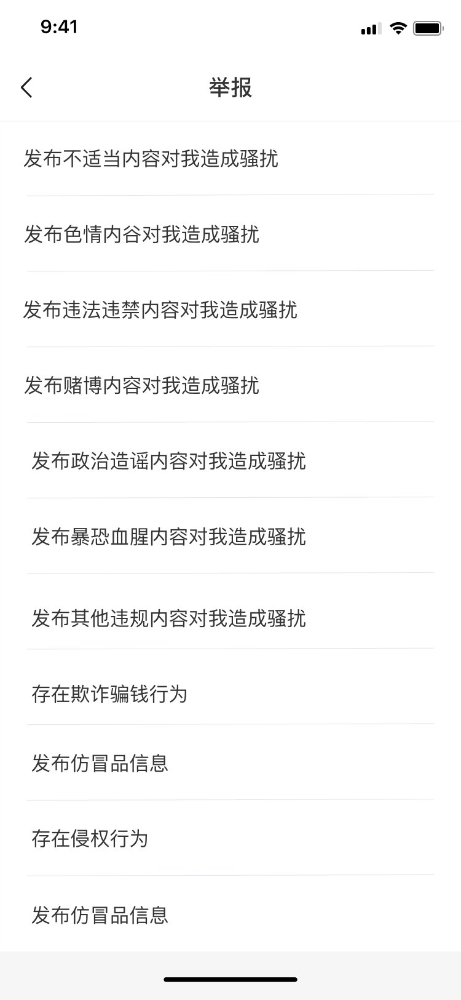

**状态：新增。**

- 原因：`GET /v1/im/reports/abuse/reasons?target_type=user|group|message` 返回 `reason_code,label,requires_description,allows_evidence`。
- 进入页面携带受控目标：用户 `user_id`、群 `topic` 或消息 `(topic,seq)`；客户端不提交 tenant_id 或被举报者任意文本身份。
- 服务端先验证举报人能够看到目标，再返回适用原因；举报人身份不下发给被举报方。

### 11.4 举报(1).png

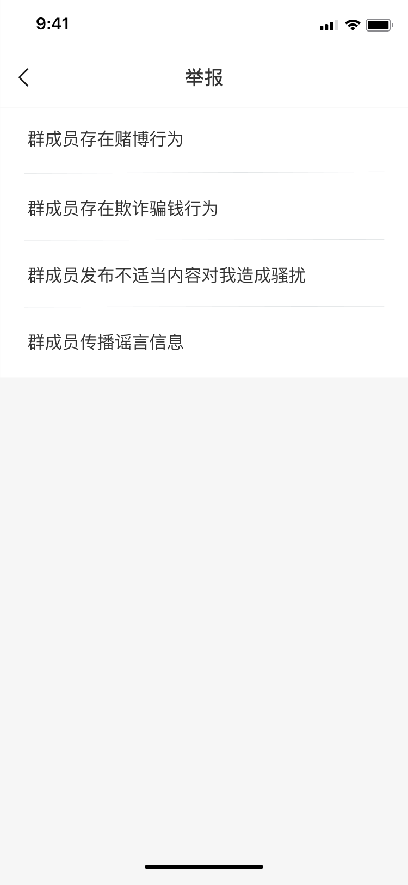

**状态：新增。**

- 证据使用 `purpose=abuse_evidence` 上传；提交 `POST /v1/im/reports/abuse`，Body `{"target":{"type":"message","topic":"...","seq":"12"},"reason_code":"fraud","description":"...","evidence_file_ids":[]}`。
- 服务端从目标消息保存必要、受控的审核快照，校验证据数量/MIME/大小，返回 `report_id,status:"received"`。
- 重复举报按策略合并并返回原受理号或 `REPORT_RATE_LIMITED`；证据使用独立严格 ACL 和保留期。

### 11.5 意见反馈.png

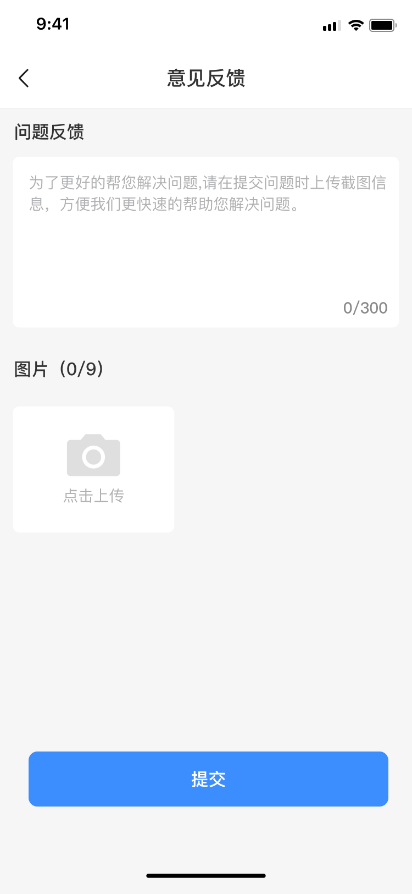

**状态：新增。**

- 配置：`GET /v1/im/feedback/config` 返回类别、最大正文、附件规则、是否允许联系方式和日志授权说明。
- 提交：`POST /v1/im/feedback`，Body `{"category":"bug","content":"...","contact":"...","attachment_file_ids":[],"client_context":{"platform":"android","app_version":"1.0.0","os_version":"..."},"include_diagnostics":false}`。
- 附件用 `purpose=feedback`；只有用户明确同意 `include_diagnostics=true` 才上传经过脱敏的诊断包。成功返回 `feedback_id,status:"received"`，重复提交由幂等键去重。

## 12. 联调实施清单

### 12.1 当前可直接联调的基础能力

1. WebSocket `/v0/channels`、Wire Version `0.25` 和最低版本 `0.20`。
2. 第一条 `hi` 携带企业码并固定 Session 租户；响应包含公开租户信息、限制、ICE 配置和呼叫超时。
3. `basic`/`token` 登录，`sub/get/set/pub/leave/del/note` 基础 Tinode 协议。
4. `pub` 成功返回 `202 + seq`，Topic 消息与基础回执同步。
5. `/v0/file/u/` 和 `/v0/file/s/{file_id}` 的基础上传下载及租户存储隔离。

### 12.2 必须优先完成的服务端阻塞项

| 优先级 | 改造项 | 阻塞图片章节 |
| --- | --- | --- |
| P0 | `/v1/im` 统一认证中间件、响应封装、幂等键、租户 Principal | 全部 HTTP 产品能力 |
| P0 | 企业码解析、验证码、密码重置、二次认证、Token `auth_version` 和刷新/撤销 | 1.1～1.11、10.7～10.8 |
| P0 | 普通用户禁止发布系统 Topic；系统事件可信生产通道 | 2.5、3.1～3.5、6.4、11.1 |
| P0 | 消息 `x-im-schema/type/client-mid` 校验和服务端幂等 | 2～4 章 |
| P0 | 文件资源级 ACL、Range、ETag、用途绑定和租户存储配额 | 3.6、4.10～4.14、6.27～7.16、11.4～11.5 |
| P1 | 好友申请、好友关系、黑名单状态机 | 第 3、5 章 |
| P1 | 群成员、角色、禁言、公告、邀请审批和配额 | 第 6 章 |
| P1 | 收藏、转发和聊天记录搜索 | 第 4、7 章 |
| P1 | 通话媒体状态、结果消息、Push 来电 | 第 8 章 |
| P2 | 工作台、组织、会议、日报、月报、信箱 | 第 9 章 |
| P2 | 隐私、青少年模式、反诈、举报、反馈 | 第 10、11 章 |

### 12.3 前后端联调最低验收用例

| 编号 | 场景 | 预期结果 |
| --- | --- | --- |
| T-01 | A 企业 Token 连接 B 企业 Session | 登录失败 `TENANT_MISMATCH`，不产生用户/Topic 数据 |
| T-02 | 企业停用后使用旧 Token 登录和请求 HTTP | WS/HTTP 均拒绝，客户端清除凭证并回企业入口 |
| T-03 | 同 `client_mid` 断线重发同一消息 | 只落一条消息并返回同一 `seq` |
| T-04 | 相同 HTTP 幂等键、相同请求体重复提交 | 返回第一次结果；不同请求体返回 `IDEMPOTENCY_CONFLICT` |
| T-05 | 被拉黑或删除好友后绕过按钮直接 `pub` | 服务端拒绝，对方不收到消息 |
| T-06 | 普通用户构造 `system_event` 或向系统 Topic 发布 | 服务端拒绝，系统消息页不展示可信样式 |
| T-07 | 普通群成员调用管理员、禁言、转让群主接口 | 返回 `FORBIDDEN`，群状态不变且写安全审计 |
| T-08 | 群成员数已达租户配置上限时同意两个并发申请 | 至多一个成功，成员数不超限 |
| T-09 | 非消息接收者持同租户 Token 下载文件 | 返回 `FILE_FORBIDDEN`，不能只通过 file_id 下载 |
| T-10 | 文件下载中 Token 过期后刷新并 Range 续传 | 文件完整、checksum 正确、不重复下载已完成分片 |
| T-11 | 风控二次确认后重复重放 risk token | 只有首次有效，其余返回 Token 已消费 |
| T-12 | 切换企业后查看缓存、上传任务、收藏和搜索 | 不出现上一租户数据或任务 |

### 12.4 统一错误 reason

首版客户端至少实现：`TENANT_UNAVAILABLE`、`TENANT_MISMATCH`、`AUTH_FAILED`、`TOKEN_EXPIRED`、`ACCOUNT_DISABLED`、`RATE_LIMITED`、`VALIDATION_FAILED`、`IDEMPOTENCY_CONFLICT`、`RESOURCE_NOT_FOUND`、`FORBIDDEN`、`FRIEND_RELATION_REQUIRED`、`MESSAGE_NOT_ALLOWED`、`GROUP_MUTED`、`GROUP_MEMBER_LIMIT_EXCEEDED`、`TENANT_USER_QUOTA_EXCEEDED`、`TENANT_GROUP_QUOTA_EXCEEDED`、`FILE_TOO_LARGE`、`FILE_FORBIDDEN`、`FILE_UNAVAILABLE`、`STORAGE_QUOTA_EXCEEDED`、`REALNAME_REQUIRED`、`YOUTH_MODE_RESTRICTED`、`RISK_CONFIRMATION_REQUIRED`、`RISK_ACTION_BLOCKED`。

未知 `reason` 使用通用失败文案并记录 `request_id`，不得把服务端 `message` 原样展示给用户。

### 12.5 完成定义

每个图片小节进入联调前，服务端须提供 OpenAPI/JSON Schema、错误码、权限规则和可用测试租户；前端须提供请求日志脱敏、断线/重试行为和四态页面（加载、空、成功、失败）。联调完成必须逐图勾选对应协议、至少覆盖成功、权限拒绝、重复提交、断网恢复和跨租户五类场景。
