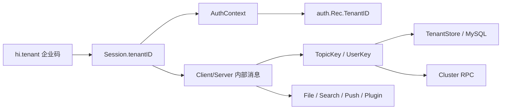

# IM 服务端多租户第 5 至 12 章代码改造与测试方案

## 1. 文档目的

本文是《IM-服务端多租户改造方案》第 5 章至第 12 章的代码实施方案，覆盖租户识别与认证、Session 与 Topic、Store 与 Adapter、MySQL 数据访问、缓存与集群、文件、搜索，以及 Push、插件和外部服务。

本文只规划代码改造和测试，不包含数据库建表、数据迁移、历史数据回填、双写、灰度迁移或旧 Token 兼容。实施前提是本地 MySQL 已经更新为最终多租户表结构，所有业务表的 `tenant_id`、复合索引和复合外键均已就绪。

## 2. 实施范围与原则

### 2.1 本期范围

- WebSocket 握手解析企业码并固定 Session TenantID；
- 注册、登录、Token、验证码、REST 认证和密码找回租户化；
- User、Topic、Subscription、Message、Device、File、Cache 的 Store 与 MySQL 查询租户化；
- Hub、本地缓存、Session Store 和集群路由键租户化；
- 文件上传、下载、关联、删除和对象存储路径租户化；
- 用户、Topic、Tags、消息搜索和组织数据租户化；
- Push、Plugin Firehose 及外部服务调用携带可信 TenantID；
- 单元测试、MySQL 集成测试、双租户隔离测试和集群测试。

### 2.2 明确不做

- 不实现 `tenant_ticket`，首次 `hi` 继续直接提交公开企业码；
- 不兼容无 TenantID 的旧 Token；
- 不设置默认租户；
- 不提供无租户业务 Store；
- 不处理历史数据；
- 本期产品运行时只支持 MySQL。MongoDB、PostgreSQL 和 RethinkDB 不得以未隔离模式启动。

### 2.3 核心安全不变量

以下规则应通过类型、统一入口和测试共同保证：

```text
tenant_id 只能由服务端根据 hi.tenant、已签名 Token 或已认证 Session 得到
已认证 Session 的 tenant_id != 0、uid != 0
认证结果 tenant_id == Session tenant_id
业务对象 tenant_id == Session tenant_id
内部消息、缓存键、集群路由和外部调用均携带同一个 tenant_id
任何跨租户访问统一返回 NotFound/Denied，不泄露目标对象是否存在
```

禁止从 Topic Tags、请求 Body、URL Query 或普通 Header 中读取客户端自报的内部 `tenant_id` 作为授权依据。

## 3. 当前实现基线

| 能力 | 当前状态 | 本方案处理 |
| --- | --- | --- |
| `TenantID`、租户实体和状态 | 已实现 | 保留并补充通用 TenantKey 类型 |
| `hi.tenant` 企业码 | 已实现 | 保留；补充后续链路测试 |
| Session 固定 TenantID | 已实现 | 补充认证后用户归属校验 |
| MySQL `TenantGetByCode` | 已实现 | 保留 |
| `ClientComMessage.TenantID` | 已实现 | 扩展到服务端消息、集群和后台任务 |
| protobuf `ClientHi.tenant` | 已实现 | 补充内部 TenantID 字段或 RPC 元数据 |
| `AuthContext`、`auth.Rec.TenantID` | 未实现 | 第 5 章实施 |
| Token 携带 TenantID | 未实现 | 升级为 Token v2，拒绝旧格式 |
| Store/Adapter 业务接口租户化 | 未实现 | 第 7 章实施 |
| MySQL 业务 SQL 带租户条件 | 未实现 | 第 8 章实施 |
| Hub/Cluster/Cache 路由键租户化 | 未实现 | 第 9 章实施 |
| 文件、搜索、Push、插件租户化 | 未实现 | 第 10 至 12 章实施 |

## 4. 总体代码结构

### 4.1 租户作用域类型

在 `server/store/types` 增加统一键类型，所有内部路由和缓存只通过这些类型生成 Key：

```go
type TopicKey struct {
    TenantID TenantID
    Topic    string
}

func (k TopicKey) RoutingKey() (string, error)

type UserKey struct {
    TenantID TenantID
    UID      Uid
}

func (k UserKey) CacheKey() (string, error)
```

`TenantID == ZeroTenantID`、Topic 为空或 UID 为零时生成 Key 必须报错。业务代码不得自行拼接 `tenantID + ":" + topic`。

### 4.2 租户作用域 Store

推荐在 `server/store/store.go` 增加：

```go
type TenantStore struct {
    TenantID types.TenantID
    Users    TenantUsersStore
    Topics   TenantTopicsStore
    Subs     TenantSubsStore
    Messages TenantMessagesStore
    Devices  TenantDevicesStore
    Files    TenantFilesStore
    PCache   TenantCacheStore
}

func ForTenant(tenantID types.TenantID) (*TenantStore, error)
```

Session、Topic、HTTP Handler 和后台任务先取得 `TenantStore`，再访问业务数据。`ForTenant(0)` 必须返回错误。租户注册表和平台管理操作继续使用独立的 `Tenants`/`PlatformStore`，不能混入业务 Store。

底层 MySQL Adapter 的业务方法显式接收 `tenantID`。为了避免未完成的数据库 Adapter 继续工作，启动时检查配置的 Adapter 是否完整实现租户能力；非 MySQL Adapter 返回 `ErrUnsupportedTenant` 并终止启动。

### 4.3 TenantID 的传播方向



传播只允许从左向右。认证器、插件、数据库结果和外部回调只能验证 TenantID，不能替换 Session 已绑定的 TenantID。

## 5. 第 5 章：租户识别与认证流程

### 5.1 修改目标

已完成的 `hi.tenant` 解析继续作为连接租户入口。本章补齐认证上下文、认证记录、Token v2、凭证查询和管理员边界。

### 5.2 代码修改

#### 5.2.1 认证接口

修改 `server/auth/auth.go`：

```go
type AuthContext struct {
    TenantID   types.TenantID
    RemoteAddr string
}

type Rec struct {
    TenantID types.TenantID `json:"tenant_id,omitempty"`
    // 原有字段保持不变
}
```

将 `AuthHandler` 的以下方法改为接收 `AuthContext` 或 TenantID：

```go
AddRecord(ctx AuthContext, rec *Rec, secret []byte)
UpdateRecord(ctx AuthContext, rec *Rec, secret []byte)
Authenticate(ctx AuthContext, secret []byte)
IsUnique(ctx AuthContext, secret []byte)
DelRecords(tenantID types.TenantID, uid types.Uid)
GetResetParams(tenantID types.TenantID, uid types.Uid)
```

同步修改：

- `server/auth/basic/auth_basic.go`；
- `server/auth/code/auth_code.go`；
- `server/auth/rest/auth_rest.go`；
- `server/auth/token/auth_token.go`；
- `server/auth/anon/auth_anon.go`；
- `server/auth/mock_auth`；
- `server/session.go` 中注册、登录、临时认证和凭证校验调用点；
- HTTP 文件认证调用点。

所有认证器入口先校验 `ctx.TenantID != 0`。认证结果没有 TenantID，或 `rec.TenantID != ctx.TenantID`，统一返回认证失败并记录安全日志。

#### 5.2.2 Basic、Code、REST 认证

- Basic 登录名按 `(tenant_id, scheme, unique)` 查询；
- 注册时唯一性检查只在当前租户执行；
- Code 认证的验证码记录、次数和过期时间按租户隔离；
- REST 认证请求携带服务端签名的 TenantID，响应必须原样返回 TenantID；
- 密码找回先从 Session/签名上下文得到 TenantID，再查询 Credential，禁止全库按手机号或邮箱查找。

#### 5.2.3 Token v2

修改 `server/auth/token/auth_token.go`。当前 Token 是 50 字节且没有版本和 TenantID，替换为明确版本的 v2 布局：

```text
[1:version][8:tenant_id][8:uid][4:expires][2:auth_level]
[2:serial][2:features][32:HMAC-SHA256]
```

实施规则：

- `version` 固定为 2；
- `tenant_id` 和其余 Token 字段一起参与 HMAC；
- `GenSecret` 要求 `rec.TenantID != 0`；
- `Authenticate` 校验版本、精确长度、签名、租户、过期时间和 serial；
- v1/当前 50 字节 Token 直接返回 `ErrMalformed` 或 `ErrFailed`；
- Token TenantID 与 `AuthContext.TenantID` 不一致时返回认证失败；
- 认证成功返回包含 TenantID 的 `auth.Rec`。

本项目没有历史数据，因此不增加双版本解析和兼容开关。

#### 5.2.4 用户归属和管理员

登录取得 UID 后，使用当前 `TenantStore.Users.Get(uid)` 再确认 User 属于相同租户，然后才写入 `Session.uid`。Tenant Admin 角色通过租户内角色/权限数据判断，不能用全局 `AuthLevelRoot` 代替。普通 WebSocket 请求中的 `AsUser` 必须同时验证角色和目标 User 的 TenantID。

### 5.3 测试用例

| 编号 | 层级 | 场景与操作 | 预期结果 |
| --- | --- | --- | --- |
| T5-HI-001 | 单元 | 使用有效且 active 的 `acme` 执行首次 `hi` | Session 固定 Tenant A，响应只含 code/name |
| T5-HI-002 | 单元 | `hi` 不传 tenant、传空白或超过 64 字符 | 握手失败，Session 仍未绑定 |
| T5-HI-003 | 单元 | 使用不存在或 suspended 租户 | 分别返回 NotFound/Denied，不绑定 Session |
| T5-HI-004 | 单元 | 已绑定 A 的 Session 再传 B | 拒绝且 Session 仍为 A |
| T5-AUTH-001 | MySQL 集成 | A、B 分别创建相同登录名 `alice` | 两条记录均成功，分别登录到各自用户 |
| T5-AUTH-002 | MySQL 集成 | A 使用 B 的 `alice` 密码登录 | 认证失败，不泄露 B 用户存在性 |
| T5-AUTH-003 | 单元 | Authenticator 返回 B 的 `auth.Rec` 给 A Session | 登录失败并产生安全日志 |
| T5-AUTH-004 | 单元 | 为 A 用户生成 Token v2，再在 A Session 登录 | 成功，TenantID/UID 完整恢复 |
| T5-AUTH-005 | 单元 | A Token 在 B Session 使用 | 认证失败，B Session 不写入 UID |
| T5-AUTH-006 | 单元 | 修改 Token 中 TenantID 或版本字节 | HMAC/版本校验失败 |
| T5-AUTH-007 | 单元 | 使用当前 50 字节旧 Token | 明确拒绝，不进入兼容分支 |
| T5-AUTH-008 | MySQL 集成 | A、B 使用相同手机号发起密码找回 | 只命中当前租户用户和验证码 |
| T5-AUTH-009 | 权限 | A 的 tenant_admin 代操作 B 用户 | 拒绝；平台管理 API 不受普通 WS 入口影响 |

## 6. 第 6 章：Session、消息和 Topic 改造

### 6.1 修改目标

TenantID 从 Session 贯穿到内部双向消息、Topic 生命周期和所有 P2P/群聊权限检查。客户端 Topic 名和对外协议保持不变。

### 6.2 代码修改

#### 6.2.1 内部消息和 Session

- 保留 `Session.tenantID` 和 `ClientComMessage.TenantID`；
- 给 `ServerComMessage` 增加不序列化给普通客户端的 `TenantID`；
- Session 收到每条客户端消息时覆盖内部 TenantID，忽略反序列化对象中可能存在的值；
- 所有 Topic、Hub、Cluster 和后台生成消息必须显式填写 TenantID；
- 登录成功前验证 `User.tenant_id == Session.tenantID`；
- PROXY、MULTIPLEX Session 同样必须有 TenantID。

#### 6.2.2 Topic 对象和路由键

修改 `server/topic.go`、`server/hub.go`、`server/session.go` 及相关辅助类型：

- `Topic` 增加初始化后不可变的 `tenantID`；
- Hub `topicGet/topicPut/topicDel` 参数从裸字符串改为 `types.TopicKey`；
- Session 订阅表、Topic Proxy、Multiplex Session 使用 `RoutingKey()`；
- 调试输出可显示 TenantID 和外部 Topic 名，但不能把内部前缀回传客户端；
- 数据库中的 Topic 名仍保存原始名称，不保存 `tenantID:` 前缀。

#### 6.2.3 特殊 Topic、P2P 和群聊

- `sys` 按 `(tenant_id, "sys")` 懒加载，不再创建全局唯一实例；
- `me`、`fnd`、`slf` 使用 Session TenantStore 加载；
- 创建 P2P 前加载双方 User，并验证双方与 Session 同租户；
- 创建群、邀请、审批、踢人、转让群主、发送系统通知时验证 Topic、操作者和目标成员同租户；
- Subscription、Outbox、系统消息和附件关联全部沿用 Topic TenantID。

### 6.3 测试用例

| 编号 | 层级 | 场景与操作 | 预期结果 |
| --- | --- | --- | --- |
| T6-MSG-001 | 单元 | A Session 发送普通消息 | `ClientComMessage.TenantID` 被服务端写为 A |
| T6-MSG-002 | 单元 | 构造内部消息自带 B TenantID 后交给 A Session | 值被覆盖或请求被拒绝，不能进入 B |
| T6-MSG-003 | 单元 | Topic 产生服务端响应/通知 | `ServerComMessage.TenantID` 等于 Topic TenantID |
| T6-TOPIC-001 | 单元 | A、B 同时加载裸名称 `sys` | Hub 中存在两个不同 Topic 实例 |
| T6-TOPIC-002 | 单元 | A、B 使用相同 Group Topic 名 | 内部 RoutingKey 不同，对外名称不变 |
| T6-P2P-001 | 集成 | A 用户邀请 A 用户创建 P2P | 创建成功，Topic/Subs 均为 A |
| T6-P2P-002 | 集成 | A 用户邀请 B 用户创建 P2P | 返回通用 NotFound/Denied，不产生 Topic/Subs |
| T6-GRP-001 | 集成 | A 管理员邀请 B 用户加入 A 群 | 拒绝且没有部分写入 |
| T6-GRP-002 | 集成 | A 用户用已知 B Topic 名订阅、读、写、删 | 所有操作均失败，B 数据不变化 |
| T6-SYS-001 | 集成 | A 发布系统通知 | 只有 A 的 `sys` 订阅者收到 |

## 7. 第 7 章：Store 与 Adapter 改造

### 7.1 修改目标

消除业务代码中的无租户持久化入口，使漏传 TenantID 在编译期或统一 Store 入口立即失败，而不是依赖开发者记得追加 SQL 条件。

### 7.2 代码修改

#### 7.2.1 Store 接口

修改 `server/store/store.go`，为以下域建立 TenantStore Mapper：

- Users：Create/Get/GetAll/Update/Delete/State/Tags/Topics/Subs/Unread；
- Auth：Add/Get/Update/Delete/Unique lookup；
- Credentials：Upsert/Get/Confirm/Fail/Delete/Reset lookup；
- Topics：Create/Get/Share/Delete/Update/Owner/Find；
- Subscriptions：Create/Get/Update/Delete/按 User 或 Topic 查询；
- Messages：Save/Get/Delete/GetDeleted/Topic SeqId；
- Devices：Upsert/Get/Delete/Push Channel；
- Files：Start/Finish/Get/Link/DeleteUnused/Access；
- Persistent Cache：Get/Upsert/Delete/Expire。

现有 `store.Users`、`store.Topics` 等全局 Mapper 不再供 Session/Topic/Handler 使用。完成调用点替换后删除或限制为测试期私有入口，避免新代码绕过 TenantStore。

#### 7.2.2 Adapter 接口

修改 `server/db/adapter.go`，所有租户业务方法显式接收 `types.TenantID`，例如：

```go
UserGet(tenantID types.TenantID, uid types.Uid)
AuthGetUniqueRecord(tenantID types.TenantID, unique string)
TopicGet(tenantID types.TenantID, topic string)
SubscriptionGet(tenantID types.TenantID, topic string, uid types.Uid, keepDeleted bool)
MessageGetAll(tenantID types.TenantID, topic string, uid types.Uid, opts *types.QueryOpt)
FileGet(tenantID types.TenantID, fileID string)
```

数据对象 `User`、`Topic`、`Subscription`、`Message`、`DelMessage`、`Credential`、`DeviceDef` 和 `FileDef` 增加内部 TenantID。Create/Save 时同时校验“方法参数 TenantID、父对象 TenantID、待写对象 TenantID”一致。

#### 7.2.3 非 MySQL Adapter

公共接口变化会影响 `server/db/postgres`、`server/db/mongodb`、`server/db/rethinkdb` 和 Mock。处理方式：

- Mock 完整实现租户参数，用于单元测试；
- MySQL 完整实现业务逻辑；
- 其他 Adapter 实现相同签名但返回 `ErrUnsupportedTenant`；
- 服务启动阶段检测并拒绝使用不支持租户业务接口的 Adapter；
- 不允许退回旧的无租户查询。

### 7.3 测试用例

| 编号 | 层级 | 场景与操作 | 预期结果 |
| --- | --- | --- | --- |
| T7-STORE-001 | 单元 | 调用 `store.ForTenant(0)` | 返回错误，不创建 Mapper |
| T7-STORE-002 | 单元 | A TenantStore 查询 B UID | 返回 NotFound/Denied |
| T7-STORE-003 | 单元 | Create 参数为 A、对象 TenantID 为 B | 写入前失败，Adapter 不被调用 |
| T7-STORE-004 | 单元 | Mock 断言 Session 所有 Store 调用 | 每次调用都收到 Session TenantID |
| T7-STORE-005 | 构建 | 搜索生产代码中的全局 `store.Users/Topics/...` | Session/Topic/Handler 路径不存在绕过入口 |
| T7-ADP-001 | 启动 | 配置 PostgreSQL/MongoDB/RethinkDB | 启动失败并明确提示不支持多租户 |
| T7-ADP-002 | 单元 | Adapter 收到零 TenantID | 统一返回 `ErrInvalidTenant`，不执行 SQL |

## 8. 第 8 章：MySQL 代码改造

### 8.1 前提

本地数据库已经更新，本章不执行任何 schema 修改。代码直接以最终多租户表结构为准，测试负责验证 SQL 使用 `tenant_id`、唯一约束和复合外键符合预期。

### 8.2 代码修改

修改 `server/db/mysql/adapter.go` 中所有业务 SQL：

- `SELECT` 必须包含 `WHERE tenant_id = ?`；
- `UPDATE`、`DELETE` 必须同时包含 TenantID 和业务主键；
- `INSERT` 明确写入 `tenant_id`，不能依赖数据库默认值；
- JOIN 同时关联父子表 TenantID，例如 `child.tenant_id = parent.tenant_id`；
- 唯一查询按复合业务键执行，如 `(tenant_id, uname)`；
- 聚合、未读数、序号、清理任务和批处理同样按租户过滤；
- 受影响行数为 0 时直接返回 NotFound/Denied，不再发起无租户探测查询；
- 租户级垃圾清理采用 `tenantID + limit`，由平台调度器遍历 active 租户。

建议按域逐段改造并提交，每段同时更新对应 MySQL 测试：

1. User、Auth、Credential；
2. Topic、Subscription、Tags；
3. Message、DelLog、未读数；
4. Device；
5. FileUpload、FileMessageLink；
6. Persistent Cache。

### 8.3 SQL 审计要求

新增测试辅助函数或代码审查清单，对 `adapter.go` 中业务 SQL 做静态检查。以下情况必须阻止合并：

- 业务表查询完全没有 `tenant_id`；
- JOIN 只按 ID 关联，没有 TenantID；
- Update/Delete 只按全局 ID；
- `IN (...)` 批量查询没有 TenantID 前置条件；
- 后台清理一次扫描全部租户业务数据；
- 为判断“其他租户是否存在该对象”而执行无租户查询。

### 8.4 测试用例

| 编号 | 层级 | 场景与操作 | 预期结果 |
| --- | --- | --- | --- |
| T8-DB-001 | MySQL 集成 | A、B 插入相同 `auth.uname` | 均成功；同租户重复失败 |
| T8-DB-002 | MySQL 集成 | A、B 插入相同 Topic name/tag | 均成功；查询只返回当前租户 |
| T8-DB-003 | MySQL 集成 | A 查询 B 的 UID、Topic、Message、File | 均返回空/NotFound |
| T8-DB-004 | MySQL 集成 | A 更新/删除 B 对象的业务 ID | 影响行数为 0，B 数据不变 |
| T8-DB-005 | MySQL 集成 | 尝试写入 A Subscription 关联 B Topic/User | 代码校验或复合外键拒绝，事务回滚 |
| T8-DB-006 | MySQL 集成 | A 消息关联 B 文件 | 代码校验或复合外键拒绝 |
| T8-DB-007 | MySQL 集成 | A、B 分别统计未读数和设备数 | 结果只包含本租户数据 |
| T8-DB-008 | MySQL 集成 | A 的批量删除、过期和垃圾清理 | B 的 Message/File/Cache 不变化 |
| T8-DB-009 | 静态审计 | 扫描全部业务 SQL | 无缺失 TenantID 的读写和 JOIN |

## 9. 第 9 章：缓存与集群改造

### 9.1 代码修改

#### 9.1.1 Hub 与 User Cache

修改 `server/hub.go`：

- `topicGet/topicPut/topicDel` 使用 `TopicKey.RoutingKey()`；
- 放入 Hub 前验证请求、Topic 对象和数据库行 TenantID 一致；
- `topicUnreg`、rehash、stats 和 debug 结构增加 TenantID。

修改 User Cache、未读数、Pending Push 和 EvictUser 相关代码：

- 使用 `UserKey{TenantID, UID}`；
- `EvictUser(tenantID, uid, skipSID)`；
- 用户状态、设备和未读数更新都携带 TenantID。

Session ID 保持全局随机，但通过 SID 取 Session 后，使用方必须读取并验证 Session TenantID，不能再只取 UID。

#### 9.1.2 集群

修改 `server/cluster.go`：

- `ClusterSess`、`ClusterSessUpdate`、`ClusterReq`、`ClusterRoute`、`ClusterResp` 增加 TenantID；
- `nodeForTopic`、`isRemoteTopic` 接收 `TopicKey` 并按 RoutingKey 做一致性哈希；
- Proxy/Master 两端重算 RoutingKey，并验证 RPC、Session、Client/Server Message TenantID 一致；
- User Cache RPC 和 Topic rehash 携带 TenantID；
- Cluster 协议版本增加多租户能力位，旧节点拒绝加入。

#### 9.1.3 持久化缓存

增加统一 `TenantCacheKey(tenantID, namespace, key)`。租户配置、验证码、未读数和业务临时状态均使用该函数。平台级 schema/version 缓存使用独立 Platform Cache 接口。

### 9.2 测试用例

| 编号 | 层级 | 场景与操作 | 预期结果 |
| --- | --- | --- | --- |
| T9-HUB-001 | 单元 | A、B Put/Get 相同 Topic 名 | 分别命中各自对象，无覆盖 |
| T9-HUB-002 | 单元 | 将 B Topic 放入 A TopicKey | 拒绝并记录安全告警 |
| T9-USER-001 | 单元 | Evict A 的同值 UID | 只断开 A Session，B Session 保持 |
| T9-CACHE-001 | MySQL 集成 | A、B 写同 namespace/key | 值独立；过期 A 不删除 B |
| T9-CL-001 | 单元 | A、B 相同 Topic 计算节点 | 使用不同 RoutingKey；结果按各自 Key 稳定 |
| T9-CL-002 | 集群集成 | RPC TenantID 与消息 TenantID 不一致 | 接收端拒绝，不创建 Proxy Topic |
| T9-CL-003 | 集群集成 | A Session 伪造 B RcptTo | Master 重算路由后拒绝 |
| T9-CL-004 | 集群集成 | 节点重哈希 | A、B 同名 Topic 均完整迁移且不合并 |
| T9-CL-005 | 启动 | 多租户节点与旧协议节点组网 | 握手失败，不能形成混合版本集群 |

## 10. 第 10 章：文件与对象存储改造

### 10.1 代码修改

在 `server/hdl_files.go` 增加：

```go
type RequestPrincipal struct {
    TenantID types.TenantID
    UID      types.Uid
    Roles    []string
}
```

`authFileRequest` 改为返回 `RequestPrincipal`：

- Token 路径从 Token v2 得到 TenantID；
- SID 路径从 Session 得到 TenantID；
- 两条路径都要求 TenantID 和 UID 非零；
- API Key 只做应用准入，不推导 TenantID。

Store/Adapter 增加 `FileCanAccess(tenantID, uid, fileID, action)`，并改造上传、下载、断点续传、关联、删除和垃圾回收：

- 先使用 TenantID 加载 File；
- 未完成上传只允许同租户上传者访问；
- 已关联消息时校验同租户 Subscription 和 Read 权限；
- 删除验证上传者、群主或租户管理员角色；
- 转发时验证源文件、源消息和目标 Topic 同租户；
- 签名 URL 覆盖 TenantID、FileID、Action 和 Expires；
- 新对象路径使用 `tenants/{tenant_id}/yyyy/mm/{file_id}`；
- Location 仅供服务端使用，不直接返回客户端。

### 10.2 测试用例

| 编号 | 层级 | 场景与操作 | 预期结果 |
| --- | --- | --- | --- |
| T10-AUTH-001 | 单元 | Token 和 SID 分别认证同一用户 | 得到相同 TenantID/UID Principal |
| T10-AUTH-002 | 单元 | 无租户旧 Token、无效 SID 或零 UID | 认证失败，不进入 File Store |
| T10-UP-001 | 集成 | A 上传文件 | DB TenantID 为 A，路径以 `tenants/A/` 开头 |
| T10-DL-001 | 集成 | A 用户下载 A 群内有权限文件 | 成功 |
| T10-DL-002 | 集成 | A 使用已知 B FileID 下载 | 通用 NotFound/Denied，不返回元数据/Location |
| T10-LINK-001 | 集成 | A 消息关联 B FileID | 失败，文件 use_count 不变化 |
| T10-FWD-001 | 集成 | A 转发 B 文件到 A Topic | 失败且不创建消息 |
| T10-SIGN-001 | 单元 | 修改签名 URL 中 TenantID/FileID/Expires | 验签失败 |
| T10-GC-001 | MySQL 集成 | 清理 A 未使用文件 | B 文件记录和对象不被删除 |

## 11. 第 11 章：搜索、Tags 与组织数据

### 11.1 代码修改

修改 `server/store/store.go`、`server/db/adapter.go` 和 `server/db/mysql/adapter.go`：

- `Find`、`FindOne`、User/Topic Tag 增删改查显式接收 TenantID；
- 精确账号、手机号、邮箱查询只在当前租户执行；
- 结果对象再次验证 TenantID 后才返回；
- 无结果和命中其他租户统一表现为空/NotFound。

消息搜索索引文档必须包含 TenantID，文档键或路由键使用 `tenant_id + topic + seq_id`。查询时先强制加 TenantID，再按当前用户在同租户 Topic 的 Read ACL 二次过滤。TenantID 来自认证上下文，不接受 Query 参数覆盖。

组织表 Repository 均以 TenantID 为首参数。新增/移动部门、设置负责人、添加成员时加载父部门和 User，验证它们属于同一租户。涉及多表写入时使用事务，任何归属不一致都整体回滚。

### 11.2 测试用例

| 编号 | 层级 | 场景与操作 | 预期结果 |
| --- | --- | --- | --- |
| T11-FIND-001 | MySQL 集成 | A、B 用户具有相同 `email:`/`tel:` Tag | 各租户只返回自己的用户 |
| T11-FIND-002 | MySQL 集成 | A 搜索只有 B 存在的 Tag | 返回空结果，不提示跨租户命中 |
| T11-FIND-003 | MySQL 集成 | A、B 使用相同 Topic Tag | 排名和结果集合互不影响 |
| T11-MSG-001 | 搜索集成 | A、B 消息正文相同 | A 查询结果中不出现 B 文档 |
| T11-MSG-002 | 搜索集成 | A 用户搜索 A 内无 Read 权限 Topic | ACL 二次过滤移除结果 |
| T11-MSG-003 | 安全 | Query 参数提交 B TenantID | 参数被忽略或请求被拒绝，仍使用 Token TenantID |
| T11-ORG-001 | MySQL 集成 | A 部门添加 A 用户 | 成功，组织关系为 A |
| T11-ORG-002 | MySQL 集成 | A 部门添加 B 用户/负责人 | 失败，事务无部分写入 |
| T11-ORG-003 | MySQL 集成 | A 部门设置 B 部门为 parent | 失败，部门树不变化 |

## 12. 第 12 章：Push、插件和外部服务

### 12.1 Push

修改 `server/push/push.go`：

```go
type Receipt struct { TenantID types.TenantID /* ... */ }
type ChannelReq struct { TenantID types.TenantID /* ... */ }
type Payload struct { TenantID types.TenantID `json:"-"` /* ... */ }
```

- Push 构造入口要求 TenantID 非零；
- 设备按 `(tenant_id, uid)` 查询；
- Channel 使用统一函数生成租户前缀，不能直接拼接客户端值；
- Push Handler 根据 TenantID 选择模板、App 包和密钥引用；
- 未读数使用 UserKey；
- 日志和指标带 TenantID，但不得输出完整设备 Token。

### 12.2 Plugin Firehose

修改 `server/plugins.go` 和 protobuf：

- `pluginGenerateClientReq` 写入 Session TenantID；
- Plugin 请求包含 TenantID 和可选租户策略版本；
- `REPLACE` 响应反序列化后，服务端强制恢复原 TenantID；
- 替换后的目标 Topic 重新执行同租户校验；
- `RESPOND` 生成的服务端消息也强制使用原 TenantID；
- 插件超时、失败开放/关闭、审计和指标按租户配置执行。

### 12.3 REST、短信、TURN 和对象存储

- 外部请求使用服务端签名的 TenantContext，至少覆盖 TenantID、请求用途、过期时间和 nonce；
- 回调响应必须返回 TenantID/nonce，服务端验证与原请求一致；
- 秘钥管理只保存租户配置中的 Secret 引用，业务 JSON 不保存明文 Secret；
- 短信模板、Push 凭证、对象存储 Bucket/Prefix 和 TURN 配置按 TenantID 选择；
- 租户没有配置时按明确策略失败，不得静默使用其他租户配置。

### 12.4 测试用例

| 编号 | 层级 | 场景与操作 | 预期结果 |
| --- | --- | --- | --- |
| T12-PUSH-001 | 单元 | A 消息生成 Push Receipt | Receipt/Payload/Channel 均为 A |
| T12-PUSH-002 | 集成 | A、B 有同值 UID 和不同设备 | A Push 只读取并投递 A 设备 |
| T12-PUSH-003 | 单元 | A、B 使用相同逻辑 Channel | 生成的物理 Channel 不碰撞 |
| T12-PUSH-004 | 单元 | TenantID 为零或找不到租户凭证 | 明确失败，不回退到其他租户凭证 |
| T12-PLG-001 | 单元 | A 请求发送到 Firehose | Plugin Request TenantID 为 A |
| T12-PLG-002 | 安全 | Plugin `REPLACE` 返回 B TenantID | 服务端拒绝或恢复 A，并重新校验 Topic |
| T12-PLG-003 | 安全 | Plugin `RESPOND` 返回 B TenantID | 响应不能进入 B 路由 |
| T12-EXT-001 | 单元 | 篡改外部请求 TenantContext | 签名校验失败 |
| T12-EXT-002 | 集成 | A 请求收到带 B TenantID/错误 nonce 的回调 | 回调拒绝，不更新任何业务状态 |
| T12-EXT-003 | 配置 | A 未配置短信/TURN/对象存储 | 按 A 策略失败，不使用 B 或全局 Secret |

## 13. 实施顺序与提交边界

### 阶段 A：基础类型和认证

1. 增加 TopicKey、UserKey、AuthContext 和 `auth.Rec.TenantID`；
2. 修改全部认证器和 Mock；
3. 实现 Token v2；
4. 完成第 5 章测试。

完成条件：注册、登录、Token 和密码找回全部绑定租户，旧 Token 明确拒绝。

### 阶段 B：Store、MySQL 与单机消息链路

1. 增加 TenantStore；
2. 改造 Adapter 接口和 MySQL User/Auth/Credential；
3. 改造 Topic/Subscription/Message/Device/File/Cache；
4. 改造 Session、Topic 和 Hub 调用点；
5. 完成第 6 至 8 章测试。

完成条件：单机模式下两个租户可使用同名登录名、Topic 和 Tag，所有交叉读写失败。

### 阶段 C：缓存、集群和文件

1. Hub/User/PCache Key 租户化；
2. Cluster RPC 和一致性哈希租户化；
3. 文件 Principal、ACL、路径和签名租户化；
4. 完成第 9、10 章测试。

完成条件：双节点路由和文件链路不存在跨租户缓存命中或资源访问。

### 阶段 D：搜索、Push、插件和外部服务

1. Find/Tags/消息索引/组织 Repository；
2. Push 数据结构、设备查询和凭证选择；
3. Plugin protobuf 与 REPLACE/RESPOND 校验；
4. 外部 TenantContext 签名与回调验证；
5. 完成第 11、12 章测试。

完成条件：所有出站和异步链路均可按 TenantID 追踪，并通过反向篡改测试。

## 14. 测试环境与公共数据

### 14.1 测试租户

在专用测试库中准备以下数据，不使用开发人员的日常业务数据：

| 数据 | Tenant A | Tenant B |
| --- | --- | --- |
| tenant_id | 1001 | 1002 |
| code | acme | beta |
| state | active | active |
| 登录名 | alice | alice |
| 手机号 | 13800000000 | 13800000000 |
| 逻辑 Topic | sys、grpShared | sys、grpShared |
| Tag | email:alice@example.com | email:alice@example.com |
| 文件 | file-shared-name | file-shared-name |

另外准备一个 `suspended` 租户用于握手和已签 Token 的停用测试。测试数据必须由测试事务或 fixture 创建并清理，不能依赖固定自增 ID。

### 14.2 测试层次

- 单元测试：Key、AuthContext、Token、Session、Hub、Cluster RPC、Plugin 和签名；
- MySQL 集成测试：每个 Adapter 方法至少包含“同租户成功 + 跨租户失败”；
- 服务集成测试：两个真实 WebSocket Session 完成握手、登录、建群、发消息和文件访问；
- 双节点集群测试：同名 Topic 路由、Proxy、重哈希和节点版本检查；
- 安全测试：篡改 TenantID、Token、RPC、Plugin 响应和外部回调；
- 并发测试：A、B 同时创建同名业务键，验证唯一约束只在租户内生效。

## 15. 验证命令

具体数据库连接参数沿用仓库现有 MySQL 测试配置，不在文档中写死账号密码。实施过程中至少执行：

```bash
go test ./server/auth/... ./server/store/... ./pbx
go test ./server
go test -tags mysql ./server/db/mysql/tests
go test -race ./server ./server/auth/... ./server/store/...
go build -tags mysql ./server/...
```

如果仓库现有 MySQL 测试要求特定工作目录或配置文件，应沿用现有测试入口。集群、对象存储、Push 和外部服务使用本地 fake/mock，另在测试环境执行真实双节点和真实供应商沙箱验收。

## 16. 完成标准

- [ ] 第 5 至 12 章所有生产调用链都能追踪到可信 TenantID 来源；
- [ ] 已认证 Session、User、Topic、消息和认证结果 TenantID 始终一致；
- [ ] 业务 Store 不存在可被生产代码调用的无租户入口；
- [ ] MySQL 所有业务读写、JOIN、批处理和清理均包含 TenantID；
- [ ] Hub、User Cache、PCache 和 Cluster 路由均使用租户 Key；
- [ ] Token、文件签名、Plugin 和外部上下文覆盖 TenantID 并通过篡改测试；
- [ ] A/B 双租户同名数据测试全部通过；
- [ ] 所有跨租户读、写、邀请、关联、删除和回调测试全部失败且不泄露对象存在性；
- [ ] 非 MySQL Adapter 无法以未隔离模式启动；
- [ ] 单元测试、MySQL 集成测试、race test 和 MySQL build 全部通过；
- [ ] 日志、指标和安全审计含 TenantID，但不输出密码、Token、设备 Token 或租户 Secret。
