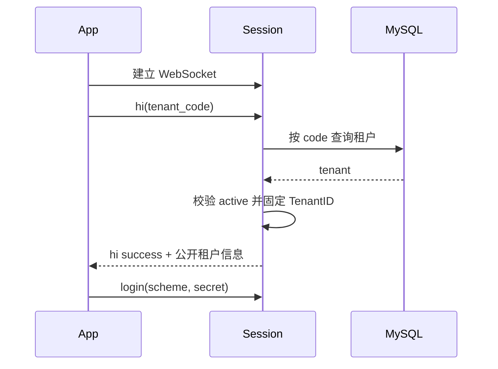

# IM 服务端多租户改造方案

> 编写日期：2026-08-10  
> 适用项目：`im_server` 当前服务端源码  
> 需求背景：[IM 产品原型需求文档](./IM-产品原型需求文档.md) 第 1.1 节“企业码登录”及第 9 章“企业工作台与办公协同”  
> 关联文档：[IM 产品需求服务端改造分析报告](./IM-产品需求服务端改造分析报告.md)

> 实施状态：第一阶段租户识别已落地。MySQL Adapter schema 117 创建 `im_tenant`、`im_tenant_config` 和默认租户；首次 `hi` 使用企业码解析并固定 Session TenantID。核心业务表的 `tenant_id`、租户化认证和路由隔离尚未完成。

## 1. 方案目标

当前项目是单租户 Tinode 服务端。用户、认证记录、Topic、Subscription、Message、File、缓存、集群路由和 Push 都没有租户维度。本方案目标是在一套服务集群和一套 MySQL 数据库中安全承载多个企业租户，并满足以下约束：

1. 一个企业的数据默认只能被本企业用户和管理员访问；
2. 同一手机号、用户名可以在不同企业分别注册；
3. 单聊、群聊、搜索、文件、Push、系统消息和后台任务均不可跨租户；
4. 租户身份由服务端在握手/认证阶段确定，客户端后续消息不能修改；
5. 现有 `usr...`、`grp...`、`p2p...` Topic 格式尽量保持兼容；
6. 多租户启用后，可以按租户配置功能、配额、认证方式、数据保留和安全策略。

## 2. 当前实现为什么不支持多租户

### 2.1 认证和 Session 没有租户

- `auth.Rec` 只有 `Uid`、`AuthLevel`、有效期、状态等字段，没有 `TenantID`；
- `Session` 只保存 `uid` 和 `authLvl`，登录成功后直接把认证记录写入 Session；
- `MsgClientHi`、`MsgClientLogin` 和 Token 中均没有租户；
- basic 登录名在数据库中全局唯一，手机号/邮箱凭证也全局唯一；
- 密码找回按 `method:value` 全局查找账号；
- root 用户可以通过 `Extra.AsUser` 代表任意用户操作，没有租户范围。

这意味着同一手机号无法在两个企业分别注册，也无法证明当前连接属于哪个企业。

### 2.2 数据库全部按全局键查询

改造前 MySQL schema 版本为 116；第一阶段建立租户主表和握手解析后为 117。除租户主数据表外，核心表仍没有 `tenant_id`：

| 表 | 当前关键唯一约束 | 多租户问题 |
| --- | --- | --- |
| `users` | `id` | 无租户归属 |
| `auth` | `uname` 全局唯一 | 不同企业不能使用相同登录名 |
| `credentials` | `synthetic` 全局唯一 | 同一手机号不能加入多个企业 |
| `usertags` | 用户/Tag | 搜索可能返回其他企业用户 |
| `devices` | 设备 Hash 全局唯一 | 同一设备上的多企业账号会冲突 |
| `topics` | `name` 全局唯一 | 没有 Topic 租户边界 |
| `subscriptions` | Topic/User | 不能证明用户与 Topic 属于同一租户 |
| `messages` | Topic/SeqId | 查询只按 Topic，没有租户条件 |
| `dellog` | Topic/User | 删除记录没有租户条件 |
| `fileuploads` | File ID | 文件查询和清理没有租户范围 |
| `filemsglinks` | File/Message/Topic/User | 附件关联不能强制同租户 |

Store/Adapter 的方法也只接收 UID 或 Topic，例如：

```go
UserGet(uid)
AuthGetUniqueRecord(unique)
TopicGet(topic)
SubscriptionGet(topic, uid, keepDeleted)
MessageGetAll(topic, uid, opts)
FileGet(fileID)
```

只在 SQL 表加字段但不修改这些接口，后续开发很容易漏写 `WHERE tenant_id = ?`，仍然会发生越权。

### 2.3 内存、集群和系统 Topic 没有租户

- Hub 的 `topics` 使用裸 Topic 名作为 `sync.Map` Key；
- 集群一致性哈希只对裸 Topic 名计算；
- `ClusterSess` 和集群 RPC 没有租户字段；
- User Cache 仅以 UID 为 Key；
- Push Receipt、FCM Channel 只有 UID/Topic，没有租户；
- Hub 启动时只初始化一个字面值为 `sys` 的全局系统 Topic；
- 持久化缓存 Key 没有租户命名空间。

如果两个租户都使用 `sys` 等逻辑 Topic，同一个内存对象会被共享。即使普通 Topic 名当前由全局 UID 生成，也不能依赖“ID 不碰撞”代替租户授权。

### 2.4 文件接口只获得 UID

`authFileRequest` 当前只返回 UID。文件下载查询只按 File ID，无法把文件访问限制在当前租户。对象存储 Location 也没有统一的租户目录规则。

## 3. 关键设计决策

### 3.1 目标模式

本方案采用：

> **共享服务集群 + 共享 MySQL 数据库 + 共享表 + 每行 `tenant_id` 强隔离**

该模式最符合“多企业共用一套平台”的目标，但也是改造面最大的模式。若实际只需要企业数据物理隔离，采用“一企一实例/一企一库”会更简单；它不属于本文的共享多租户实现。

### 3.2 用户模型：租户内账号

推荐同一个自然人在不同企业中对应不同的 Tinode User：

```text
手机号 138****0000
  ├─ 租户 A -> user A1 -> 独立好友、群、消息和设置
  └─ 租户 B -> user B1 -> 独立好友、群、消息和设置
```

这样可以最大程度复用当前 User/Topic/Subscription 模型，离职、停用、数据导出和删除也能按企业处理。

如果以后需要一个账号切换多个企业，可新增 `global_identities` 和 `tenant_memberships`，把全局身份映射到各租户的本地 User。不要在第一阶段直接把当前 User 改造成跨租户共享主体，否则所有 P2P、资料、设备、未读数和隐私规则都会变得更复杂。

### 3.3 ID 策略：保持全局唯一，额外校验租户

继续使用现有 Snowflake/加密 UID 生成器，User ID、File ID、普通 Group Topic 名保持全局唯一。外部协议继续使用现有 `usr...`、`grp...`、`p2p...` 格式，不把租户编码暴露在这些 ID 中。

所有数据库查询仍必须带 `tenant_id`，原因是：

- 全局唯一只防止碰撞，不能证明调用者有权访问；
- 已知或泄露的其他租户 ID 仍然可能被直接请求；
- 使用复合租户条件可以让越权请求稳定返回不存在。

### 3.4 跨租户通信默认禁止

第一阶段规则：

- 用户搜索只在当前租户；
- P2P 双方必须属于同一租户；
- Group Topic 及全部成员必须属于同一租户；
- 文件、收藏、搜索结果和系统通知不跨租户；
- Tenant Admin 只能管理本租户；
- Platform Admin 的跨租户操作只能走独立后台 API，禁止使用普通客户端协议随意 `AsUser`。

未来若需要跨企业协作，应作为“外部联系人/联邦通信”独立设计，使用明确授权、双边租户策略和审计，不能绕过本方案的同租户不变量。

## 4. 租户领域模型

### 4.1 TenantID 与租户上下文

新增强类型，不使用裸字符串在各层传递：

```go
package types

type TenantID int64

const ZeroTenantID TenantID = 0

type TenantContext struct {
    TenantID TenantID
    ActorUID Uid
}

type TopicKey struct {
    TenantID TenantID
    Topic    string
}

type UserKey struct {
    TenantID TenantID
    UID      Uid
}
```

`TenantID = 0` 仅允许出现在“尚未完成租户握手”的连接和平台级任务中。任何租户业务 Store 调用发现 `ZeroTenantID` 应立即返回错误，不能自动降级为全局查询。

`context.Context` 继续用于超时和取消；租户 ID 应作为显式的强类型参数或租户作用域对象，不能只隐藏在 `context.Value` 中。

### 4.2 租户表

建议新增：

```sql
CREATE TABLE im_tenant (
    id         BIGINT NOT NULL AUTO_INCREMENT,
    code       VARCHAR(64) NOT NULL,
    name       VARCHAR(128) NOT NULL,
    tenant_desc VARCHAR(256),
    state      SMALLINT NOT NULL,
    created_at DATETIME(3) NOT NULL DEFAULT CURRENT_TIMESTAMP(3),
    created_by BIGINT NOT NULL,
    updated_at DATETIME(3) NOT NULL DEFAULT CURRENT_TIMESTAMP(3) ON UPDATE CURRENT_TIMESTAMP(3),
    updated_by BIGINT NOT NULL,
    PRIMARY KEY (id),
    UNIQUE KEY tenants_code (code)
);
```

`created_by` 和 `updated_by` 保存操作人用户 ID；系统初始化默认租户时使用 `0` 表示系统操作。

当前阶段不在租户主表预留 `config_version` 和 `data_region`。真正建设租户配置中心或多地域路由时，再通过独立的 `tenant_settings` 表增加相应版本/地域字段，避免提前维护没有实际使用场景的列。

租户状态建议包括：

| 状态 | 登录 | 读消息 | 发消息/写业务 | 管理操作 |
| --- | --- | --- | --- | --- |
| `provisioning` | 禁止 | 禁止 | 禁止 | 平台管理员可配置 |
| `active` | 允许 | 允许 | 允许 | 按角色允许 |
| `suspended` | 禁止新登录 | 可配置只读 | 禁止 | 平台管理员可恢复/导出 |
| `deleting` | 禁止 | 禁止 | 禁止 | 仅执行删除任务 |
| `deleted` | 禁止 | 禁止 | 禁止 | 只保留必要审计 |

### 4.3 租户配置与配额

第一阶段只建立 `im_tenant_config`，保存用户数、群数和单群成员数上限。每个租户最多一条配置；三个上限字段为 `0` 时表示不限制。

```sql
CREATE TABLE im_tenant_config (
    id                BIGINT NOT NULL AUTO_INCREMENT,
    tenant_id         BIGINT NOT NULL,
    max_users         BIGINT UNSIGNED NOT NULL DEFAULT 0 COMMENT '0 means unlimited',
    max_groups        BIGINT UNSIGNED NOT NULL DEFAULT 0 COMMENT '0 means unlimited',
    max_group_members INT UNSIGNED NOT NULL DEFAULT 0 COMMENT '0 means unlimited',
    created_at        DATETIME(3) NOT NULL DEFAULT CURRENT_TIMESTAMP(3),
    created_by        BIGINT NOT NULL,
    updated_at        DATETIME(3) NOT NULL DEFAULT CURRENT_TIMESTAMP(3)
                      ON UPDATE CURRENT_TIMESTAMP(3),
    updated_by        BIGINT NOT NULL,
    PRIMARY KEY (id),
    UNIQUE KEY uk_im_tenant_config_tenant_id (tenant_id),
    CONSTRAINT fk_im_tenant_config_tenant
        FOREIGN KEY (tenant_id) REFERENCES im_tenant(id)
        ON DELETE CASCADE
);
```

`created_by` 和 `updated_by` 保存操作人用户 ID。系统初始化时可以使用约定的系统操作人 ID；在平台管理员账号模型确定前，暂不为这两个字段建立用户外键。

认证、文件、消息频控、功能开关、保留期、合规策略、第三方服务配置及企业品牌等配置本阶段不建字段，待有明确业务需求后再增加。

## 5. 租户识别与认证流程

### 5.1 推荐流程



第一阶段不引入 Tenant Resolve API 和 `tenant_ticket`。企业码不是密码，客户端可直接提交；服务端必须查询数据库并只接受 `active` 租户，客户端不能直接提交数据库 TenantID。

`tenant_ticket` 的价值在于把一次企业码解析结果变成服务端签名的短期凭证，防止客户端伪造内部 TenantID，并减少 WebSocket 节点的重复查询；它还可以携带目标集群、过期时间和随机数。当前是单集群且刚开始建设，直接查询更简单。以后出现多集群路由或租户解析查询成为性能瓶颈时，可以再增加 ticket，不影响 Session 固定 TenantID 的核心约束。

### 5.2 协议修改

在 `MsgClientHi` 增加：

```go
Tenant string `json:"tenant,omitempty"`
```

该字段当前直接传企业码，不传数据库 TenantID。规则如下：

1. 首次 `hi` 必须设置 Tenant；
2. Session 一旦绑定租户，后续 `hi/login/acc/pub/get/set/del/note` 都不能修改；
3. 注册、登录和密码找回前必须已绑定租户；
4. Tenant 缺失、为空或超过 64 个字符时拒绝握手，不做默认租户兼容；
5. 租户不存在时返回 404，租户不是 `active` 状态时返回 403；
6. 服务端返回的租户信息仅包含 `code` 和 `name`，不返回内部 ID、状态或密钥。

当前已实现 `MsgClientHi.Tenant`、MySQL 按企业码查询、Session TenantID 固定、租户公开信息响应，以及未绑定租户时拒绝后续命令。认证器和业务表尚未带 TenantID，因此当前代码只是租户识别基础，不能视为已经完成数据隔离。

后续 HTTP API 的 TenantID 必须从租户化签名 Token 中获得。禁止只信任 URL、Header 或请求 Body 中客户端自报的 `tenant_id`。

### 5.3 认证接口修改

当前认证器接口：

```go
Authenticate(secret []byte, remoteAddr string)
```

建议改为：

```go
type AuthContext struct {
    TenantID  types.TenantID
    RemoteAddr string
}

Authenticate(ctx AuthContext, secret []byte)
```

`auth.Rec` 增加：

```go
TenantID types.TenantID `json:"tenant_id,omitempty"`
```

basic、REST、code、token 等认证器和所有 Mock 必须同步修改。认证器返回 TenantID 与 Session 不一致时，统一按认证失败处理，并写安全审计。

### 5.4 登录名和凭证的租户唯一性

数据库约束修改为：

```text
auth:        UNIQUE (tenant_id, uname)
auth:        UNIQUE (tenant_id, userid, scheme)
credentials: UNIQUE (tenant_id, synthetic)
devices:     UNIQUE (tenant_id, hash)
```

这样同一手机号可以分别加入多个企业。密码找回必须先有 TenantContext，再按 `(tenant_id, method, value)` 查找，不能全库搜索手机号后选择第一个用户。

### 5.5 Token v2

当前 HMAC Token 固定包含 UID、过期时间、认证级别、序列号和特性位，没有 TenantID。需要新增带版本的 Token v2：

```text
[version][tenant_id][uid][expires][auth_level][serial][features][signature]
```

Token 规则：

1. v2 Token 的签名覆盖 TenantID；
2. Token 认证返回 `TenantID + UID`；
3. Session 已绑定租户时必须与 Token 一致；
4. 不包含 TenantID 的 Token 一律拒绝；
5. 租户停用时应支持按租户 Token 版本或撤销时间拒绝已签发 Token，不能只能全平台提升 serial。

### 5.6 管理员模型

当前 `AuthLevel` 只有 NONE、ANON、AUTH、ROOT，不足以表达租户管理员。建议保留认证级别，同时增加业务角色：

- `platform_admin`：平台级租户生命周期和运维；
- `tenant_owner`：本租户最高管理员；
- `tenant_admin`：组织、用户、群和安全管理；
- `security_auditor`：实名、举报、审计读取；
- 普通用户。

Tenant Admin 的权限必须绑定 TenantID。普通 WebSocket 的 `Extra.AsUser` 只能在同租户且有明确授权时使用；平台管理员跨租户代操作应走隔离的后台 API、二次验证和完整审计。

## 6. Session、消息和 Topic 改造

### 6.1 Session

`Session`、`ClusterSess` 增加：

```go
tenantID types.TenantID
```

需要建立以下不变量：

```text
已认证 Session:
session.tenantID != 0
session.uid != 0
User(session.uid).tenant_id == session.tenantID
```

所有内部 `ClientComMessage` 和 `ServerComMessage` 应携带服务端写入的 TenantID，序列化给普通客户端时不必暴露。插件、集群和后台任务可以读取，但不得覆盖。

### 6.2 内部路由键

外部 Topic 名保持不变，内部统一使用：

```go
func (k TopicKey) RoutingKey() string {
    return strconv.FormatUint(uint64(k.TenantID), 10) + ":" + k.Topic
}
```

需要修改：

- Hub `topicGet/topicPut/topicDel`；
- Session 的订阅 Map；
- Topic Proxy 和 Multiplex Session Key；
- 集群一致性哈希 `nodeForTopic/isRemoteTopic`；
- ClusterReq、ClusterRoute、ClusterResp；
- Topic 重哈希和代理失效；
- 调试端点中显示的 Topic 标识。

客户端仍看到原始 Topic 名，只有服务端内部使用 RoutingKey。不要直接把 `tenantID:` 前缀写入数据库 Topic 名或回传客户端，否则会破坏 Topic 类别解析、P2P 解析和现有客户端。

### 6.3 `sys`、`me`、`fnd`、`slf`

- `me`、`fnd`、`slf` 虽由全局 UID 派生，仍必须使用 Session TenantID 加载；
- 全局字面值 `sys` 必须改为“租户作用域内的逻辑别名”；
- Hub 不再启动一个全局 `sys` Topic；应在租户首次使用或租户创建时初始化 `(tenant_id, sys)`；
- 系统消息生产者必须指定 TenantID，不能广播到全平台 `sys`；
- `fnd` 搜索只读取当前租户 Tags；
- `slf` 收藏不能引用其他租户的源消息或文件。

### 6.4 P2P

P2P Topic 名仍由两个全局 UID 生成，但创建前必须执行：

```text
initiator.tenant_id == invited.tenant_id == session.tenant_id
```

订阅、发送、读取、删除和通话时都继续带 TenantID 查询，避免通过已知 P2P 名访问其他企业。

### 6.5 群聊

创建 Group Topic 时由 Session 注入 TenantID。邀请、审批、管理员变更和群主转让必须验证：

- Topic 属于当前租户；
- 操作者属于当前租户；
- 目标成员属于同一租户；
- 所有写入的 Subscription 使用同一 TenantID；
- Outbox 和系统通知也使用相同 TenantID。

不要接受客户端在 `set.desc`、Aux 或 Tags 中提交的 tenant 字段作为授权依据。

## 7. Store 与 Adapter 改造

### 7.1 不推荐只靠 `context.Value`

租户条件应进入编译期可见的接口。推荐增加租户作用域 Store：

```go
tenantStore := store.ForTenant(session.tenantID)

user, err := tenantStore.Users.Get(uid)
topic, err := tenantStore.Topics.Get(topicName)
msgs, err := tenantStore.Messages.GetAll(topicName, uid, opts)
```

底层 Adapter 接口显式接收 TenantID：

```go
UserGet(tenantID, uid)
AuthGetUniqueRecord(tenantID, unique)
TopicGet(tenantID, topic)
SubscriptionGet(tenantID, topic, uid, keepDeleted)
MessageGetAll(tenantID, topic, uid, opts)
FileGet(tenantID, fileID)
```

`store.ForTenant(ZeroTenantID)` 必须失败。平台级扫描和租户生命周期操作使用单独的 `PlatformStore` 接口，不能给业务代码一个可省略 TenantID 的全局 Store。

### 7.2 需要修改的 Store 接口范围

| 接口域 | 必须租户化的操作 |
| --- | --- |
| Users | Create/Get/GetAll/Update/Delete/State/Tags/Topics/Subs/Unread |
| Auth | Add/Get/Update/Delete/Unique lookup |
| Credentials | Upsert/Get/Confirm/Fail/Delete/Reset lookup |
| Topics | Create/Get/Share/Delete/Update/Owner/Find |
| Subscriptions | Create/Get/Update/Delete/按 User/Topic 查询 |
| Messages | Save/Get/Delete/GetDeleted/更新 Topic SeqId |
| Devices | Upsert/Get/Delete/Push Channel |
| Files | Start/Finish/Get/Link/DeleteUnused/Access check |
| Persistent Cache | Get/Upsert/Delete/Expire |

这会修改 `server/store/store.go`、`server/db/adapter.go`、MySQL Adapter、Mock Store 以及大量调用点。不要为了减少改动只改少数查询；任何保留的无租户业务接口都会成为后续越权入口。

### 7.3 数据库支持范围

当前仓库还有 PostgreSQL、MongoDB、RethinkDB Adapter。多租户改造会使公共 Adapter 接口整体变化。

推荐产品版第一阶段明确只支持 MySQL：

- MySQL 完成多租户 schema 和全部集成测试；
- 其他 Adapter 编译时可使用明确的 `ErrUnsupportedTenant` 或从产品构建中排除；
- 不能让未实现多租户过滤的 Adapter 在配置错误时继续启动；
- 如果必须继续支持四种数据库，应将工作量视为四套独立实现和隔离验收。

## 8. MySQL Schema 改造

### 8.1 统一规则

1. 所有租户业务表增加 `tenant_id BIGINT NOT NULL`；
2. 唯一索引和高频查询索引以 `tenant_id` 作为第一列；
3. 子表使用 `(tenant_id, parent_id)` 复合外键，防止跨租户关联；
4. `kvmeta` 中数据库 schema 版本属于平台级元数据，不加 TenantID；
5. 持久化业务缓存使用 TenantID 列或强制租户 Key 前缀；
6. 所有删除、更新、聚合和后台批处理同样带 TenantID；
7. MySQL 没有可直接依赖的应用级 RLS，隔离责任主要在 Adapter 和复合约束。

### 8.2 核心表与索引

| 表 | 新增列 | 主要索引调整 |
| --- | --- | --- |
| `users` | `tenant_id` | `UNIQUE(tenant_id,id)`；状态/最近登录索引前加 tenant |
| `usertags` | `tenant_id` | `INDEX(tenant_id,tag)`；`UNIQUE(tenant_id,userid,tag)` |
| `devices` | `tenant_id` | `UNIQUE(tenant_id,hash)`；复合外键到 users |
| `auth` | `tenant_id` | `UNIQUE(tenant_id,uname)`；`UNIQUE(tenant_id,userid,scheme)` |
| `topics` | `tenant_id` | `UNIQUE(tenant_id,name)`；Owner/State 索引前加 tenant |
| `topictags` | `tenant_id` | `INDEX(tenant_id,tag)`；`UNIQUE(tenant_id,topic,tag)` |
| `subscriptions` | `tenant_id` | `UNIQUE(tenant_id,topic,userid)`；User/Topic 查询前加 tenant |
| `messages` | `tenant_id` | `UNIQUE(tenant_id,topic,seqid)`；历史查询索引前加 tenant |
| `dellog` | `tenant_id` | Topic/User/DelId 索引前加 tenant |
| `credentials` | `tenant_id` | `UNIQUE(tenant_id,synthetic)`；User/Method 索引前加 tenant |
| `fileuploads` | `tenant_id` | `INDEX(tenant_id,status,updatedat)`；复合用户归属 |
| `filemsglinks` | `tenant_id` | File/Message/Topic/User 索引及复合外键全部带 tenant |

Topic 名当前通常全局唯一，但仍把数据库唯一约束改为 `(tenant_id, name)`，这样各租户可以拥有自己的逻辑 `sys`，也让 schema 明确表达隔离边界。

### 8.3 业务表

后续新增的所有 `im_*` 表，包括好友、群审批、组织、会议、日报、举报、Outbox、审计和消息索引，必须从第一版就包含 TenantID。禁止先以全局表上线再补租户。

推荐所有 Repository 方法使用如下形态：

```text
Get(tenantID, id)
List(tenantID, filter, cursor)
Create(tenantID, actorID, data)
Update(tenantID, id, expectedVersion, data)
Delete(tenantID, id)
```

### 8.4 SQL 示例

认证查询：

```sql
SELECT userid, secret, expires, authlvl
FROM auth
WHERE tenant_id = ? AND uname = ?;
```

Topic 查询：

```sql
SELECT ...
FROM topics
WHERE tenant_id = ? AND name = ? AND state <> ?;
```

消息查询：

```sql
SELECT ...
FROM messages
WHERE tenant_id = ? AND topic = ? AND seqid < ?
ORDER BY seqid DESC
LIMIT ?;
```

所有 `UPDATE` 和 `DELETE` 必须同时带业务主键和 `tenant_id`。如果受影响行数为 0，统一返回 NotFound/Denied，不能再用无租户查询判断对象是否属于其他企业，以免泄露对象存在性。

## 9. 缓存与集群改造

### 9.1 Hub Topic Cache

当前 Hub 使用裸 Topic 名作为 Key，应改为 `TopicKey.RoutingKey()`。Topic 对象自身增加 TenantID，初始化后不可修改。

加载 Topic 时同时检查：

```text
requested tenant == loaded topic tenant == database row tenant
```

如果不一致，记录安全告警并拒绝把 Topic 放入缓存。

### 9.2 User Cache

现有 UID 在全平台全局唯一，理论上可以继续只按 UID 缓存。但为避免导入数据、测试固定 UID 或代码误用造成污染，建议改为 `UserKey{TenantID, UID}`。

`UserCacheReq`、未读数 IO、Pending Push、EvictUser、集群 UserCacheUpdate 全部增加 TenantID。设备注销或账号停用只能影响指定租户的 User。

### 9.3 Session Store

Session ID 继续全局随机即可，但以下操作必须带租户断言：

- 通过 SID 完成文件认证；
- `EvictUser`；
- Cluster Proxy 恢复 Session；
- root/管理员代操作；
- 调试页面查看 Session。

建议新增 `EvictUser(tenantID, uid, skipSID)`，防止固定/导入 UID 冲突时误踢其他企业用户。

### 9.4 集群路由

一致性哈希由：

```text
hash(topic)
```

改为：

```text
hash(tenant_id + ":" + topic)
```

`ClusterSess`、`ClusterReq`、`ClusterRoute`、`ClusterResp` 和 User Cache RPC 增加 TenantID。接收端验证：

- RPC 声明租户与消息内部租户一致；
- Session 租户与请求租户一致；
- RoutingKey 重新计算结果与目标节点一致；
- Plugin 返回的替换消息不能修改租户。

集群节点加入时必须校验协议版本，不理解 Tenant 字段的节点应拒绝加入集群。

### 9.5 持久化缓存

缓存 Key 统一通过函数生成：

```go
TenantCacheKey(tenantID, namespace, key)
```

禁止业务代码自行字符串拼接。租户配置变化时只失效该租户 Key。平台级 schema/version Key 与租户业务 Cache 使用不同接口。

## 10. 文件与对象存储改造

### 10.1 HTTP 认证结果

`authFileRequest` 从只返回 UID 改为：

```go
type RequestPrincipal struct {
    TenantID types.TenantID
    UID      types.Uid
    Roles    []string
}
```

Token 认证和 SID 认证都必须得到相同 Principal。API Key 只表示合法客户端应用，不能替代 Tenant 身份和资源授权。

### 10.2 文件访问

新增：

```go
FileCanAccess(tenantID, uid, fileID, action)
```

访问流程：

1. `FileGet(tenantID, fileID)`；
2. 上传未完成时只允许同租户上传者访问；
3. 已关联消息时，Subscription 必须为同租户且有 Topic Read 权限；
4. 群文件删除检查同租户上传者/管理员/群主；
5. 转发时源文件、源消息和目标 Topic 全部属于同租户；
6. 生成短时签名 URL，签名上下文包含 TenantID/FileID/过期时间；
7. 审计日志记录 TenantID、UID、FileID 和结果。

### 10.3 存储路径

新文件统一使用：

```text
tenants/{tenant_id}/yyyy/mm/{file_id}
```

Location 不直接返回客户端。垃圾回收任务按 TenantID 分批并设置公平配额，避免大租户占满清理队列。

## 11. 搜索、Tags 与组织数据

### 11.1 用户和 Topic 搜索

`Find`、`FindOne`、Tag 更新和精确账号搜索都必须带 TenantID。相同手机号/用户名在不同租户生成相同 Tag 没有问题，因为索引和唯一约束均以 TenantID 为前缀。

跨租户查询统一返回空结果或通用 NotFound，不能返回“该用户属于其他企业”。

### 11.2 消息搜索

消息索引记录必须包含 TenantID，搜索引擎索引名或文档路由也包含 TenantID：

```text
tenant_id + topic + seq_id
```

查询至少经过两层过滤：

1. 搜索请求强制加入 TenantID；
2. 返回结果按当前用户的同租户 Topic Read ACL 二次校验。

如果使用 OpenSearch/Elasticsearch，可以共享索引并按 TenantID 路由，也可以按大租户独立索引。无论哪种方式，TenantID 必须来自 Token，而不是客户端 Query 参数。

### 11.3 组织架构

`im_org_units`、`im_org_members` 等第 9 章业务表以 TenantID 为根。部门树的 `parent_id`、负责人、成员和数据权限都必须使用复合租户约束，禁止把其他租户 User 设置为部门负责人。

## 12. Push、插件和外部服务

### 12.1 Push

`push.Receipt`、`ChannelReq` 和 `Payload` 内部增加 TenantID。要求：

- 设备查询使用 `(tenant_id, uid)`；
- FCM Topic/Channel 名加入不可碰撞的租户前缀；
- 租户级 Push 模板、应用包和凭证由服务端配置选择；
- Push Handler 日志不可输出其他租户的设备 Token；
- 未读数 Cache 使用 Tenant User Key；
- 锁屏正文按租户安全策略生成。

如果不同租户使用不同品牌 App，Push Handler 需要根据 TenantID 选择 FCM/APNS 凭证，不能继续假定一套全局凭证。

### 12.2 Plugin Firehose

Plugin 请求增加 TenantID、租户策略版本和不可伪造的上下文。插件返回 `REPLACE` 时服务端必须保留原 TenantID，禁止插件把消息换到其他租户/Topic。

插件配置分两类：

- 平台级统一审核服务；
- 租户级专属审核服务。

无论哪种，调用超时、熔断、失败开放/关闭策略都按租户配置，审计和指标带 TenantID。

### 12.3 REST 认证、短信、TURN 和对象存储

外部请求必须携带服务端签名的租户上下文，并对回调结果校验 TenantID。租户自带密钥时，通过密钥管理系统按 TenantID 选择，不把 Secret 缓存在普通 Topic/User JSON 中。

## 13. API Key、限流和配额

当前 `X-Tinode-APIKey` 是应用级准入凭证。多租户后建议保持以下职责：

- API Key：识别客户端应用、平台、版本和是否允许连接；
- Tenant Ticket/Token：确定租户；
- User Token：确定租户内用户；
- Role/Policy：确定具体操作权限。

不要仅通过 API Key 推导 Tenant，因为同一个 App 可能登录多个企业。若某企业使用专属 App，可额外把 API Key 限定到一个 Tenant，但仍需验证 Token Tenant 一致。

限流 Key 至少包含：

```text
tenant + endpoint/action
tenant + uid + action
tenant + ip + action
```

配额计数包括用户、Topic、消息速率、文件大小、总存储、会议/报告等。超限返回稳定业务错误并记录租户审计，不能让一个大租户耗尽全平台队列。

## 14. 日志、指标与审计

### 14.1 日志和 Trace

认证后所有请求日志增加：

```text
request_id, tenant_id, uid, sid, topic, action, result
```

手机号、证件号、Token、企业码密钥和文件签名不写日志。TenantID 可写内部数值或不可逆短标识。

### 14.2 指标

租户 ID 直接作为 Prometheus Label 可能造成高基数。建议：

- 平台指标默认不带 Tenant Label；
- 关键配额和 SLA 写入租户用量表或专用统计系统；
- 仅对白名单大租户暴露租户级指标；
- 错误日志和 Trace 保留 TenantID 供定位。

### 14.3 审计

以下操作必须记录 TenantID：

- 租户创建、停用、恢复和删除；
- Tenant Admin 授权和代操作；
- 用户停用、离职和数据导出；
- 群主/管理员变更；
- 实名审核、举报处置、匿名信箱读取；
- 文件下载、批量导出和搜索敏感内容；
- 平台管理员跨租户操作。

审计表只允许追加，普通租户管理员不能修改或删除。

## 15. 测试方案

### 15.1 单元和接口测试

- TenantContext 不可为空；
- Session 只能绑定一次 Tenant；
- Token Tenant 与 Session Tenant 不一致时登录失败；
- Store/Adapter 不提供无 Tenant 的业务查询；
- TopicKey、UserKey、CacheKey 和 Push Channel 正确命名空间化；
- Plugin 不能替换 Tenant；
- Platform Admin 与 Tenant Admin 权限边界正确。

### 15.2 MySQL 集成测试

创建 Tenant A、Tenant B，并使用相同用户名、手机号、群显示名和逻辑 `sys`。至少覆盖：

| 场景 | 预期 |
| --- | --- |
| 两租户注册相同用户名/手机号 | 均成功，各自登录到不同 UID |
| A 使用 B 的账号密码登录 | 统一认证失败 |
| A 已知 B 的 UID 执行 Get/Set/Delete | NotFound/Denied，不返回存在性 |
| A 已知 B 的 Group Topic 订阅或发布 | 拒绝且不加载到 A 的 Hub Cache |
| A 邀请 B 用户进入 A 群 | 拒绝，无 Subscription 写入 |
| A 已知 B 的 Message Topic/SeqId | 不能读取、搜索、删除或收藏 |
| A 已知 B 的 File ID/URL | 不能下载、关联或转发 |
| A/B 同时使用 `sys` | 只收到本租户系统消息 |
| A 停用用户 | 不影响相同设备上的 B 用户 |
| A Tenant Admin `AsUser` B 用户 | 拒绝并审计 |
| 同一设备在 A/B 注册 Push | 设备记录和 Push 不串租户 |
| A 大量任务积压 | B 的通知和文件 GC 不被长期饿死 |

### 15.3 集群测试

- 相同 Topic 别名在不同 Tenant 生成不同 RoutingKey；
- Proxy/Master 传输后 Tenant 不丢失；
- 节点重启、重哈希和故障转移不串 Topic；
- 混入旧节点时启动检查直接失败；
- User Cache、未读数和 Push 在远程节点保持租户一致。

### 15.4 安全测试

- 篡改 `hi.tenant`、Token Tenant、HTTP Header 和 Body Tenant；
- 枚举其他租户 UID、Topic、File ID、企业码；
- SQL 查询遗漏 Tenant 的代码扫描与集成测试；
- root/OBO 越权；
- 搜索索引、缓存、导出、日志和审计的跨租户泄露；
- 对象存储签名 URL 重放和跨租户替换；
- Plugin/回调伪造 Tenant。

## 16. 代码修改清单

| 文件/目录 | 主要修改 |
| --- | --- |
| `server/store/types/tenant.go`、`types.go` | TenantID、TenantContext、TopicKey、UserKey；核心实体 TenantID |
| `server/auth/auth.go` | AuthContext、`auth.Rec.TenantID`、认证接口 |
| `server/auth/basic` | 租户内登录名查询和唯一性 |
| `server/auth/token` | Token v2、TenantID 和租户撤销版本 |
| `server/auth/rest`、`server/auth/code` | 传递并校验租户上下文 |
| `server/datamodel.go` | `MsgClientHi.Tenant`；内部消息 TenantID |
| `server/session.go` | Tenant 握手、固定 Session Tenant、登录/注册/发布断言 |
| `server/user.go` | User Cache Key、租户级未读/踢出/状态更新 |
| `server/sessionstore.go` | `EvictUser(tenant, uid)`、SID 认证租户断言 |
| `server/hub.go` | TopicKey 缓存、租户 `sys`、租户路由 |
| `server/init_topic.go` | Topic Tenant 初始化和同租户检查 |
| `server/topic.go` | Topic/成员/消息 Tenant 不变量 |
| `server/cluster.go`、`server/topic_proxy.go` | Cluster RPC Tenant、复合 RoutingKey、协议版本检查 |
| `server/store/store.go` | `ForTenant` 作用域和所有 Mapper 租户化 |
| `server/db/adapter.go` | Adapter 全接口 Tenant 参数 |
| `server/db/mysql/adapter.go` | 所有 SQL Tenant 条件和复合约束 |
| `server/db/mysql/schema.sql` | im_tenant、tenant_id、索引、外键和新 schema 版本 |
| `server/hdl_files.go` | RequestPrincipal、FileCanAccess、Tenant 文件路径 |
| `server/push.go`、`server/push` | Receipt/Channel/设备查询 Tenant 化 |
| `server/plugins.go`、`pbx` | 插件协议 Tenant 上下文和不可变校验 |
| `server/main.go` | 租户配置缓存和启动自检 |
| `server/tinode.conf` | 租户服务和配额配置 |
| `server/store/mock_store` | 重新生成所有租户化 Mock |
| `server/*_test.go`、`server/db/mysql/tests` | 双租户正向、负向和隔离测试 |

## 17. 实施阶段与交付物

### 阶段 0：决策和基线

- 确认共享表模式；
- 确认租户内独立 User；
- 确认跨租户通信首期禁止；
- 确认产品版数据库支持范围；
- 冻结 TenantID、TopicKey 和认证协议设计。

交付物：架构决策记录、数据字典和接口清单。

### 阶段 1：Schema 与租户基础服务

- `im_tenant`、`im_tenant_config`；
- 核心表 `tenant_id BIGINT NOT NULL`；
- 默认租户；
- `hi.tenant` 企业码解析和 Session 绑定；
- 租户配置缓存。

交付物：全新数据库初始化 Schema、租户基础服务和 Schema 约束测试。

### 阶段 2：认证和 Store

- Session Tenant；
- AuthContext 和 Token v2；
- `store.ForTenant`；
- MySQL 全查询租户化；
- Mock 和单元测试更新。

交付物：租户内注册、登录和 Store 隔离能力。

### 阶段 3：实时路由与集群

- Hub TopicKey；
- 租户 `sys/me/fnd/slf`；
- Cluster RPC 和一致性哈希；
- User Cache 和 Session Evict；
- Plugin Tenant。

交付物：双租户集群隔离测试通过，不兼容节点无法加入集群。

### 阶段 4：文件、Push、搜索和后台任务

- 文件 Principal、ACL 和租户路径；
- Push Receipt/设备/凭证租户化；
- 搜索索引和二次 ACL；
- Outbox、审计、GC、配额和限流租户化。

交付物：资源和异步链路跨租户负向测试通过。

### 阶段 5：上线验收

- 内部第二租户；
- 安全测试、压测和故障演练；
- 上线检查和真实第二企业启用。

交付物：测试报告、应急预案和多租户上线审批。

## 18. 主要风险

| 风险 | 影响 | 控制措施 |
| --- | --- | --- |
| 某个 SQL 漏 Tenant 条件 | 严重数据泄露 | 显式 Store 接口、复合约束、双租户负向测试和代码检查 |
| 只改数据库，缓存/集群未改 | 实时消息串租户 | TopicKey/UserKey、Cluster Tenant 不变量和集群测试 |
| 全局 `sys` 未拆分 | 系统通知泄露 | 租户逻辑 sys、Hub 复合 Key、通知生产者强制 Tenant |
| 文件 URL 泄露 | 跨租户下载 | FileGet Tenant 条件、Topic ACL、短时签名和审计 |
| root/OBO 权限过大 | 管理员跨租户操作 | Platform/Tenant Admin 分离、后台 API、二次验证和审计 |
| 混跑旧集群节点 | Tenant 字段丢失 | 集群协议版本检查，不兼容节点拒绝加入 |
| 指标 Tenant Label 高基数 | 监控系统压力 | 指标聚合，Tenant 主要进入日志/Trace/用量表 |

## 19. 上线前必须满足的条件

1. 业务代码不存在无 Tenant 的 User/Topic/Message/File 查询接口；
2. 核心表和全部业务表 TenantID 为 NOT NULL；
3. Auth、Credential、Device、Topic 和 Subscription 唯一约束已租户化；
4. Token v2、Session Tenant 和 HTTP Principal 全链路一致；
5. Hub、User Cache、Cluster、Push、Plugin 和 Persistent Cache 均携带 Tenant；
6. `sys` 已按租户隔离；
7. 文件下载和搜索完成租户过滤及 ACL 二次校验；
8. 双租户自动化测试、集群测试和安全测试全部通过；
9. 所有运行节点和后台任务均为租户感知版本；
10. 内部第二租户稳定运行后，才允许创建真实第二企业。

## 20. 最终建议

多租户改造必须被视为服务端基础架构改造，而不是“给 users/topics/messages 加一列”。当前代码的认证、Store 接口、Hub Cache、Cluster、系统 Topic、文件和 Push 都使用全局 UID/Topic 语义，任何一处遗漏都可能造成跨企业数据泄露。

建议采用租户内独立 User、全局唯一 UID、共享表 `tenant_id` 强隔离的方案。全新数据库从创建时就使用最终多租户 Schema，并在 Store、认证、Token、路由、缓存、文件和 Push 全链路强制 TenantID；所有负向测试通过后，再开启真实租户。

工程上最重要的控制手段是：让 TenantID 进入类型和方法签名，使遗漏租户条件尽量在编译或测试阶段暴露；平台级全局查询使用隔离接口，普通业务代码永远只能获得 `store.ForTenant(...)`。这样才能让后续好友、群治理、企业工作台、搜索和安全业务从一开始就在正确的隔离边界内建设。
