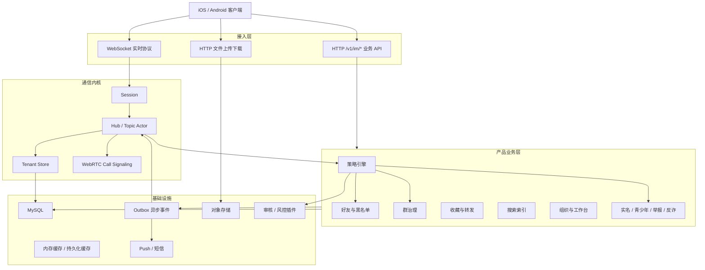
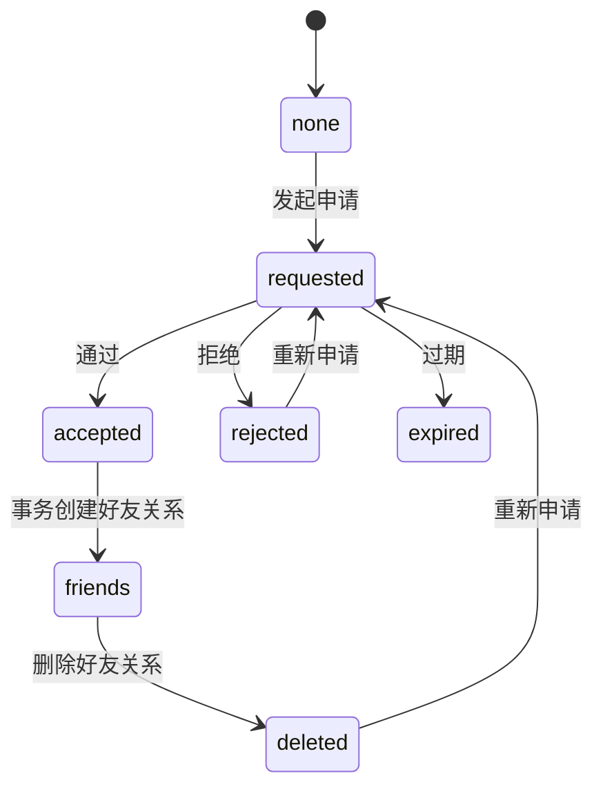
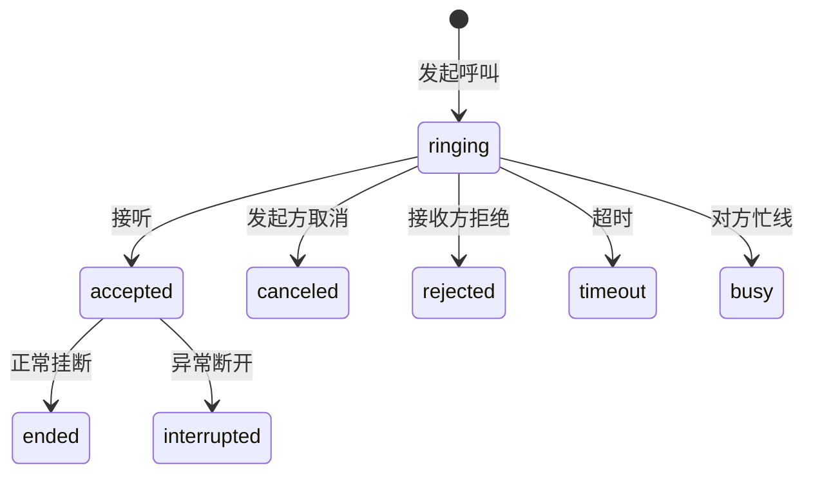

# IM 系统设计文档

> 版本：v1.1<br>
> 日期：2026-08-11<br>
> 状态：后续开发基线<br>
> 需求依据：[IM 产品原型需求文档](./IM-产品原型需求文档.md)<br>
> 关联文档：[IM 产品需求服务端改造分析报告](./IM-产品需求服务端改造分析报告.md)、[IM 现有实现与新需求差异对照总结](./IM-现有实现与新需求差异对照总结.md)、[IM 服务端多租户改造方案](./IM-服务端多租户改造方案.md)

| 版本 | 日期 | 变更 |
| --- | --- | --- |
| v1.0 | 2026-08-11 | 建立总体架构和业务模块设计 |
| v1.1 | 2026-08-11 | 冻结 MySQL 范围；补齐认证、配额、消息变更、好友/群真源、审核、事务、Outbox、搜索和测试设计 |

## 1. 文档目的

本文作为后续 IM 产品开发的系统设计指导文件，用于统一服务端、客户端和测试团队对产品架构、模块边界、数据模型、接口风格、权限规则、消息事件和开发顺序的理解。

本文不替代详细接口文档和数据库 DDL。后续每个业务模块进入开发前，应在本文定义的边界内补充独立的 API 文档、状态机文档、表结构 SQL 和测试用例。

本文是产品业务开发的设计基线。关联分析报告用于记录调研过程；表名、唯一约束、状态机或技术选择与本文冲突时，以本文为准。设计发生变化时，必须先修改本文并记录版本，再修改接口和代码。

## 2. 设计目标

系统面向企业内部沟通与协作场景，核心目标如下：

1. 支持企业码进入租户，所有账号、好友、群、消息、文件、组织和办公数据均按 `tenant_id` 强隔离。
2. 复用现有 Tinode 实时通信内核，保留 WebSocket 消息、Topic、Subscription、回执、文件、Push 和 WebRTC 信令能力。
3. 在实时内核外新增产品业务层，承载好友关系、群治理、收藏、搜索、组织、会议、日报、月报、实名、青少年、举报和反诈等业务。
4. 服务端必须成为权限和状态机的唯一可信执行方，客户端只负责交互展示和本地体验优化。
5. 所有敏感动作具备幂等、防重、审计和可测试的错误码。
6. 支持 iOS、Android 多端一致同步，网络断开后可增量恢复。

### 2.1 首期技术范围

1. 产品版首期只支持 MySQL 8，共享服务、共享数据库，通过 `tenant_id` 隔离租户。
2. PostgreSQL、MongoDB 和 RethinkDB 不在首期产品业务支持范围内。启用产品模块但 Adapter 未实现完整租户业务接口时，服务必须拒绝启动，不能静默退回无租户接口。
3. 实时消息继续使用现有 Tinode WebSocket 协议；事务型产品业务使用 HTTP API。
4. 搜索首期使用 MySQL，达到第 11.3 节定义的切换条件后再引入独立搜索引擎。

## 3. 总体架构

系统采用“实时通信内核 + 产品业务服务 + 异步事件”的分层架构。



## 4. 核心分层职责

| 层 | 职责 | 禁止事项 |
| --- | --- | --- |
| 接入层 | 解析 Token、Session、文件认证和租户上下文；做基础参数校验 | 不从客户端自报字段信任内部 `tenant_id` |
| 通信内核 | 维护连接、Topic 路由、消息顺序、广播、回执、Push 触发和通话信令 | 不承载复杂审批、报表、组织树等事务业务 |
| 产品策略层 | 发消息前校验好友、黑名单、群禁言、青少年、文件权限和内容风险 | 不把策略只放客户端 |
| 业务服务层 | 处理好友申请、群审批、公告、收藏、组织、会议、日报、举报等 CRUD 和状态机 | 不把主数据塞进 Topic Public/Aux 任意 JSON |
| 存储层 | 所有业务表带 `tenant_id`，更新删除必须带租户条件 | 不保留无租户业务查询入口 |
| 异步层 | 系统消息、Push、搜索索引、审核任务、定时提醒和审计导出 | 不在 Topic 事件循环中执行耗时远程调用；核心审计记录仍在业务事务内落库 |

## 5. 多租户基础规则

多租户是本系统的底座，后续所有业务模块必须遵守：

1. 首次 `hi.tenant` 使用企业码解析租户，Session 固定 `TenantID`。
2. Token、认证记录、设备、Push、文件和插件调用均携带服务端可信 `TenantID`。
3. 普通业务 Store 只能通过租户作用域访问，禁止全局查用户、Topic、消息、文件。
4. 新增租户业务表必须包含 `tenant_id BIGINT NOT NULL`。平台级表和租户根表 `im_tenant` 例外；例外表必须在 DDL 评审中明确说明作用域。
5. 唯一索引优先使用 `(tenant_id, business_key)`。
6. 子表外键优先使用 `(tenant_id, parent_id)` 复合约束。
7. 跨租户通信首期禁止；搜索、加好友、入群、转发和文件访问均限制在当前租户。
8. 越权访问统一返回 NotFound/Denied，不泄露目标对象是否存在于其他租户。

### 5.1 租户配置与配额

`im_tenant_config` 是租户配额的配置真源，首期使用以下字段：

| 字段 | 含义 | `0` 的含义 |
| --- | --- | --- |
| `max_users` | 租户有效用户数上限 | 不限制 |
| `max_groups` | 租户有效群数上限 | 不限制 |
| `max_group_members` | 单群有效成员数上限 | 不限制 |

配额必须由服务端在事务内强制执行：

1. 注册或启用用户时锁定租户配置记录，统计有效用户后再创建账号。
2. 创建群时锁定租户配置记录，统计有效群后再创建 Topic 和群业务数据。
3. 邀请、扫码入群或审批入群时锁定目标群业务记录，统计有效成员并校验 `max_group_members` 后再写成员关系和 Subscription。
4. 配额检查和资源创建必须在同一事务中完成，禁止先查询、提交后再创建。
5. 超限返回稳定错误码，并记录 `tenant_id`、当前用量、限制值和操作类型；响应不得泄露其他租户信息。

## 6. 通道与接口风格

### 6.1 WebSocket 实时协议

继续使用现有 Tinode 协议承载以下实时能力：

| 能力 | 协议方向 | 说明 |
| --- | --- | --- |
| 登录、注册、Token 登录 | client -> server | 已租户化，继续复用 |
| 发消息 | `pub` | 增加产品策略校验、消息类型和客户端幂等 ID |
| 拉消息、拉元数据 | `get` | 保留原序号查询；复杂搜索走 HTTP |
| 已读、送达、输入中 | `note` | 保留并增加隐私和节流规则 |
| 订阅/退订 Topic | `sub` / `leave` | 由好友、群审批等业务控制是否允许 |
| 通话信令 | `note` 或现有 call 信令 | 增加 `call_id`、通话类型和结束原因 |
| 系统消息 | 服务端发布的 `system` 类型消息 | 个人事件进入服务端管理的系统通知 Topic；群内事件进入对应群 Topic；普通用户不能发布该类型 |

### 6.2 HTTP 业务 API

新增业务 API 使用 `/v1/im/*` 前缀，按模块划分：

```text
/v1/im/friends/*
/v1/im/groups/*
/v1/im/favorites/*
/v1/im/search/*
/v1/im/org/*
/v1/im/meetings/*
/v1/im/reports/*
/v1/im/profile/*
/v1/im/settings/*
/v1/im/security/*
/v1/im/reports-abuse/*
/v1/im/feedback/*
```

HTTP API 通用规则：

1. HTTP 请求使用 `Authorization: Bearer <token>`；统一认证中间件校验 Token 后生成只读 Principal，并从中获取 `tenant_id` 和 `uid`。请求参数中的同名字段不参与授权。
2. 写接口必须支持幂等，使用 `Idempotency-Key` 或业务唯一键。HTTP 幂等键作用域固定为 `tenant_id + uid + method + route + key`；相同键但请求体摘要不同返回冲突错误。
3. 列表接口统一使用游标分页，不使用不稳定的大 offset。
4. 错误响应使用稳定业务错误码，客户端不解析数据库错误。
5. 敏感接口记录审计日志。

### 6.3 文件 API

继续复用现有文件上传下载入口，但必须满足：

1. 文件记录带 `tenant_id`。
2. 上传路径使用 `tenants/{tenant_id}/yyyy/mm/{file_id}`。
3. 下载前校验文件上传者或关联消息/Topic 读取权限。
4. 群文件、收藏文件、举报证据和反馈附件复用同一文件基础设施，但业务用途单独记录。
5. 客户端不可见内部 `location`。

## 7. 核心领域与认证设计

### 7.1 已有通信模型

| 模型 | 继续复用 | 新增约束 |
| --- | --- | --- |
| User | 用户账号和基础资料 | 租户归属、实名状态、隐私设置、青少年状态 |
| Topic | 单聊、群聊、系统 Topic、收藏 Topic | 租户归属、产品业务类型、群治理策略 |
| Subscription | 用户与 Topic 的关系和 ACL | 好友/群状态不能只靠 ACL 表达 |
| Message | 话题内顺序消息 | 消息类型、幂等 ID、审核状态、搜索索引 |
| FileDef | 上传文件元数据 | 租户归属、业务用途、访问授权、扫描状态 |

### 7.2 新增产品模型

| 模块 | 目标表 | 主要职责 |
| --- | --- | --- |
| 好友关系 | `im_friendships`、`im_friend_requests`、`im_user_blocks` | 好友申请、同意、拒绝、删除、拉黑 |
| 用户资料 | `im_user_profiles`、`im_user_privacy_settings` | 昵称、生日、签名、可见性和添加方式 |
| 群治理 | `im_group_settings`、`im_group_join_requests`、`im_group_announcements`、`im_group_mutes`、`im_group_admin_logs` | 入群审批、公告、禁言、管理员、转让群主 |
| 群文件 | `im_group_files` | 群文件目录、搜索、删除权限 |
| 收藏 | `im_favorites` | 收藏去重、分类、来源、搜索和分享 |
| 搜索 | `im_message_index` 或外部搜索索引 | 关键词、类型、附件、链接、图片、视频检索 |
| 通话 | `im_call_records`、`im_call_participants` | 通话记录、状态、时长、结束原因 |
| 组织 | `im_org_units`、`im_org_members` | 部门树、成员、岗位、数据范围 |
| 工作台 | `im_workbench_apps`、`im_workbench_user_apps` | 企业应用入口和权限 |
| 会议 | `im_meetings`、`im_meeting_participants` | 会议通知、确认状态、提醒和取消 |
| 日报月报 | `im_reports`、`im_report_read_states` | 日报/月报填写、提交、查看和统计 |
| 总经理信箱 | `im_manager_mailbox` | 意见提交、匿名规则、处理状态 |
| 实名认证 | `im_realname_verifications` | 实名信息加密、审核状态、脱敏展示 |
| 青少年模式 | `im_youth_mode_settings` | 启用状态、PIN 哈希、策略版本 |
| 举报反馈 | `im_abuse_reports`、`im_feedbacks`、`im_evidence_files` | 举报、证据、反馈和处理状态 |
| 审计 | `im_audit_logs` | 敏感操作追加日志 |
| 异步事件 | `im_outbox_events` | 系统消息、Push、搜索索引、定时任务 |

新增以下基础模型，避免各业务模块重复实现认证、会话设置和消息变更：

| 模块 | 表 | 主要职责 |
| --- | --- | --- |
| 账号安全 | `im_user_security` | `auth_version`、密码更新时间、登录失败和锁定状态 |
| 短信验证 | `im_verification_codes` | 验证码用途、目标号码哈希、有效期、错误次数和发送频控 |
| 二次验证 | `im_auth_challenges` | 敏感操作挑战、一次性票据哈希、绑定操作和过期时间 |
| 登录设备 | `im_login_sessions` | 设备会话、Token 标识、最近活动和撤销状态 |
| 会话设置 | `im_conversation_settings` | 置顶、免打扰、隐藏和用户侧会话状态 |
| 群成员 | `im_group_members` | 群成员业务状态、角色、入群来源和操作者 |
| 消息版本 | `im_message_revisions` | 编辑前内容、版本、操作者和变更原因 |

### 7.3 企业码与登录流程

1. 未认证客户端先通过 `hi.tenant` 提交企业码；服务端只按 `im_tenant.code` 查找启用租户并把 `TenantID` 固定到 Session。
2. 企业不存在、已停用或不允许登录时返回统一企业不可用错误，不能暴露内部状态和数据库信息。
3. 后续注册、登录、验证码和找回密码全部使用该服务端租户上下文；不接受客户端在业务请求中重新指定租户。
4. HTTP 场景使用 `/v1/im/tenants/resolve` 完成企业码解析，只返回公开品牌信息和服务地址。首期不设计 `tenant_ticket`；注册、登录等未认证请求由服务端根据企业码重新解析租户，认证成功后只信任正式用户 Token。
5. 用户 Token 必须包含可信 `tenant_id`、`uid`、`auth_version`、签发时间和过期时间。Token 租户与当前接入租户不一致时拒绝认证。

### 7.4 验证码、密码重置和二次验证

验证码按 `register`、`login`、`reset_password`、`sensitive_action` 用途隔离，相同验证码不能跨用途使用。数据库只保存验证码强哈希和手机号规范化哈希，明文只在发送时短暂存在。

密码重置必须在同一事务中完成：

1. 消费有效验证码或二次验证挑战。
2. 更新密码强哈希和密码更新时间。
3. 递增 `im_user_security.auth_version`。
4. 撤销该用户现有 `im_login_sessions`。
5. 写安全审计和 Outbox 通知。

二次验证成功后签发一次性操作票据。票据必须绑定 `tenant_id + uid + action + target + expires_at`，只保存票据哈希，成功使用后立即失效。青少年模式独立密码不与登录密码共用，哈希保存在 `im_youth_mode_settings`。

### 7.5 认证安全约束

1. 用户名和手机号唯一约束均包含 `tenant_id`。
2. 验证码发送和验证按租户、手机号、IP、设备分别限频。
3. 登录错误使用统一提示；服务端仍按账号、IP 和设备记录失败次数并执行指数退避或临时锁定。
4. 新设备登录、密码修改、会话撤销和异常登录通过 Outbox 发送安全通知。
5. 手机号、验证码、密码、票据、Token 和证件信息不得写入普通日志或消息内容。

## 8. 消息体系设计

### 8.1 消息类型

服务端需要定义稳定的消息类型，不允许各端随意约定 JSON 字段。

产品消息协议 v1 使用现有 `pub`，固定字段放在 `head`：

| 字段 | 规则 |
| --- | --- |
| `x-im-schema` | 产品消息必填，首版固定为 `1` |
| `x-im-type` | 产品消息必填，值必须在下表白名单中 |
| `x-im-client-mid` | 普通客户端消息必填，对应服务端 `client_msg_id` |
| `x-im-reply-to` | 引用消息时填写同 Topic 的 SeqId |
| `x-im-forward-mode` | 转发时为 `single` 或 `merged` |
| `x-im-risk-state` | 仅服务端生成；客户端提交时删除并记录安全日志 |

`content` 只保存对应消息类型的业务内容。每种类型进入开发前必须冻结字段、长度、必填条件和兼容规则；客户端未知字段应忽略，未知消息类型显示安全占位而不能崩溃。

| 类型 | 用途 | 关键字段 |
| --- | --- | --- |
| `text` | 普通文本和 Unicode 表情 | `text`、`mentions` |
| `image` | 图片消息 | `file_id`、`width`、`height`、`thumb_file_id` |
| `voice` | 语音消息 | `file_id`、`duration_ms`、`waveform` |
| `video` | 视频消息 | `file_id`、`duration_ms`、`thumb_file_id` |
| `file` | 普通文件 | `file_id`、`name`、`size`、`mime` |
| `contact_card` | 名片 | `user_id`、`display_name_snapshot`、`avatar_snapshot` |
| `call` | 通话结果消息 | `call_id`、`call_type`、`result`、`duration_sec` |
| `system` | 系统提示 | `event_type`、`actor_id`、`target_ids`、`params` |
| `forward_single` | 单条转发 | `source_message_ref`、`snapshot` |
| `forward_merged` | 合并转发 | `summary`、`items`、`source_refs` |

### 8.2 消息幂等

客户端发消息必须带不超过 64 字符的 `client_msg_id`，推荐使用 UUID/ULID。服务端在当前租户和发送人范围内保证唯一，不把 Topic 放入唯一键，避免客户端误把同一个发送请求投递到多个会话：

```text
UNIQUE(tenant_id, from_uid, client_msg_id)
```

断线重试时，如果服务端发现重复 `client_msg_id`，返回原消息的 Topic、`seq_id`、状态和响应摘要，不能再次插入消息。服务端生成的系统消息也必须生成稳定幂等 ID，并以 Outbox 事件 ID 作为去重来源。

### 8.3 发消息前策略校验

每条消息持久化前执行统一策略链：

1. Session 租户和 Topic 租户一致。
2. 发送人是同租户有效用户。
3. Topic 存在且未删除。
4. Subscription 具备写权限。
5. 单聊检查好友关系、黑名单、删除状态和隐私策略。
6. 群聊检查禁言、全员禁言、群状态和成员身份。
7. 文件消息检查文件归属、扫描状态和目标 Topic 权限。
8. 青少年模式和反诈策略检查。
9. 内容审核通过或进入待审核策略。

### 8.4 消息编辑、引用、撤回与删除

消息在 Topic 中的 `seq_id` 和原发送人不可变。产品消息增加 `message_type`、`client_msg_id`、`version`、`moderation_state`、`recalled_at` 和 `recalled_by` 等明确字段，不能依赖客户端任意 JSON 决定服务端状态。

| 操作 | 服务端规则 | 多端同步 |
| --- | --- | --- |
| 引用 | 保存 `topic + seq_id` 引用和发送时的安全摘要；禁止跨租户引用 | 新消息正常广播；原消息删除后仍显示受控摘要 |
| 编辑 | 仅原发送人、允许类型、规定时限内可编辑；事务内递增 `version` 并写 `im_message_revisions` | 广播带版本号的编辑事件，旧版本事件不得覆盖新版本 |
| 全员撤回 | 校验发送人或群管理员权限及撤回时限；保留受保护审计内容，普通查询只返回撤回占位 | 广播撤回事件，收藏、搜索和引用按保留策略更新 |
| 仅自己删除 | 使用现有用户侧删除日志，不改变其他成员可见性 | 只同步当前用户的其他设备 |
| 批量删除/撤回 | 限制单次数量，逐项授权，返回逐项结果 | 每个成功项产生独立事件和审计记录 |

编辑、撤回与索引更新必须使用乐观版本控制。请求携带期望 `version`，版本不一致返回冲突错误，客户端重新拉取当前消息状态。

### 8.5 内容审核时序

发送链路先执行本地权限、限频和硬规则，再按租户及消息类型选择以下一种审核模式：

| 模式 | 处理方式 | 适用场景 |
| --- | --- | --- |
| `sync_block` | 在短超时内同步审核，通过后持久化和广播；超时按租户配置拒绝或降级 | 高风险文本、小请求 |
| `async_hold` | 以 `pending_review` 持久化但不广播；Outbox 审核通过后发布，拒绝后标记 `rejected` | 文件、图片和高风险内容 |
| `async_post_audit` | 先发布，异步审核；命中后执行系统撤回并审计 | 租户明确允许的低风险内容 |

状态转换固定为：

```text
pending_review -> approved -> published
pending_review -> rejected
published -> recalled_by_review
```

客户端提交的审核状态一律忽略。审核 Worker 必须幂等，同一消息只能完成一次终态转换。

## 9. 好友与黑名单设计

好友关系是单聊产品状态的真源，不直接用 P2P Topic 是否存在表示好友。

### 9.1 好友申请与关系状态



`im_friend_requests` 记录申请状态，`im_friendships` 记录双方好友关系，`im_user_blocks` 记录单向拉黑。拉黑不修改好友关系状态；取消拉黑只删除当前用户的黑名单记录，不自动恢复已经删除的好友关系。

### 9.2 服务端规则

1. 申请、同意、拒绝、删除、拉黑必须幂等。
2. 好友申请保存验证留言、来源、过期时间和处理人。
3. 拉黑是单向行为，唯一约束为 `(tenant_id, blocker_id, blocked_id)`；被拉黑人发消息、通话、名片、查看资料时按策略阻断。
4. 删除好友后历史消息默认保留，但双方不能继续发送好友消息。
5. 好友资料字段由关系和隐私设置共同决定。
6. 接受申请必须在一个事务内更新申请、创建好友关系、创建或激活 P2P Topic/Subscription，并写入 Outbox。
7. 单聊策略按“双方账号有效 -> 好友关系有效 -> 任一方向黑名单 -> 隐私/青少年/风控”的顺序判定。

## 10. 群治理设计

现有 Group Topic 继续作为群消息容器。`im_group_settings` 与 `im_group_members` 是群业务状态真源；Topic、Subscription 和 ACL 是通信内核投影。所有成员和角色变化必须通过产品业务接口完成，并在同一 MySQL 事务内同步业务真源与通信投影。

### 10.1 群角色

| 角色 | 业务真源 | 通信投影 | 权限 |
| --- | --- | --- | --- |
| 群主 | `im_group_settings.owner_user_id` + `im_group_members.role=owner` | Topic Owner + Owner ACL | 全部群管理、转让、解散 |
| 管理员 | `im_group_members.role=admin` | Admin ACL | 审批、公告、禁言、成员管理 |
| 普通成员 | `im_group_members.role=member` | 有效 Subscription | 收发消息、查看公告和群文件 |
| 游客/待审批 | `im_group_join_requests` | 无 Subscription | 不具备群消息读写权限 |

禁止客户端直接修改群 Topic Owner 或管理员 ACL。服务启动或定时一致性任务发现业务真源与通信投影不一致时，记录告警并以业务真源修复投影。

### 10.2 群能力

| 能力 | 设计 |
| --- | --- |
| 创建群 | 同一事务创建 Topic、群设置、群主成员记录、Subscription、ACL、审计和 Outbox |
| 入群邀请 | 写邀请/申请记录，审批通过后在同一事务写成员记录和 Subscription |
| 入群验证 | 群设置控制是否需要审批 |
| 群公告 | 公告表保存版本，群内发送系统消息 |
| 群二维码 | 签名短 Token，包含群 ID、租户、过期时间和用途 |
| 管理员 | 更新 `im_group_members.role`，同一事务同步 ACL |
| 禁言 | 全员禁言和成员禁言都在发消息前强制检查 |
| 群文件 | 文件消息成功后进入群文件索引，按群权限查询 |
| 转让群主 | 二次确认；同一事务更新 owner、双方角色、Topic Owner/ACL、审计和 Outbox |
| 解散群聊 | 标记群状态、踢出成员、停用二维码和审批入口 |

## 11. 收藏、转发与搜索设计

### 11.1 收藏

收藏使用独立 `im_favorites` 表作为查询和去重真源，不仅依赖 `slf` Topic。

收藏记录需要保存：

1. 租户、收藏人、来源 Topic、来源 SeqId、来源消息 ID。
2. 消息类型、摘要、文件 ID、发送人、发送时间。
3. 收藏时间、去重键和删除状态。
4. 原消息删除后的可见策略。

### 11.2 转发

逐条转发和合并转发都必须重新执行目标会话权限和文件权限。

| 转发类型 | 规则 |
| --- | --- |
| 逐条转发 | 每条源消息生成一条新消息；保持顺序；每条使用新 `client_msg_id` |
| 合并转发 | 生成不可变快照；限制条数、总大小和敏感字段；支持点击查看详情 |
| 文件转发 | 源文件和目标 Topic 必须同租户；必要时创建新的引用关系 |

### 11.3 搜索

搜索分三类：

1. 用户和群搜索：使用租户内规范化 Tags，并执行隐私策略。
2. 聊天记录搜索：`im_message_index` 保存 `tenant_id`、Topic、SeqId、消息类型、发送人、时间、规范化检索文本和资源元数据，返回前二次校验 ACL。
3. 文件/图片/视频/链接搜索：依赖消息类型索引和文件元数据索引。

首期固定使用 MySQL 8：结构化条件使用 B-Tree 复合索引，消息正文使用独立 `im_message_index.search_text` 和适合中文的 FULLTEXT/ngram 索引。分页游标使用稳定的 `created_at + message_id`，不能使用大 Offset。

搜索索引不是授权来源。查询必须先限定 `tenant_id` 和当前用户可读 Topic 集合，返回前再次校验 Topic Read ACL、成员状态、用户侧删除、全员撤回和审核状态。退群、拉黑或权限变更后必须立即阻断查询，即使异步索引尚未删除。

出现以下任一情况时重新评估 OpenSearch/Elasticsearch：单租户可检索消息达到千万级、MySQL 搜索 P95 超过 500ms、需要复杂中文相关性/高亮，或索引写入明显影响消息主库。切换时保持 HTTP 搜索契约不变。

## 12. 通话设计

现有 P2P WebRTC 信令继续复用，新增业务通话记录。

### 12.1 通话状态



### 12.2 关键字段

`im_call_records` 至少包含：

```text
tenant_id, call_id, topic, caller_id, callee_id, call_type,
state, start_at, accepted_at, ended_at, duration_sec,
end_reason, created_at, updated_at
```

通话结束后生成 `call` 类型消息，双方看到的文案由统一结果码生成。

## 13. 企业工作台设计

工作台是独立业务域，不能依赖聊天 Topic 保存主数据。

| 模块 | 入口 | 通知方式 |
| --- | --- | --- |
| 组织架构 | `/v1/im/org/*` | 组织变更一般不发聊天消息，必要时发系统通知 |
| 会议通知 | `/v1/im/meetings/*` | 创建、变更、取消和提醒通过系统消息 + Push |
| 日报/月报 | `/v1/im/reports/*` | 未提交提醒、提交通知和管理员提醒通过 Outbox |
| 总经理信箱 | `/v1/im/manager-mailbox/*` | 提交成功给本人通知；处理结果按匿名规则通知 |
| 工作台应用 | `/v1/im/workbench/apps` | 返回租户配置和用户权限范围内的入口 |

组织数据权限用于日报、月报、会议统计和通讯录查询。管理员只能查看权限范围内成员数据。

## 14. 个人资料、隐私与青少年模式

### 14.1 个人资料

基础展示资料可以同步到 User Public，但可索引、可审计或敏感字段应进入独立表。

| 字段 | 存储建议 |
| --- | --- |
| 头像、昵称、签名 | User Public + `im_user_profiles` |
| 生日、地区、性别 | `im_user_profiles`，按隐私设置返回 |
| 实名姓名、证件号 | 实名表加密存储，不进入 Public |
| 群昵称 | `im_group_members`，按需投影到 Subscription Private |

### 14.2 隐私设置

隐私设置影响以下入口：

1. 账号/手机号/二维码/群聊添加好友。
2. 个人主页字段展示。
3. 在线状态和最后在线时间展示。
4. 非好友消息和通话发起。

客户端可以隐藏入口，但最终阻断必须在服务端执行。

### 14.3 青少年模式

青少年模式状态保存在服务端，PIN 使用强哈希，不保存明文。

受限能力由租户策略决定，首期建议覆盖：

1. 添加好友。
2. 加群和创建群。
3. 文件传输。
4. 音视频通话。
5. 工作台外部链接。

### 14.4 会话与通知设置

`im_conversation_settings` 以 `(tenant_id, user_id, topic)` 唯一，保存置顶、免打扰、隐藏等用户侧设置。它不改变其他成员的会话状态，也不能替代 Topic ACL。

Push 发送前同时检查租户通知策略、用户全局通知设置、会话免打扰、青少年模式和系统权限登记状态。客户端系统通知权限只用于展示引导，服务端保存的是用户偏好和最近一次上报状态，不把客户端上报当作可靠授权依据。

## 15. 安全、实名、举报与反诈

### 15.1 实名认证

实名认证采用独立状态机：

```text
none -> pending -> approved
none -> pending -> rejected
approved -> appeal_pending -> approved/rejected
```

证件号、姓名等敏感字段加密存储，普通查询只返回脱敏状态。

### 15.2 反诈策略

反诈由“本地规则 + 外部风控插件”共同组成：

1. 本地规则用于稳定阻断和提示，例如陌生人、敏感词、频繁加好友、异常文件。
2. 外部插件用于内容审核、风险评分和策略建议。
3. 插件调用遵守第 8.5 节的三种审核模式、超时和降级规则，不能在 Topic Actor 中执行无界远程等待。
4. 风险提示和二次确认结果写审计。

### 15.3 举报与反馈

举报和反馈都按工单处理。

| 类型 | 特点 |
| --- | --- |
| 举报 | 绑定被举报对象、会话、消息、原因、证据和处理状态 |
| 意见反馈 | 绑定提交人、设备、版本、问题描述、附件和处理状态 |

举报证据应固化消息快照和文件引用，防止原消息删除后无法处理。

## 16. 系统消息与通知设计

需要产生异步副作用的业务状态变化，在同一数据库事务中写入 Outbox，由 Worker 生成系统消息、Push、索引或定时任务。没有异步副作用的更新不要求创建空事件。

### 16.1 系统消息格式

系统消息固定使用以下结构；业务模块只能登记 `event_type` 和参数 Schema，不能自行定义另一套消息信封：

```json
{
  "type": "system",
  "event_type": "group_join_approved",
  "template_version": 1,
  "actor_id": "usr...",
  "target_ids": ["usr..."],
  "params": {
    "group_id": "grp...",
    "group_name": "项目群"
  },
  "dedupe_key": "tenant:1:group:grpxxx:join:request123"
}
```

### 16.2 事件类型

首期至少定义：

| 业务 | 事件 |
| --- | --- |
| 账号安全 | 新设备登录、密码修改、实名提醒 |
| 好友 | 新申请、通过、拒绝、删除 |
| 群 | 邀请、申请、审批、公告、禁言、管理员变更、群主转让、解散 |
| 文件 | 群文件上传、文件失效 |
| 通话 | 未接、拒绝、取消、忙线、通话结束 |
| 工作台 | 会议通知、会议变更、日报提醒、月报提醒、信箱处理 |
| 安全 | 反诈提示、举报受理、反馈受理 |

## 17. 权限模型

### 17.1 角色层级

| 层级 | 角色 |
| --- | --- |
| 平台 | `platform_admin` |
| 租户 | `tenant_owner`、`tenant_admin` |
| 组织 | 部门负责人、报表管理员 |
| 群 | 群主、管理员、成员 |
| 关系 | 好友、非好友、黑名单 |
| 账号 | 普通用户、实名用户、青少年模式用户 |

### 17.2 权限判定顺序

```text
租户状态 -> 用户状态 -> 业务角色 -> Topic ACL -> 产品策略 -> 风控策略
```

任何一步失败，写操作不得继续。

## 18. 数据一致性与异步任务

### 18.1 事务边界

必须在同一事务中完成：

1. 好友申请处理和关系状态更新。
2. 群审批通过和 Subscription 写入。
3. 群主转让和权限更新。
4. 消息保存和附件引用建立。
5. 文件记录从 `uploaded` 切换为 `ready`、附件引用和业务索引写入。
6. 举报提交和证据引用。

业务层不能在 Handler 中连续调用多个独立 Store 方法来模拟事务。`imstore` 必须提供按用例划分的事务方法，例如 `AcceptFriendRequest`、`ApproveGroupJoin`、`TransferGroupOwner` 和 `SaveMessageWithAttachments`，方法内部同时更新产品业务表、Tinode 核心表、审计记录和 Outbox。

对象存储不参与 MySQL 事务，文件采用以下状态机：

```text
pending -> uploaded -> ready
pending/uploaded -> failed
uploaded(超时且无引用) -> orphaned -> deleted
```

对象上传成功后，再在 MySQL 事务中把文件切换为 `ready` 并建立业务引用。若数据库事务失败，文件保持 `uploaded`，由带宽受控的租户级垃圾回收任务清理；消息只能引用 `ready` 文件。

### 18.2 Outbox

需要通知、Push、索引或审计的业务写操作，在事务内写入 `im_outbox_events`。异步 Worker 负责：

1. 发送系统消息。
2. 推送离线通知。
3. 更新搜索索引。
4. 调用外部审核/反诈。
5. 发送会议、日报、月报定时提醒。
6. 记录可观测指标。

`im_outbox_events` 至少包含：

```text
id, tenant_id, aggregate_type, aggregate_id, event_type,
payload, dedupe_key, state, available_at, attempts,
locked_by, locked_at, last_error, created_at, processed_at
```

Outbox 处理规则：

1. `dedupe_key` 在租户内唯一，生产事件和消费副作用都必须幂等。
2. Worker 使用 `SELECT ... FOR UPDATE SKIP LOCKED` 分批领取事件，设置最大批量和租户公平调度，避免单个租户占满队列。
3. 失败采用有上限的指数退避；超过上限进入 `dead_letter`，触发告警并支持人工重放。
4. 系统消息通过集群安全的内部发布接口进入目标 Topic，不能直接假设 Outbox Worker 与目标 Topic 位于同一进程。
5. 标记事件成功前必须确认目标副作用已获得稳定幂等结果；进程崩溃后的重复执行不得产生重复消息或 Push。
6. 外部审核事件必须按第 8.5 节推进消息审核状态，不能绕过状态机直接广播。

## 19. API 与错误码规范

### 19.1 成功响应

```json
{
  "code": 0,
  "data": {},
  "request_id": "..."
}
```

### 19.2 错误响应

```json
{
  "code": 30001,
  "message": "permission denied",
  "reason": "GROUP_MUTED",
  "request_id": "..."
}
```

错误码按模块分段：

| 范围 | 模块 |
| --- | --- |
| 10000-19999 | 通用、认证、租户 |
| 20000-29999 | 好友、黑名单、隐私 |
| 30000-39999 | 群、公告、群文件 |
| 40000-49999 | 消息、收藏、搜索、转发 |
| 50000-59999 | 文件、媒体、通话 |
| 60000-69999 | 组织、会议、日报、月报 |
| 70000-79999 | 实名、青少年、安全、举报、反馈 |

HTTP 状态码表达协议层结果，业务 `code` 表达稳定失败原因：参数错误使用 400，未认证使用 401，无权限使用 403，不可见资源使用 404，版本或幂等冲突使用 409，限频使用 429，服务端故障使用 5xx。客户端不得只判断 HTTP 状态而忽略业务 `code`。

## 20. 可观测性与审计

### 20.1 日志字段

认证后的请求日志至少包含：

```text
request_id, tenant_id, uid, sid, topic, action, result, latency_ms
```

手机号、证件号、Token、验证码、文件签名和设备 Push Token 不写明文日志。

### 20.2 审计事件

必须审计：

1. 租户、组织和管理员变更。
2. 登录、密码修改、实名审核和二次验证。
3. 好友删除、拉黑、黑名单解除。
4. 群主转让、管理员变更、禁言、解散群。
5. 文件下载、批量转发、收藏导出。
6. 举报处理、反馈处理和反诈二次确认。
7. 平台管理员代操作。

## 21. 开发阶段规划

### 阶段 0：基础底座收口

目标：让后续业务都站在正确地基上。

交付：

1. 多租户核心链路完成并通过双租户隔离测试。
2. 消息 `client_msg_id` 幂等。
3. 文件下载资源级授权。
4. 系统消息结构和 Outbox 基础。
5. 统一错误码和请求日志。
6. 产品版明确只支持 MySQL 8，不支持的 Adapter 在启动时快速失败。
7. `im_tenant_config` 三项配额在注册、建群和入群入口强制生效。
8. 建立专用业务事务 Store，禁止跨多个 Store 调用拼接关键事务。

### 阶段 1：账号、资料、好友和黑名单

交付：

1. 注册、登录、找回密码、二次验证。
2. `auth_version`、登录设备、Token 撤销和安全通知。
3. 个人资料、会话设置和隐私设置。
4. 好友申请、通讯录、主页、删除好友。
5. 独立黑名单和单聊发送/通话策略。

### 阶段 2：群聊产品化

交付：

1. 群列表、创建群、群资料、群头像。
2. 入群审批、邀请、群二维码。
3. 群公告、管理员、群主转让。
4. 全员禁言、成员禁言、群文件。
5. 群业务真源与 Topic/Subscription/ACL 投影一致性检查。

### 阶段 3：消息增强、收藏、搜索和转发

交付：

1. 结构化消息类型。
2. @成员、引用、编辑、撤回、批量删除及消息版本事件。
3. 收藏分类和分享。
4. 聊天记录、文件、图片、视频和链接搜索。
5. 逐条转发和合并转发。
6. `sync_block`、`async_hold` 和 `async_post_audit` 审核状态机。

### 阶段 4：通话和通知体验

交付：

1. `call_id` 和通话记录。
2. 通话状态消息。
3. 忙线、拒绝、未接、超时和异常断开。
4. Push 文案、免打扰、锁屏隐私。

### 阶段 5：企业工作台

交付：

1. 工作台应用配置。
2. 组织架构。
3. 会议通知和参会确认。
4. 日报、月报。
5. 总经理信箱。

### 阶段 6：安全合规

交付：

1. 实名认证。
2. 青少年模式。
3. 反诈策略。
4. 举报和意见反馈。
5. 审计后台和处置流程。

## 22. 测试策略

### 22.1 自动化测试

每个模块至少包含：

1. 单元测试：状态机、权限判断、错误码。
2. Store 测试：租户隔离、唯一约束、分页、软删除。
3. API 测试：参数校验、幂等、越权、并发。
4. WebSocket 测试：消息顺序、回执、离线重连、系统消息。
5. 安全测试：跨租户、跨用户、跨群、文件越权和枚举。
6. 事务测试：在每个数据库写入点注入失败，验证业务真源、通信投影、审计和 Outbox 不出现部分提交。
7. Worker 测试：重复消费、锁超时、进程崩溃、指数退避、死信和人工重放。
8. Schema 测试：MySQL 初始化 DDL、升级 DDL 和 Adapter SQL 保持一致，唯一约束与外键真实生效。
9. 性能测试：大群广播、并发发消息、重连风暴、文件上传下载、中文搜索和 Outbox 积压恢复。

性能测试不能只记录平均值。每次发布前根据部署规模给出 P95/P99 延迟、错误率、吞吐、数据库连接和队列积压报告；未确定正式 SLO 前，以当前稳定版本基线为回归门槛。

### 22.2 重点验收场景

| 场景 | 预期 |
| --- | --- |
| 两个租户使用相同手机号注册 | 均成功，互不影响 |
| A 租户尝试搜索 B 租户用户 | 返回空或通用 NotFound |
| 被拉黑用户发送消息 | 不进入对方会话，返回稳定失败原因 |
| 禁言成员发群消息 | 服务端拒绝，其他成员不可见 |
| 文件 URL 被其他用户重放 | 无权限返回 403/404 |
| 断线重试同一消息 | 不重复入库，返回原消息状态 |
| 同一发送人把相同 `client_msg_id` 投递到不同 Topic | 第二次返回首次投递结果，不写入另一 Topic |
| 并发注册超过 `max_users` | 成功数不超过配额，失败请求返回同一超限错误 |
| 并发审批入群超过 `max_group_members` | 最终有效成员数不超过配额 |
| 群主转让并发提交 | 最终只有一个成功，审计完整 |
| 群主转让在任一写入点失败 | owner、成员角色和 Topic ACL 全部回滚 |
| `async_hold` 消息等待审核 | 审核前其他成员不可见，通过后只广播一次 |
| Outbox 发送成功但标记前进程崩溃 | 重启重放不产生重复系统消息或 Push |
| 用户退群后搜索旧群消息 | 即使索引尚在也不返回结果 |
| 举报消息后原消息被撤回 | 举报证据仍可处理 |

## 23. 开发约束

1. 新业务表一律以 `im_` 前缀命名。
2. 所有租户业务表必须带 `tenant_id`；平台级表和 `im_tenant` 等根表例外，例外必须经过 DDL 评审。
3. 新接口不使用无租户 Store。
4. 不在 Topic Actor 中执行慢查询、外部 HTTP 或复杂报表统计。
5. 不把敏感字段放入 User Public、Topic Public、普通消息 JSON 或日志。
6. 新增消息类型必须先定义 schema，再实现客户端渲染。
7. 所有危险操作必须有二次确认、幂等和审计。
8. 所有批量操作必须限制数量并返回逐项结果。
9. 所有列表必须分页。
10. 所有外部服务调用必须有超时、重试上限和降级策略。
11. 关键业务状态变化必须通过专用事务 Store 完成，不允许 Handler 直接修改 Topic ACL 绕过业务真源。
12. 产品模块只允许在 `TenantBusinessReady()` 为真且数据库版本满足要求时启动。

## 24. 待产品确认事项

以下问题会影响接口和表结构，开发前需要产品或业务方确认：

对应阶段冻结接口和 DDL 前必须确认本节事项。在产品未给出结论时，可以按本文其他章节声明的默认行为开发内部能力，但不得将未确认交互作为正式验收口径。

1. 删除好友后是否同时删除双方会话，还是仅禁止继续发送。
2. 拉黑后是否允许被拉黑人看到历史消息和个人资料。
3. 群聊已读回执是否展示具体已读成员，是否只对管理员开放。
4. 消息撤回时限和管理员撤回范围。
5. 合并转发是否允许包含已撤回、已删除或涉敏消息。
6. 群文件是否等同于群内所有文件消息，还是独立上传目录。
7. 实名认证是否强制，未实名能否继续登录、聊天、加好友、入群。
8. 青少年模式限制范围和默认策略。
9. 总经理信箱是否匿名，以及哪些角色可以查看真实提交人。
10. 日报/月报是否支持草稿、补交、撤回和修改。

## 25. 总结

后续开发应以现有 Tinode 服务端作为实时通信内核，在其外建设清晰的产品业务层。核心原则是：聊天实时链路保持轻，业务状态机走 HTTP 和数据库事务，状态变化通过系统消息和 Push 回到聊天体验中。

多租户、消息幂等、文件授权、系统消息和审计是所有功能之前的基础工程。好友、群治理、收藏搜索、通话、工作台和安全合规应按阶段推进，每个阶段都必须同时完成数据模型、接口、权限、通知和测试闭环。
