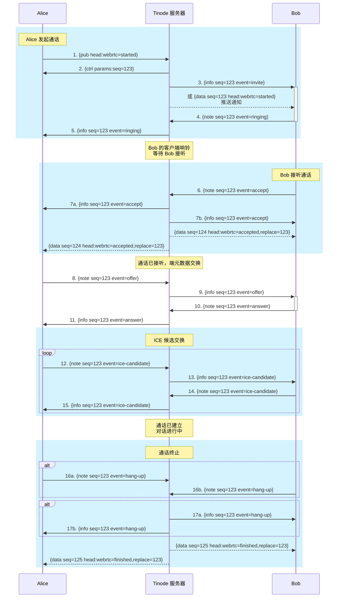

# 视频通话建立流程

Tinode 通过 [WebRTC](https://webrtc.org/) 支持点对点视频通话。下图展示了两个用户 `Alice` 和 `Bob` 之间的通话建立流程。该流程概念上类似于 [SIP](https://en.wikipedia.org/wiki/Session_Initiation_Protocol)，但使用原生 Tinode 消息传输。

注意：
- 所有通信都由 Tinode 服务器代理。
- 客户端到服务器事件通过 `{note}` 消息分发，设置通话的 `topic` 和 `seq` 字段。
- 服务器到客户端数据通过 `me` 话题的 `{info}` 消息路由，设置通话的 `src`（通话话题）和 `seq` 字段（和/或在数据推送通知中）。
- 假设 Alice 和 Bob 都可能有多个设备。

## 详情
### 通话阶段
流程可分为 4 个阶段：
* 步骤 1-5: 通话发起
* 步骤 6-7: 通话接听
* 步骤 8-15: 元数据交换
* 步骤 16-17: 通话终止

### 通话建立与终止步骤

#### 通话发起
1. `Alice` 通过发布视频通话消息（带 `webrtc=started` 头）发起通话
2. 服务器回复 `{ctrl}` 消息，包含通话的 `seq` id。
3. 服务器将 `invite` 事件消息路由到 `Bob`（所有客户端）。
  - 此外，服务器向 `Bob` 发送包含 `webrtc=started` 字段的数据推送通知。
  - 收到以上任一消息后，`Bob` 显示来电通话 UI。
4. `Bob` 回复 `ringing` 事件。
5. 服务器将 `ringing` 事件转发给 `Alice`。后者现在播放振铃音。
  - 注意 `Alice` 可能收到多个 `ringing` 事件，因为 `Bob` 的每个实例分别确认收到通话邀请。
  - `Alice` 和服务器将等待服务器配置的超时时间，等待 `Bob` 接听然后挂断。
  - 此时，通话正式**已发起**。

#### 通话接听
6. `Bob` 通过发送 `accept` 事件接听通话。
7. (a) 和 (b): 服务器将 `accept` 事件路由到 `Alice` 和 `Bob`。
  - 此外，服务器广播通话数据消息的替换消息，带 `webrtc=accepted` 头。
  - 替换消息的推送通知也会发送。
  - `Bob` 的会话（除接听通话的那个）可以静默关闭来电通话 UI。
  - 此时，通话正式**已接听**。

#### 元数据交换
8. `Alice` 发送包含 SDP 载荷的 `offer` 事件。
9. 服务器将 `offer` 路由给 `Bob`。
10. 收到 `offer` 后，`Bob` 回复包含 SDP 载荷的 `answer` 事件。
11. 服务器将 `Bob` 的 `answer` 事件转发给 `Alice`。

步骤 12-15 是 `Alice` 和 `Bob` 之间的 Ice 候选交换。
此时通话正式**已建立**。`Alice` 和 `Bob` 可以互相看到和听到。

#### 通话终止
16. `Alice` 向服务器发送 `hang-up` 事件。
17. 服务器将 `hang-up` 事件路由给 `Bob`。

此外，服务器广播通话数据消息的替换消息，带 `webrtc=finished` 头。
替换消息的推送通知也会发送。